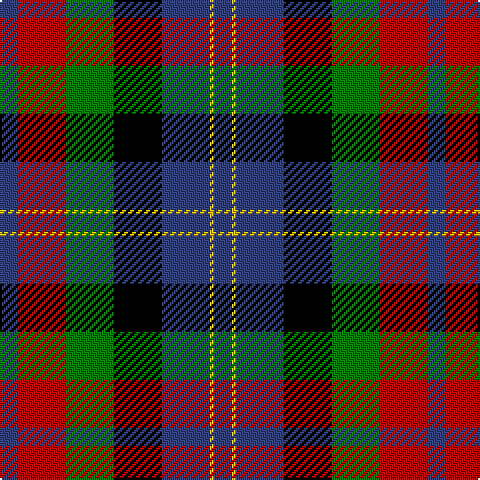

In pattern [BRGKBYB](/patterns/brgkbyb/).

This was sourced from weddslist.  It is a [7 stripes tartan](/stripes/stripes7/).

Original link http://www.weddslist.com/cgi-bin/tartans/pg.pl?source=sts

## Thread count
B/9 R24 G24 K24 B24 Y2 B/9

## Palette
Each colour and its ΔE from the base-6 reference it is a variant of.

| Colour | Shade | Base | ΔE (OKLab) |
|---|---|---|---|
| B | <code style="background-color:#304080;">#304080</code> `#304080` | B <code style="background-color:#2A418A;">#2A418A</code> | 0.02 |
| G | <code style="background-color:#008000;">#008000</code> `#008000` | G <code style="background-color:#006100;">#006100</code> | 0.10 |
| K | <code style="background-color:#000000;">#000000</code> `#000000` | K <code style="background-color:#000000;">#000000</code> | 0.00 |
| R | <code style="background-color:#C00000;">#C00000</code> `#C00000` | R <code style="background-color:#CC0000;">#CC0000</code> | 0.03 |
| Y | <code style="background-color:#F0C000;">#F0C000</code> `#F0C000` | Y <code style="background-color:#F2BF00;">#F2BF00</code> | 0.00 |

# Sample pattern

## Nearest tartans

The nearest existing variants by ΔTartan distance.

1. [MacLaren](/setts/s7/b9k7g5r4g7k1y1~b800080-g008000-k000000-rc00020-yf0c000~x2/) — ΔT 0.74
1. [Dundas](/setts/s7/b9r24g24k24b24y2b9~b2c4084-g005020-k101010-rdc0000-ye8c000/) — ΔT 1.06
1. [Brodie Hunting](/setts/s7/r2b8g8k8y1k8r2~b5c8ca8-g006818-k101010-rc80000-yd09800~x4/) — ΔT 1.15
1. [Thom(p)son's, Fancy](/setts/s6/r2ra8b2ba4k4ba1~b304080-ba5480b0-k000000-rc00000-ra806050~x6/) — ΔT 1.17
1. [MacLaren #2](/setts/s7/b9k7g5r4g7k1y1~b5a008c-g005020-k101010-rc80028-ye8c000~x2/) — ΔT 1.17
1. [Brough](/setts/s7/r20k14w2k14g9r3g11~g008000-k000030-rc00000-we0e0e0~x2/) — ΔT 1.17
1. [MacKean, Green](/setts/s8/k4b8k4b8r2g10k1w2~b304080-g008000-k000000-rc00000-we0e0e0~x2/) — ΔT 1.18
1. [MacWilliam](/setts/s6/r10b24r4k30g36ba5~b304080-ba000050-g008000-k000000-rc00000/) — ΔT 1.21
1. [St. Clement of Rome (Corporate)](/setts/s8/b18k5r26k5g25k5b18y2~b202060-g006818-k101010-rc80000-ye8c000~x2/) — ΔT 1.21
1. [MacLeish](/setts/s8/k18b12k5g4r6g12k2y4~b1c0070-g006818-k101010-rc80000-ybc8c00~x2/) — ΔT 1.21

## Neighbour map

Every grey dot is one of 15726 variants placed by the first two principal components of the ΔTartan feature space (44% of its variance). Red is this tartan; blue dots are its nearest — click one to open its page.

<svg viewBox="0 0 640 380" role="img" style="max-width:100%;height:auto;border:1px solid #e0e0e0;border-radius:4px;display:block" xmlns="http://www.w3.org/2000/svg"><image href="/nn/cloud.v1.png" width="640" height="380"/><a href="/setts/s7/b9k7g5r4g7k1y1~b800080-g008000-k000000-rc00020-yf0c000~x2/"><circle cx="103.8" cy="201.1" r="4" fill="#3465a4"><title>MacLaren</title></circle></a><a href="/setts/s7/b9r24g24k24b24y2b9~b2c4084-g005020-k101010-rdc0000-ye8c000/"><circle cx="145.8" cy="211.7" r="4" fill="#3465a4"><title>Dundas</title></circle></a><a href="/setts/s7/r2b8g8k8y1k8r2~b5c8ca8-g006818-k101010-rc80000-yd09800~x4/"><circle cx="152.7" cy="217.0" r="4" fill="#3465a4"><title>Brodie Hunting</title></circle></a><a href="/setts/s6/r2ra8b2ba4k4ba1~b304080-ba5480b0-k000000-rc00000-ra806050~x6/"><circle cx="132.8" cy="210.0" r="4" fill="#3465a4"><title>Thom(p)son's, Fancy</title></circle></a><a href="/setts/s7/b9k7g5r4g7k1y1~b5a008c-g005020-k101010-rc80028-ye8c000~x2/"><circle cx="141.0" cy="217.6" r="4" fill="#3465a4"><title>MacLaren #2</title></circle></a><a href="/setts/s7/r20k14w2k14g9r3g11~g008000-k000030-rc00000-we0e0e0~x2/"><circle cx="158.6" cy="220.0" r="4" fill="#3465a4"><title>Brough</title></circle></a><a href="/setts/s8/k4b8k4b8r2g10k1w2~b304080-g008000-k000000-rc00000-we0e0e0~x2/"><circle cx="136.6" cy="194.7" r="4" fill="#3465a4"><title>MacKean, Green</title></circle></a><a href="/setts/s6/r10b24r4k30g36ba5~b304080-ba000050-g008000-k000000-rc00000/"><circle cx="105.9" cy="205.6" r="4" fill="#3465a4"><title>MacWilliam</title></circle></a><a href="/setts/s8/b18k5r26k5g25k5b18y2~b202060-g006818-k101010-rc80000-ye8c000~x2/"><circle cx="156.4" cy="182.5" r="4" fill="#3465a4"><title>St. Clement of Rome (Corporate)</title></circle></a><a href="/setts/s8/k18b12k5g4r6g12k2y4~b1c0070-g006818-k101010-rc80000-ybc8c00~x2/"><circle cx="153.4" cy="206.8" r="4" fill="#3465a4"><title>MacLeish</title></circle></a><circle cx="116.8" cy="202.3" r="5" fill="#c00000"/></svg>

ID: /setts/s7/b9r24g24k24b24y2b9~b304080-g008000-k000000-rc00000-yf0c000/
