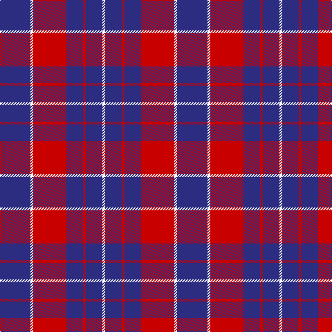

**Bands:** [BWRBRBW](/stripes/bwrbrbw/) · **Stripes:** [DB W R DB R DB W](/stripes/stripes7/) DB W R DB R DB W

This was sourced from register-of-tartans.  It is a [7 band tartan](/bands/bands7/).

Original link https://www.tartanregister.gov.uk/tartanDetails.aspx?ref=771

## Attestations

This cloth appears in 2 source records; the oldest owns this page.

- 01/01/2002 — Coronation (1936) #2 (register-of-tartans, [record](https://www.tartanregister.gov.uk/tartanDetails.aspx?ref=771))
- pre 2002 — Coronation (1936) #2 (Commemorative) (tartans-authority, [record](http://www.tartansauthority.com/tartan-ferret/display/2082/))

## Register references

External register numbers recorded for this tartan.

- Scottish Register of Tartans: [771](https://www.tartanregister.gov.uk/tartanDetails.aspx?ref=771)
- Scottish Tartans Authority (ITI): 2082
- Scottish Tartans World Register: 2082

## Variants

Other setts woven to the same stripe pattern.

- [Coronation](/setts/s7/db7w1r7db4r2db4w2~x2/)
- [Coronation](/setts/s7/db11w1r12db6r1db6w1~x2/)

## Thread count
DB/44 W4 R48 DB24 R4 DB24 W/4

## Palette
Each colour and its ΔE from the base-6 reference it is a variant of.

| Colour | Shade | Base | ΔE (OKLab) |
|---|---|---|---|
| DB | <code style="background-color:#2C2C80;">#2C2C80</code> `#2C2C80` | B <code style="background-color:#2A418A;">#2A418A</code> | 0.06 |
| R | <code style="background-color:#C80000;">#C80000</code> `#C80000` | R <code style="background-color:#CC0000;">#CC0000</code> | 0.01 |
| W | <code style="background-color:#FCFCFC;">#FCFCFC</code> `#FCFCFC` | W <code style="background-color:#F7F7F7;">#F7F7F7</code> | 0.01 |

# Sample pattern

## Nearest tartans

The nearest existing variants by ΔTartan distance.

1. [Coronation](/setts/s7/db11w1r12db6r1db6w1~x2/) — ΔT 0.77
1. [South Australian Pipes & Drums](/setts/s10/db60ly6db11r25db11ly6~x2/) — ΔT 0.96
1. [MacQueen variant](/setts/s6/db2r7db2r7db22ly2~x2/) — ΔT 0.98
1. [Butler](/setts/s6/db48r18db6r13ly4r14~x2/) — ΔT 1.06
1. [Orlando Fire Department (Corporate)](/setts/s9/db12ly1r16db1r1db14r3db14ly1~x4/) — ΔT 1.07
1. [BC Corps of Commissionaires, The](/setts/s7/db12lb1r3lb1r3lb1db6~x4/) — ΔT 1.14
1. [South Australian Pipes & Drums (Corp](/setts/s6/db60ly6db11r25~x2/) — ΔT 1.16
1. [Embrace, The](/setts/s8/db10r24db4r3db24w2r6db6~x2/) — ΔT 1.23
1. [Hamilton Red Clan Tartan Tartan Number: 477. Earliest known date: 1842 First recorded in the Vestiarium Scoticum which was supposedly based on an ancient manuscript now known to have been forged. The original illustration shows the four main stripes in a very dark shade of blue. There is no evidence of a Hamilton tartan prior to the publication of this spectacular work. The authors, the Sobieski Stuart brothers, enjoyed a popular following amongst the Scottish gentry of the period and it is probable that the design can be attributed to Charles Edward Stuart (Allan Hay) who prepared the illustrations for the book. See products available Copyright © Blair Urquhart, Comrie, 2015](/setts/s5/db6r1db6r9w1~x4/) — ΔT 1.31
1. [O'Long (Personal)](/setts/s7/g22dp22g3dp11w3dp4w3~x2/) — ΔT 1.31

## Neighbour map

Every grey dot is one of 14299 variants placed by the first two principal components of the ΔTartan feature space (44% of its variance). Red is this tartan; blue dots are its nearest — click one to open its page.

<svg viewBox="0 0 640 380" role="img" style="max-width:100%;height:auto;border:1px solid #e0e0e0;border-radius:4px;display:block" xmlns="http://www.w3.org/2000/svg"><image href="/nn/cloud.v1.png" width="640" height="380"/><a href="/setts/s7/db11w1r12db6r1db6w1~x2/"><circle cx="378.4" cy="218.1" r="4" fill="#3465a4"><title>Coronation</title></circle></a><a href="/setts/s10/db60ly6db11r25db11ly6~x2/"><circle cx="343.5" cy="190.1" r="4" fill="#3465a4"><title>South Australian Pipes &amp; Drums</title></circle></a><a href="/setts/s6/db2r7db2r7db22ly2~x2/"><circle cx="394.4" cy="206.7" r="4" fill="#3465a4"><title>MacQueen variant</title></circle></a><a href="/setts/s6/db48r18db6r13ly4r14~x2/"><circle cx="348.9" cy="213.1" r="4" fill="#3465a4"><title>Butler</title></circle></a><a href="/setts/s9/db12ly1r16db1r1db14r3db14ly1~x4/"><circle cx="420.2" cy="190.8" r="4" fill="#3465a4"><title>Orlando Fire Department (Corporate)</title></circle></a><a href="/setts/s7/db12lb1r3lb1r3lb1db6~x4/"><circle cx="406.5" cy="208.3" r="4" fill="#3465a4"><title>BC Corps of Commissionaires, The</title></circle></a><a href="/setts/s6/db60ly6db11r25~x2/"><circle cx="410.4" cy="214.8" r="4" fill="#3465a4"><title>South Australian Pipes &amp; Drums (Corp</title></circle></a><a href="/setts/s8/db10r24db4r3db24w2r6db6~x2/"><circle cx="352.9" cy="211.9" r="4" fill="#3465a4"><title>Embrace, The</title></circle></a><a href="/setts/s5/db6r1db6r9w1~x4/"><circle cx="320.8" cy="243.9" r="4" fill="#3465a4"><title>Hamilton Red Clan Tartan Tartan Number: 477. Earliest known date: 1842 First recorded in the Vestiarium Scoticum which was supposedly based on an ancient manuscript now known to have been forged. The original illustration shows the four main stripes in a very dark shade of blue. There is no evidence of a Hamilton tartan prior to the publication of this spectacular work. The authors, the Sobieski Stuart brothers, enjoyed a popular following amongst the Scottish gentry of the period and it is probable that the design can be attributed to Charles Edward Stuart (Allan Hay) who prepared the illustrations for the book. See products available Copyright © Blair Urquhart, Comrie, 2015</title></circle></a><a href="/setts/s7/g22dp22g3dp11w3dp4w3~x2/"><circle cx="305.3" cy="222.8" r="4" fill="#3465a4"><title>O'Long (Personal)</title></circle></a><circle cx="361.5" cy="208.9" r="5" fill="#c00000"/></svg>

ID: /setts/s7/db11w1r12db6r1db6w1~x4/
