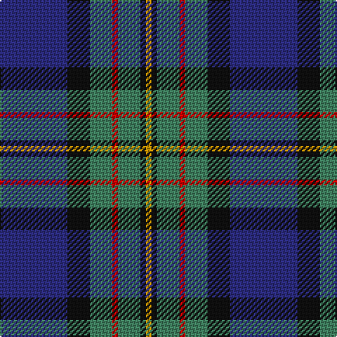

In pattern [BKGRGKY](/stripes/bkgrgky/).

This was sourced from register-of-tartans.  It is a [7 stripe tartan](/stripes/stripes7/).

Original link https://www.tartanregister.gov.uk/tartanDetails.aspx?ref=2594

## Attestations

This cloth appears in 2 source records; the oldest owns this page.

- 01/01/1819 — MacLaren (register-of-tartans, [record](https://www.tartanregister.gov.uk/tartanDetails.aspx?ref=2594))
- 1819 — MacLaren (Clan) (tartans-authority, [record](http://www.tartansauthority.com/tartan-ferret/display/342/))

## Register references

External register numbers recorded for this tartan.

- Scottish Register of Tartans: [2594](https://www.tartanregister.gov.uk/tartanDetails.aspx?ref=2594)
- Scottish Tartans Authority (ITI): 342
- Scottish Tartans World Register: 342

## Thread count
DB/48 K16 G16 R4 G16 K4 DY/4

## Palette
Each colour and the base-6 reference it is a variant of.

| Colour | Shade | Base |
|---|---|---|
| DB | <code style="background-color:#2C2C80;">#2C2C80</code> `oklch(35.0% 0.138 276.6)` <small>#2C2C80</small> | B <code style="background-color:#2A418A;">#2A418A</code> |
| DY | <code style="background-color:#D09800;">#D09800</code> `oklch(71.4% 0.147 82.1)` <small>#D09800</small> | Y <code style="background-color:#F2BF00;">#F2BF00</code> |
| G | <code style="background-color:#408060;">#408060</code> `oklch(54.8% 0.084 160.1)` <small>#408060</small> | G <code style="background-color:#006100;">#006100</code> |
| K | <code style="background-color:#101010;">#101010</code> `oklch(17.3% 0.000 89.9)` <small>#101010</small> | K <code style="background-color:#000000;">#000000</code> |
| R | <code style="background-color:#C80000;">#C80000</code> `oklch(52.3% 0.215 29.2)` <small>#C80000</small> | R <code style="background-color:#CC0000;">#CC0000</code> |

# Sample pattern

## Nearest tartans

The nearest existing variants by ΔTartan distance.

1. [Leslie, Hebridean](/setts/s6/k6g15w2db22r2k4~x2/) — ΔT 0.65
1. [Paterson Blue (Personal)](/setts/s6/db22w2k10g11r3g4~x2/) — ΔT 0.78
1. [Dickson (Kirkcudbrightshire) (Name)](/setts/s7/n6db8n8g12dt29w3dt4~x2/) — ΔT 0.79
1. [Alexander - 2000 (Name)](/setts/s7/db12k4g4dp1g4k1w1~x4/) — ΔT 0.82
1. [Scottish Chamber Orchestra](/setts/s9/lb3db20k3db2k5db2k3y15r2~x2/) — ΔT 0.84
1. [MacThomas (Clan)](/setts/s7/dg5lp3dg32k16b32m3b5~x2/) — ΔT 0.85
1. [MacThomas Clan Tartan Tartan Number: 407. Earliest known date: 1975 Designed by David Thomas - former director of the Strathmore Woollen Co. in Forfar who still (in 2011) weave this tartan. Adopted by Clan Society in 1975, and registered with Lord Lyon in 1979. See products available Copyright © Blair Urquhart, Comrie, 2015](/setts/s7/db3m2db22k11g24lp2g3~x2/) — ΔT 0.86
1. [New England (Fashion)](/setts/s6/k2w1k12g5db11r1~x2/) — ΔT 0.88
1. [MacLeod Small Clan Tartan Tartan Number: 15833. Earliest known date: See products available Copyright © Blair Urquhart, Comrie, 2015](/setts/s7/r1k1g7k5db10k1ly1~x2/) — ΔT 0.88
1. [State Seal of Washington (Fashion)](/setts/s7/b5dy28lb5k20lo5b47lo4~x2/) — ΔT 0.88

## Neighbour map

Every grey dot is one of 14299 variants placed by the first two principal components of the ΔTartan feature space (44% of its variance). Red is this tartan; blue dots are its nearest — click one to open its page.

<svg viewBox="0 0 640 380" role="img" style="max-width:100%;height:auto;border:1px solid #e0e0e0;border-radius:4px;display:block" xmlns="http://www.w3.org/2000/svg"><image href="/nn/cloud.v1.png" width="640" height="380"/><a href="/setts/s6/k6g15w2db22r2k4~x2/"><circle cx="214.6" cy="197.6" r="4" fill="#3465a4"><title>Leslie, Hebridean</title></circle></a><a href="/setts/s6/db22w2k10g11r3g4~x2/"><circle cx="204.0" cy="204.8" r="4" fill="#3465a4"><title>Paterson Blue (Personal)</title></circle></a><a href="/setts/s7/n6db8n8g12dt29w3dt4~x2/"><circle cx="212.8" cy="202.7" r="4" fill="#3465a4"><title>Dickson (Kirkcudbrightshire) (Name)</title></circle></a><a href="/setts/s7/db12k4g4dp1g4k1w1~x4/"><circle cx="223.1" cy="186.0" r="4" fill="#3465a4"><title>Alexander - 2000 (Name)</title></circle></a><a href="/setts/s9/lb3db20k3db2k5db2k3y15r2~x2/"><circle cx="226.6" cy="176.9" r="4" fill="#3465a4"><title>Scottish Chamber Orchestra</title></circle></a><a href="/setts/s7/dg5lp3dg32k16b32m3b5~x2/"><circle cx="213.8" cy="200.8" r="4" fill="#3465a4"><title>MacThomas (Clan)</title></circle></a><a href="/setts/s7/db3m2db22k11g24lp2g3~x2/"><circle cx="233.8" cy="194.8" r="4" fill="#3465a4"><title>MacThomas Clan Tartan Tartan Number: 407. Earliest known date: 1975 Designed by David Thomas - former director of the Strathmore Woollen Co. in Forfar who still (in 2011) weave this tartan. Adopted by Clan Society in 1975, and registered with Lord Lyon in 1979. See products available Copyright © Blair Urquhart, Comrie, 2015</title></circle></a><a href="/setts/s6/k2w1k12g5db11r1~x2/"><circle cx="238.4" cy="203.6" r="4" fill="#3465a4"><title>New England (Fashion)</title></circle></a><a href="/setts/s7/r1k1g7k5db10k1ly1~x2/"><circle cx="196.3" cy="194.4" r="4" fill="#3465a4"><title>MacLeod Small Clan Tartan Tartan Number: 15833. Earliest known date: See products available Copyright © Blair Urquhart, Comrie, 2015</title></circle></a><a href="/setts/s7/b5dy28lb5k20lo5b47lo4~x2/"><circle cx="219.0" cy="176.9" r="4" fill="#3465a4"><title>State Seal of Washington (Fashion)</title></circle></a><circle cx="236.8" cy="186.9" r="5" fill="#c00000"/></svg>

ID: /setts/s7/db12k4g4r1g4k1lo1~x4/
