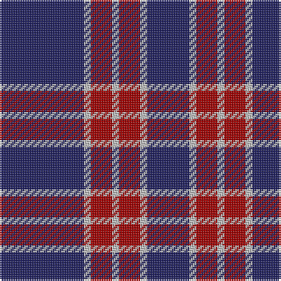

**Bands:** [BWRWRWB](/stripes/bwrwrwb/) · **Stripes:** [DB LB R LB R LB DB](/stripes/stripes7/) DB LB R LB R LB DB

This was sourced from tartans-authority.  It is a [7 band tartan](/bands/bands7/).

Original link http://www.tartansauthority.com/tartan-ferret/display/11090/

## Thread count
DB/48 N4 DR12 N4 DR12 N4 DB/24

## Palette
Each colour and its ΔE from the base-6 reference it is a variant of.

| Colour | Shade | Base | ΔE (OKLab) |
|---|---|---|---|
| DB | <code style="background-color:#202060;">#202060</code> `#202060` | B <code style="background-color:#2A418A;">#2A418A</code> | 0.11 |
| DR | <code style="background-color:#A00000;">#A00000</code> `#A00000` | R <code style="background-color:#CC0000;">#CC0000</code> | 0.09 |
| N | <code style="background-color:#C0C0C0;">#C0C0C0</code> `#C0C0C0` | W <code style="background-color:#F7F7F7;">#F7F7F7</code> | 0.17 |

# Sample pattern

## Nearest tartans

The nearest existing variants by ΔTartan distance.

1. [BC Corps of Commissionaires](/setts/s7/db12w1r3w1r3w1db6~x4/) — ΔT 0.56
1. [South Australian Pipes & Drums (Corp](/setts/s6/db60ly6db11r25~x2/) — ΔT 0.72
1. [Orlando Fire Department (Corporate)](/setts/s9/db12ly1r16db1r1db14r3db14ly1~x4/) — ΔT 1.01
1. [Edinburgh TIC (Corporate)](/setts/s8/db32r3db3r4w3r5db4r7~x2/) — ΔT 1.09
1. [Embrace, The](/setts/s8/db10r24db4r3db24w2r6db6~x2/) — ΔT 1.11
1. [Americana - 1978 (Fashion)](/setts/s8/db33w7db5r2db5w2r13db3~x2/) — ΔT 1.13
1. [Coronation (1936) #2](/setts/s7/db11w1r12db6r1db6w1~x4/) — ΔT 1.14
1. [MacQueen variant](/setts/s6/db2r7db2r7db22ly2~x2/) — ΔT 1.17
1. [Coronation](/setts/s7/db11w1r12db6r1db6w1~x2/) — ΔT 1.23
1. [South Australian Pipes & Drums](/setts/s10/db60ly6db11r25db11ly6~x2/) — ΔT 1.33

## Neighbour map

Every grey dot is one of 14299 variants placed by the first two principal components of the ΔTartan feature space (44% of its variance). Red is this tartan; blue dots are its nearest — click one to open its page.

<svg viewBox="0 0 640 380" role="img" style="max-width:100%;height:auto;border:1px solid #e0e0e0;border-radius:4px;display:block" xmlns="http://www.w3.org/2000/svg"><image href="/nn/cloud.v1.png" width="640" height="380"/><a href="/setts/s7/db12w1r3w1r3w1db6~x4/"><circle cx="395.7" cy="206.2" r="4" fill="#3465a4"><title>BC Corps of Commissionaires</title></circle></a><a href="/setts/s6/db60ly6db11r25~x2/"><circle cx="410.4" cy="214.8" r="4" fill="#3465a4"><title>South Australian Pipes &amp; Drums (Corp</title></circle></a><a href="/setts/s9/db12ly1r16db1r1db14r3db14ly1~x4/"><circle cx="420.2" cy="190.8" r="4" fill="#3465a4"><title>Orlando Fire Department (Corporate)</title></circle></a><a href="/setts/s8/db32r3db3r4w3r5db4r7~x2/"><circle cx="412.2" cy="185.6" r="4" fill="#3465a4"><title>Edinburgh TIC (Corporate)</title></circle></a><a href="/setts/s8/db10r24db4r3db24w2r6db6~x2/"><circle cx="352.9" cy="211.9" r="4" fill="#3465a4"><title>Embrace, The</title></circle></a><a href="/setts/s8/db33w7db5r2db5w2r13db3~x2/"><circle cx="394.9" cy="167.2" r="4" fill="#3465a4"><title>Americana - 1978 (Fashion)</title></circle></a><a href="/setts/s7/db11w1r12db6r1db6w1~x4/"><circle cx="361.5" cy="208.9" r="4" fill="#3465a4"><title>Coronation (1936) #2</title></circle></a><a href="/setts/s6/db2r7db2r7db22ly2~x2/"><circle cx="394.4" cy="206.7" r="4" fill="#3465a4"><title>MacQueen variant</title></circle></a><a href="/setts/s7/db11w1r12db6r1db6w1~x2/"><circle cx="378.4" cy="218.1" r="4" fill="#3465a4"><title>Coronation</title></circle></a><a href="/setts/s10/db60ly6db11r25db11ly6~x2/"><circle cx="343.5" cy="190.1" r="4" fill="#3465a4"><title>South Australian Pipes &amp; Drums</title></circle></a><circle cx="406.5" cy="208.3" r="5" fill="#c00000"/></svg>

ID: /setts/s7/db12lb1r3lb1r3lb1db6~x4/
