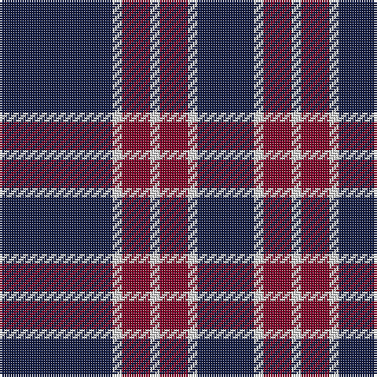

This page is one **sett** — a single exact thread-count. It belongs to the [tartan](/tartans/db12w1r3w1r3w1db6/)
(the same proportion at any scale), whose colour order is pattern [BWRWRWB](/stripes/bwrwrwb/).

Sourced from register-of-tartans.  It is a [7 stripe tartan](/stripes/stripes7/).

Original link https://www.tartanregister.gov.uk/tartanDetails.aspx?ref=11090

## Register references

External register numbers recorded for this tartan.

- Scottish Register of Tartans: [11090](https://www.tartanregister.gov.uk/tartanDetails.aspx?ref=11090)

## Thread count
DB/48 LN4 DR12 LN4 DR12 LN4 DB/24

## Palette

Palette: <strong>Tartan Register</strong>
<table><thead><tr><th>Colour</th><th>Threads</th><th>Shade</th><th>Base</th><th>OKLCh</th></tr></thead><tbody><tr><td>DB/</td><td style="text-align:right;font-variant-numeric:tabular-nums">48</td><td><code style="background-color:#141E46;">#141E46</code> <small style="color:#888">#141E46</small></td><td>B <code style="background-color:#2A418A;">#2A418A</code></td><td><small style="color:#888">oklch(25.2% 0.076 269.7)</small></td></tr><tr><td>LN</td><td style="text-align:right;font-variant-numeric:tabular-nums">4</td><td><code style="background-color:#E0E0E0;">#E0E0E0</code> <small style="color:#888">#E0E0E0</small></td><td>W <code style="background-color:#F7F7F7;">#F7F7F7</code></td><td><small style="color:#888">oklch(90.7% 0.000 89.9)</small></td></tr><tr><td>DR</td><td style="text-align:right;font-variant-numeric:tabular-nums">12</td><td><code style="background-color:#800028;">#800028</code> <small style="color:#888">#800028</small></td><td>R <code style="background-color:#CC0000;">#CC0000</code></td><td><small style="color:#888">oklch(38.2% 0.152 14.5)</small></td></tr><tr><td>LN</td><td style="text-align:right;font-variant-numeric:tabular-nums">4</td><td><code style="background-color:#E0E0E0;">#E0E0E0</code> <small style="color:#888">#E0E0E0</small></td><td>W <code style="background-color:#F7F7F7;">#F7F7F7</code></td><td><small style="color:#888">oklch(90.7% 0.000 89.9)</small></td></tr><tr><td>DR</td><td style="text-align:right;font-variant-numeric:tabular-nums">12</td><td><code style="background-color:#800028;">#800028</code> <small style="color:#888">#800028</small></td><td>R <code style="background-color:#CC0000;">#CC0000</code></td><td><small style="color:#888">oklch(38.2% 0.152 14.5)</small></td></tr><tr><td>LN</td><td style="text-align:right;font-variant-numeric:tabular-nums">4</td><td><code style="background-color:#E0E0E0;">#E0E0E0</code> <small style="color:#888">#E0E0E0</small></td><td>W <code style="background-color:#F7F7F7;">#F7F7F7</code></td><td><small style="color:#888">oklch(90.7% 0.000 89.9)</small></td></tr><tr><td>DB/</td><td style="text-align:right;font-variant-numeric:tabular-nums">24</td><td><code style="background-color:#141E46;">#141E46</code> <small style="color:#888">#141E46</small></td><td>B <code style="background-color:#2A418A;">#2A418A</code></td><td><small style="color:#888">oklch(25.2% 0.076 269.7)</small></td></tr></tbody></table>

# Sample pattern

## Nearest tartans

The nearest existing variants by ΔTartan distance, with this tartan at the top so the swatches line up against it.

ΔTartan

Tartan

Sett

—

<a href="/ttd/edit/#slug=db12w1r3w1r3w1db6~x4">BC Corps of Commissionaires</a> <a class="nn-out" href="/setts/s7/db12w1r3w1r3w1db6~x4/" title="open its dictionary page">↗</a>

0.56

<a href="/ttd/edit/#slug=db12lb1r3lb1r3lb1db6~x4">BC Corps of Commissionaires, The</a> <a class="nn-out" href="/setts/s7/db12lb1r3lb1r3lb1db6~x4/" title="open its dictionary page">↗</a>

0.98

<a href="/setts/s6/db60ly6db11r25~x2/">South Australian Pipes &amp; Drums (Corp</a>

0.98

<a href="/ttd/edit/#slug=db33w7db5r2db5w2r13db3~x2">Americana - 1978 (Fashion)</a> <a class="nn-out" href="/setts/s8/db33w7db5r2db5w2r13db3~x2/" title="open its dictionary page">↗</a>

1.25

<a href="/ttd/edit/#slug=k39o3k3o3k14o28r3~x2">Moffat (1984)</a> <a class="nn-out" href="/setts/s7/k39o3k3o3k14o28r3~x2/" title="open its dictionary page">↗</a>

1.28

<a href="/ttd/edit/#slug=db10r24db4r3db24w2r6db6~x2">Embrace, The</a> <a class="nn-out" href="/setts/s8/db10r24db4r3db24w2r6db6~x2/" title="open its dictionary page">↗</a>

1.35

<a href="/ttd/edit/#slug=t50k4t12k23lo4k4~x2">Sligo Irish County Tartan Tartan Number: 2256. Earliest known date: 1995 One of a series of Irish District tartans designed by Polly Wittering of the House of Edgar, with colours reminiscent of the Country with soft warm colours dominating. See products available Copyright © Blair Urquhart, Comrie, 2015</a> <a class="nn-out" href="/setts/s6/t50k4t12k23lo4k4~x2/" title="open its dictionary page">↗</a>

1.38

<a href="/ttd/edit/#slug=db37w9db3r9w3~x2">Glen Moy</a> <a class="nn-out" href="/setts/s5/db37w9db3r9w3~x2/" title="open its dictionary page">↗</a>

1.39

<a href="/ttd/edit/#slug=db11w1r12db6r1db6w1~x4">Coronation (1936) #2</a> <a class="nn-out" href="/setts/s7/db11w1r12db6r1db6w1~x4/" title="open its dictionary page">↗</a>

1.40

<a href="/ttd/edit/#slug=db12ly1r16db1r1db14r3db14ly1~x4">Orlando Fire Department (Corporate)</a> <a class="nn-out" href="/setts/s9/db12ly1r16db1r1db14r3db14ly1~x4/" title="open its dictionary page">↗</a>

1.43

<a href="/ttd/edit/#slug=db13lb3db1r3lb1~x6">Glen Moy</a> <a class="nn-out" href="/setts/s5/db13lb3db1r3lb1~x6/" title="open its dictionary page">↗</a>

## Neighbour map

Every grey dot is one of 14359 variants placed by the first two principal components of the ΔTartan feature space (44% of its variance). Red is this tartan; blue dots are its nearest — click one to open its page.

<svg viewBox="0 0 640 380" role="img" style="max-width:100%;height:auto;border:1px solid #e0e0e0;border-radius:4px;display:block" xmlns="http://www.w3.org/2000/svg"><image href="/nn/cloud.v1.png" width="640" height="380"/><a href="/setts/s7/db12lb1r3lb1r3lb1db6~x4/"><circle cx="405.8" cy="209.2" r="4" fill="#3465a4"><title>BC Corps of Commissionaires, The</title></circle></a><a href="/setts/s6/db60ly6db11r25~x2/"><circle cx="409.5" cy="215.8" r="4" fill="#3465a4"><title>South Australian Pipes &amp; Drums (Corp</title></circle></a><a href="/setts/s8/db33w7db5r2db5w2r13db3~x2/"><circle cx="394.0" cy="168.0" r="4" fill="#3465a4"><title>Americana - 1978 (Fashion)</title></circle></a><a href="/setts/s7/k39o3k3o3k14o28r3~x2/"><circle cx="372.2" cy="198.9" r="4" fill="#3465a4"><title>Moffat (1984)</title></circle></a><a href="/setts/s8/db10r24db4r3db24w2r6db6~x2/"><circle cx="352.3" cy="213.0" r="4" fill="#3465a4"><title>Embrace, The</title></circle></a><a href="/setts/s6/t50k4t12k23lo4k4~x2/"><circle cx="369.2" cy="198.3" r="4" fill="#3465a4"><title>Sligo Irish County Tartan Tartan Number: 2256. Earliest known date: 1995 One of a series of Irish District tartans designed by Polly Wittering of the House of Edgar, with colours reminiscent of the Country with soft warm colours dominating. See products available Copyright © Blair Urquhart, Comrie, 2015</title></circle></a><a href="/setts/s5/db37w9db3r9w3~x2/"><circle cx="368.2" cy="202.7" r="4" fill="#3465a4"><title>Glen Moy</title></circle></a><a href="/setts/s7/db11w1r12db6r1db6w1~x4/"><circle cx="360.7" cy="210.0" r="4" fill="#3465a4"><title>Coronation (1936) #2</title></circle></a><a href="/setts/s9/db12ly1r16db1r1db14r3db14ly1~x4/"><circle cx="419.3" cy="191.6" r="4" fill="#3465a4"><title>Orlando Fire Department (Corporate)</title></circle></a><a href="/setts/s5/db13lb3db1r3lb1~x6/"><circle cx="394.6" cy="202.0" r="4" fill="#3465a4"><title>Glen Moy</title></circle></a><circle cx="395.0" cy="207.2" r="5" fill="#c00000"/></svg>

ID: /setts/s7/db12w1r3w1r3w1db6~x4/
