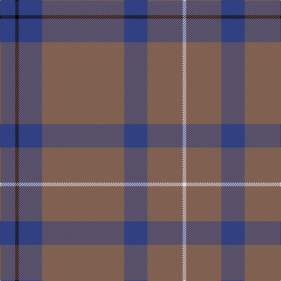

In pattern [BKBRBRW](/stripes/bkbrbrw/).

This was sourced from weddslist.  It is a [7 stripe tartan](/stripes/stripes7/).

Original link http://www.weddslist.com/cgi-bin/tartans/pg.pl?source=sts

## Thread count
B/26 K6 B40 LT140 B40 LT60 LN/6

## Palette
Each colour and the base-6 reference it is a variant of.

| Colour | Shade | Base |
|---|---|---|
| B | <code style="background-color:#304080;">#304080</code> `oklch(39.4% 0.109 270.2)` <small>#304080</small> | B <code style="background-color:#2A418A;">#2A418A</code> |
| K | <code style="background-color:#000000;">#000000</code> `oklch(0.0% 0.000 0.0)` <small>#000000</small> | K <code style="background-color:#000000;">#000000</code> |
| LN | <code style="background-color:#E0E0E0;">#E0E0E0</code> `oklch(90.7% 0.000 89.9)` <small>#E0E0E0</small> | W <code style="background-color:#F7F7F7;">#F7F7F7</code> |
| LT | <code style="background-color:#806050;">#806050</code> `oklch(51.7% 0.049 47.8)` <small>#806050</small> | R <code style="background-color:#CC0000;">#CC0000</code> |

# Sample pattern

## Nearest tartans

The nearest existing variants by ΔTartan distance.

1. [Unidentified #44](/setts/s7/db13k3db20dy70db20dy30w3~x2/) — ΔT 1.14
1. [Dunning Primary (School)](/setts/s5/n30do9w1r5ly1~x4/) — ΔT 1.51
1. [Keepers of the Quaich](/setts/s6/lo3dy33db24dy2db2dy2~x2/) — ΔT 1.57
1. [Meaux (Personal)](/setts/s4/dt62r24lo5dg3~x2/) — ΔT 1.59
1. [Cameron, hunting](/setts/s6/o15r5o30db32o4ly3~x2/) — ΔT 1.60
1. [Bute Heather, Grey](/setts/s11/y6lb1n18k6n4k4n8k1n8k2y5~x2/) — ΔT 1.68
1. [Ardee (Corporate)](/setts/s5/db4r1db18n18lr1~x4/) — ΔT 1.69
1. [Dark Lochnagar](/setts/s10/do6o1do40n1do12o12n6o2r2o4~x2/) — ΔT 1.70
1. [Bute Heather, Midnight (Fashion)](/setts/s11/n12lp3n36k10n8k8n16k2n16k4n10/) — ΔT 1.70
1. [Norsemen (Corporate)](/setts/s6/n65k2n4lr2n10r24~x2/) — ΔT 1.70

## Neighbour map

Every grey dot is one of 14299 variants placed by the first two principal components of the ΔTartan feature space (44% of its variance). Red is this tartan; blue dots are its nearest — click one to open its page.

<svg viewBox="0 0 640 380" role="img" style="max-width:100%;height:auto;border:1px solid #e0e0e0;border-radius:4px;display:block" xmlns="http://www.w3.org/2000/svg"><image href="/nn/cloud.v1.png" width="640" height="380"/><a href="/setts/s7/db13k3db20dy70db20dy30w3~x2/"><circle cx="481.8" cy="221.0" r="4" fill="#3465a4"><title>Unidentified #44</title></circle></a><a href="/setts/s5/n30do9w1r5ly1~x4/"><circle cx="465.9" cy="176.2" r="4" fill="#3465a4"><title>Dunning Primary (School)</title></circle></a><a href="/setts/s6/lo3dy33db24dy2db2dy2~x2/"><circle cx="440.9" cy="220.7" r="4" fill="#3465a4"><title>Keepers of the Quaich</title></circle></a><a href="/setts/s4/dt62r24lo5dg3~x2/"><circle cx="471.6" cy="226.0" r="4" fill="#3465a4"><title>Meaux (Personal)</title></circle></a><a href="/setts/s6/o15r5o30db32o4ly3~x2/"><circle cx="378.9" cy="245.0" r="4" fill="#3465a4"><title>Cameron, hunting</title></circle></a><a href="/setts/s11/y6lb1n18k6n4k4n8k1n8k2y5~x2/"><circle cx="373.0" cy="196.5" r="4" fill="#3465a4"><title>Bute Heather, Grey</title></circle></a><a href="/setts/s5/db4r1db18n18lr1~x4/"><circle cx="400.1" cy="227.8" r="4" fill="#3465a4"><title>Ardee (Corporate)</title></circle></a><a href="/setts/s10/do6o1do40n1do12o12n6o2r2o4~x2/"><circle cx="503.7" cy="146.8" r="4" fill="#3465a4"><title>Dark Lochnagar</title></circle></a><a href="/setts/s11/n12lp3n36k10n8k8n16k2n16k4n10/"><circle cx="400.8" cy="212.9" r="4" fill="#3465a4"><title>Bute Heather, Midnight (Fashion)</title></circle></a><a href="/setts/s6/n65k2n4lr2n10r24~x2/"><circle cx="579.5" cy="186.5" r="4" fill="#3465a4"><title>Norsemen (Corporate)</title></circle></a><circle cx="460.8" cy="203.0" r="5" fill="#c00000"/></svg>

ID: /setts/s7/db13k3db20o70db20o30w3~x2/
