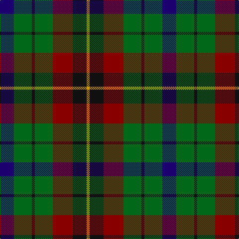

**Bands:** [BGKGRKY](/stripes/bgkgrky/) · **Stripes:** [DB G K G R K LO](/stripes/stripes7/) DB G K G R K LO

This was sourced from register-of-tartans.  It is a [7 band tartan](/bands/bands7/).

Original link https://www.tartanregister.gov.uk/tartanDetails.aspx?ref=3738

## Attestations

This cloth appears in 2 source records; the oldest owns this page.

- 01/01/1998 — Scottish Parliament (unofficial) (register-of-tartans, [record](https://www.tartanregister.gov.uk/tartanDetails.aspx?ref=3738))
- 1998 — Scottish Parliament (Unauthorised) (tartans-authority, [record](http://www.tartansauthority.com/tartan-ferret/display/2477/))

## Register references

External register numbers recorded for this tartan.

- Scottish Register of Tartans: [3738](https://www.tartanregister.gov.uk/tartanDetails.aspx?ref=3738)
- Scottish Tartans Authority (ITI): 2477
- Scottish Tartans World Register: 2477

## Thread count
DB/28 G36 K6 G36 DR40 K28 DY/6

## Palette
Each colour and its ΔE from the base-6 reference it is a variant of.

| Colour | Shade | Base | ΔE (OKLab) |
|---|---|---|---|
| DB | <code style="background-color:#1C0070;">#1C0070</code> `#1C0070` | B <code style="background-color:#2A418A;">#2A418A</code> | 0.14 |
| DR | <code style="background-color:#880000;">#880000</code> `#880000` | R <code style="background-color:#CC0000;">#CC0000</code> | 0.15 |
| DY | <code style="background-color:#D09800;">#D09800</code> `#D09800` | Y <code style="background-color:#F2BF00;">#F2BF00</code> | 0.12 |
| G | <code style="background-color:#006818;">#006818</code> `#006818` | G <code style="background-color:#006100;">#006100</code> | 0.02 |
| K | <code style="background-color:#101010;">#101010</code> `#101010` | K <code style="background-color:#000000;">#000000</code> | 0.17 |

# Sample pattern

## Nearest tartans

The nearest existing variants by ΔTartan distance.

1. [Cunningham / Wilson's No 120](/setts/s7/k11g12w2g12k12dp12r3~x2/) — ΔT 0.67
1. [Wilson's No.176](/setts/s8/k8t3g13dp12ly2dp12g13t3~x2/) — ΔT 0.74
1. [Selkirk (Personal) Original](/setts/s8/dp11y2k10g10lo2g10k10y2~x2/) — ΔT 0.81
1. [Wilson's No.217](/setts/s8/dp11t2k10g10ly3g10k10t2~x2/) — ΔT 0.89
1. [Tennant (Clan)](/setts/s7/r1dy7b7k7g7dy7r1~x4/) — ΔT 0.91
1. [Tennant](/setts/s7/r1dr7db7k7g7dr7r1~x4/) — ΔT 0.92
1. [Brodie Hunting](/setts/s7/r2k8lo1k8g8t8r2~x4/) — ΔT 1.01
1. [Unidentified Pinafore](/setts/s7/dg24k4dg24k24t7r24t7~x2/) — ΔT 1.07
1. [MacLeish](/setts/s8/k18db12k5g4r6g12k2lo4~x2/) — ΔT 1.10
1. [MacDuff, hunting](/setts/s8/o8r1o8g8k8db8o8r2~x2/) — ΔT 1.12

## Neighbour map

Every grey dot is one of 14313 variants placed by the first two principal components of the ΔTartan feature space (44% of its variance). Red is this tartan; blue dots are its nearest — click one to open its page.

<svg viewBox="0 0 640 380" role="img" style="max-width:100%;height:auto;border:1px solid #e0e0e0;border-radius:4px;display:block" xmlns="http://www.w3.org/2000/svg"><image href="/nn/cloud.v1.png" width="640" height="380"/><a href="/setts/s7/k11g12w2g12k12dp12r3~x2/"><circle cx="131.0" cy="254.9" r="4" fill="#3465a4"><title>Cunningham / Wilson's No 120</title></circle></a><a href="/setts/s8/k8t3g13dp12ly2dp12g13t3~x2/"><circle cx="150.3" cy="233.4" r="4" fill="#3465a4"><title>Wilson's No.176</title></circle></a><a href="/setts/s8/dp11y2k10g10lo2g10k10y2~x2/"><circle cx="118.8" cy="236.2" r="4" fill="#3465a4"><title>Selkirk (Personal) Original</title></circle></a><a href="/setts/s8/dp11t2k10g10ly3g10k10t2~x2/"><circle cx="106.2" cy="240.8" r="4" fill="#3465a4"><title>Wilson's No.217</title></circle></a><a href="/setts/s7/r1dy7b7k7g7dy7r1~x4/"><circle cx="151.4" cy="253.2" r="4" fill="#3465a4"><title>Tennant (Clan)</title></circle></a><a href="/setts/s7/r1dr7db7k7g7dr7r1~x4/"><circle cx="121.5" cy="237.5" r="4" fill="#3465a4"><title>Tennant</title></circle></a><a href="/setts/s7/r2k8lo1k8g8t8r2~x4/"><circle cx="155.5" cy="218.0" r="4" fill="#3465a4"><title>Brodie Hunting</title></circle></a><a href="/setts/s7/dg24k4dg24k24t7r24t7~x2/"><circle cx="192.4" cy="268.7" r="4" fill="#3465a4"><title>Unidentified Pinafore</title></circle></a><a href="/setts/s8/k18db12k5g4r6g12k2lo4~x2/"><circle cx="156.3" cy="209.9" r="4" fill="#3465a4"><title>MacLeish</title></circle></a><a href="/setts/s8/o8r1o8g8k8db8o8r2~x2/"><circle cx="155.8" cy="230.7" r="4" fill="#3465a4"><title>MacDuff, hunting</title></circle></a><circle cx="143.1" cy="245.7" r="5" fill="#c00000"/></svg>

ID: /setts/s7/db14g18k3g18r20k14lo3~x2/
