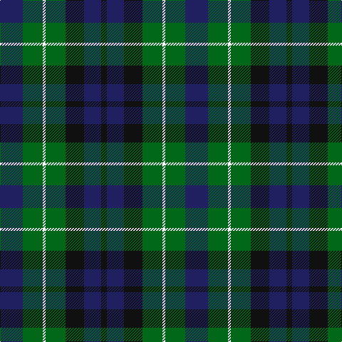

This page is one **sett** — a single exact thread-count. It belongs to the [tartan](/tartans/db16g14w2g14k13db12k4/)
(the same proportion at any scale), whose colour order is pattern [BGWGKBK](/stripes/bgwgkbk/).

Sourced from tartans-authority.  It is a [7 stripe tartan](/stripes/stripes7/).

Original link http://www.tartansauthority.com/tartan-ferret/display/196/

## Thread count
DB/32 G28 W4 G28 K26 DB24 K/8

## Palette

Palette: <strong>Tartan Register</strong>
<table><thead><tr><th>Colour</th><th>Threads</th><th>Shade</th><th>Base</th><th>OKLCh</th></tr></thead><tbody><tr><td>DB/</td><td style="text-align:right;font-variant-numeric:tabular-nums">32</td><td><code style="background-color:#202060;">#202060</code> <small style="color:#888">#202060</small></td><td>B <code style="background-color:#2A418A;">#2A418A</code></td><td><small style="color:#888">oklch(28.9% 0.111 276.9)</small></td></tr><tr><td>G</td><td style="text-align:right;font-variant-numeric:tabular-nums">28</td><td><code style="background-color:#006818;">#006818</code> <small style="color:#888">#006818</small></td><td>G <code style="background-color:#006100;">#006100</code></td><td><small style="color:#888">oklch(45.0% 0.142 145.0)</small></td></tr><tr><td>W</td><td style="text-align:right;font-variant-numeric:tabular-nums">4</td><td><code style="background-color:#FCFCFC;">#FCFCFC</code> <small style="color:#888">#FCFCFC</small></td><td>W <code style="background-color:#F7F7F7;">#F7F7F7</code></td><td><small style="color:#888">oklch(99.1% 0.000 89.9)</small></td></tr><tr><td>G</td><td style="text-align:right;font-variant-numeric:tabular-nums">28</td><td><code style="background-color:#006818;">#006818</code> <small style="color:#888">#006818</small></td><td>G <code style="background-color:#006100;">#006100</code></td><td><small style="color:#888">oklch(45.0% 0.142 145.0)</small></td></tr><tr><td>K</td><td style="text-align:right;font-variant-numeric:tabular-nums">26</td><td><code style="background-color:#101010;">#101010</code> <small style="color:#888">#101010</small></td><td>K <code style="background-color:#000000;">#000000</code></td><td><small style="color:#888">oklch(17.3% 0.000 89.9)</small></td></tr><tr><td>DB</td><td style="text-align:right;font-variant-numeric:tabular-nums">24</td><td><code style="background-color:#202060;">#202060</code> <small style="color:#888">#202060</small></td><td>B <code style="background-color:#2A418A;">#2A418A</code></td><td><small style="color:#888">oklch(28.9% 0.111 276.9)</small></td></tr><tr><td>K/</td><td style="text-align:right;font-variant-numeric:tabular-nums">8</td><td><code style="background-color:#101010;">#101010</code> <small style="color:#888">#101010</small></td><td>K <code style="background-color:#000000;">#000000</code></td><td><small style="color:#888">oklch(17.3% 0.000 89.9)</small></td></tr></tbody></table>

# Sample pattern

## Nearest tartans

The nearest existing variants by ΔTartan distance, with this tartan at the top so the swatches line up against it.

ΔTartan

Tartan

Sett

—

<a href="/ttd/edit/#slug=db16g14w2g14k13db12k4~x2">MacNeil of Colonsay (Clan)</a> <a class="nn-out" href="/setts/s7/db16g14w2g14k13db12k4~x2/" title="open its dictionary page">↗</a>

0.52

<a href="/ttd/edit/#slug=db4dg6w1dg6k6db6k2~x2">MacNeil of Colonsay</a> <a class="nn-out" href="/setts/s7/db4dg6w1dg6k6db6k2~x2/" title="open its dictionary page">↗</a>

0.76

<a href="/ttd/edit/#slug=db8dg8db1dg8k8db8ly2~x2">MacKay</a> <a class="nn-out" href="/setts/s7/db8dg8db1dg8k8db8ly2~x2/" title="open its dictionary page">↗</a>

0.78

<a href="/ttd/edit/#slug=k11dg12k2dg12k12dp12w3~x2">Wilson's No 97</a> <a class="nn-out" href="/setts/s7/k11dg12k2dg12k12dp12w3~x2/" title="open its dictionary page">↗</a>

0.86

<a href="/ttd/edit/#slug=k6dg6ly1dg6k6dp6k1~x4">Abercrombie (Wilsons No 2/64)</a> <a class="nn-out" href="/setts/s7/k6dg6ly1dg6k6dp6k1~x4/" title="open its dictionary page">↗</a>

0.90

<a href="/ttd/edit/#slug=g21k6t3g11k17db17k3~x2">MacCallum</a> <a class="nn-out" href="/setts/s7/g21k6t3g11k17db17k3~x2/" title="open its dictionary page">↗</a>

0.97

<a href="/ttd/edit/#slug=db7k2db2k2db2k7g7w1g7~x4">Abercrombie</a> <a class="nn-out" href="/setts/s9/db7k2db2k2db2k7g7w1g7~x4/" title="open its dictionary page">↗</a>

0.97

<a href="/ttd/edit/#slug=r1dr7g7db7g7db7r1~x4">Tennant</a> <a class="nn-out" href="/setts/s7/r1dr7g7db7g7db7r1~x4/" title="open its dictionary page">↗</a>

0.97

<a href="/ttd/edit/#slug=k13g12w2g12k13dp12k2~x2">MacLaggan</a> <a class="nn-out" href="/setts/s7/k13g12w2g12k13dp12k2~x2/" title="open its dictionary page">↗</a>

1.01

<a href="/ttd/edit/#slug=b10k3b10k14r2g14r5~x2">Fletcher of Dunans</a> <a class="nn-out" href="/setts/s7/b10k3b10k14r2g14r5~x2/" title="open its dictionary page">↗</a>

1.02

<a href="/ttd/edit/#slug=g21k14g9db21k3db12dp3~x2">Scotsman</a> <a class="nn-out" href="/setts/s7/g21k14g9db21k3db12dp3~x2/" title="open its dictionary page">↗</a>

## Neighbour map

Every grey dot is one of 14299 variants placed by the first two principal components of the ΔTartan feature space (44% of its variance). Red is this tartan; blue dots are its nearest — click one to open its page.

<svg viewBox="0 0 640 380" role="img" style="max-width:100%;height:auto;border:1px solid #e0e0e0;border-radius:4px;display:block" xmlns="http://www.w3.org/2000/svg"><image href="/nn/cloud.v1.png" width="640" height="380"/><a href="/setts/s7/db4dg6w1dg6k6db6k2~x2/"><circle cx="161.7" cy="279.7" r="4" fill="#3465a4"><title>MacNeil of Colonsay</title></circle></a><a href="/setts/s7/db8dg8db1dg8k8db8ly2~x2/"><circle cx="200.5" cy="276.6" r="4" fill="#3465a4"><title>MacKay</title></circle></a><a href="/setts/s7/k11dg12k2dg12k12dp12w3~x2/"><circle cx="165.1" cy="274.7" r="4" fill="#3465a4"><title>Wilson's No 97</title></circle></a><a href="/setts/s7/k6dg6ly1dg6k6dp6k1~x4/"><circle cx="192.7" cy="278.7" r="4" fill="#3465a4"><title>Abercrombie (Wilsons No 2/64)</title></circle></a><a href="/setts/s7/g21k6t3g11k17db17k3~x2/"><circle cx="205.9" cy="262.1" r="4" fill="#3465a4"><title>MacCallum</title></circle></a><a href="/setts/s9/db7k2db2k2db2k7g7w1g7~x4/"><circle cx="179.1" cy="242.8" r="4" fill="#3465a4"><title>Abercrombie</title></circle></a><a href="/setts/s7/r1dr7g7db7g7db7r1~x4/"><circle cx="180.1" cy="265.0" r="4" fill="#3465a4"><title>Tennant</title></circle></a><a href="/setts/s7/k13g12w2g12k13dp12k2~x2/"><circle cx="185.5" cy="266.3" r="4" fill="#3465a4"><title>MacLaggan</title></circle></a><a href="/setts/s7/b10k3b10k14r2g14r5~x2/"><circle cx="141.8" cy="250.5" r="4" fill="#3465a4"><title>Fletcher of Dunans</title></circle></a><a href="/setts/s7/g21k14g9db21k3db12dp3~x2/"><circle cx="210.7" cy="268.8" r="4" fill="#3465a4"><title>Scotsman</title></circle></a><circle cx="173.9" cy="269.3" r="5" fill="#c00000"/></svg>

ID: /setts/s7/db16g14w2g14k13db12k4~x2/
