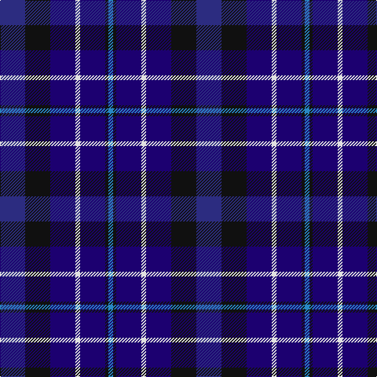

**Bands:** [BKBWBKB](/stripes/bkbwbkb/) · **Stripes:** [DB K DB W DB K T](/stripes/stripes7/) DB K DB W DB K T

This was sourced from register-of-tartans.  It is a [7 band tartan](/bands/bands7/).

Original link https://www.tartanregister.gov.uk/tartanDetails.aspx?ref=3873

## Attestations

This cloth appears in 2 source records; the oldest owns this page.

- 01/01/2007 — St. Andrew Society (register-of-tartans, [record](https://www.tartanregister.gov.uk/tartanDetails.aspx?ref=3873))
- pre 2007 — St. Andrew Society (Corporate) (tartans-authority, [record](http://www.tartansauthority.com/tartan-ferret/display/7251/))

## Register references

External register numbers recorded for this tartan.

- Scottish Register of Tartans: [3873](https://www.tartanregister.gov.uk/tartanDetails.aspx?ref=3873)
- Scottish Tartans Authority (ITI): 7251

## Thread count
DB/32 K32 DBa32 LN6 DBa32 K4 Ba/6

## Palette
Each colour and its ΔE from the base-6 reference it is a variant of.

| Colour | Shade | Base | ΔE (OKLab) |
|---|---|---|---|
| B | <code style="background-color:#1474B4;">#1474B4</code> `#1474B4` | B <code style="background-color:#2A418A;">#2A418A</code> | 0.15 |
| Ba | <code style="background-color:#2888C4;">#2888C4</code> `#2888C4` | B <code style="background-color:#2A418A;">#2A418A</code> | 0.21 |
| DB | <code style="background-color:#2C2C80;">#2C2C80</code> `#2C2C80` | B <code style="background-color:#2A418A;">#2A418A</code> | 0.06 |
| DBa | <code style="background-color:#1C0070;">#1C0070</code> `#1C0070` | B <code style="background-color:#2A418A;">#2A418A</code> | 0.14 |
| K | <code style="background-color:#101010;">#101010</code> `#101010` | K <code style="background-color:#000000;">#000000</code> | 0.17 |
| LN | <code style="background-color:#E0E0E0;">#E0E0E0</code> `#E0E0E0` | W <code style="background-color:#F7F7F7;">#F7F7F7</code> | 0.07 |
| LP | <code style="background-color:#C49CD8;">#C49CD8</code> `#C49CD8` | W <code style="background-color:#F7F7F7;">#F7F7F7</code> | 0.25 |

# Sample pattern

## Nearest tartans

The nearest existing variants by ΔTartan distance.

1. [Brodie Countryfare (Corporate)](/setts/s7/db3k13db13db13w2db13w3~x2/) — ΔT 1.20
1. [Allianz Deutschland 2012 (Corporate)](/setts/s7/db6db3db6db20k20db8w4~x2/) — ΔT 1.25
1. [Moray (Corporate)](/setts/s8/db15dp3db30k22dg18dp3dg3w3~x2/) — ΔT 1.28
1. [Romantic Scotland (Madonna)](/setts/s9/dt5dp1dt4db4dt7db8w1db2ly1~x4/) — ΔT 1.39
1. [Loyalhanna (District?)](/setts/s8/db15k3db21k3k15db2k2db15~x2/) — ΔT 1.48
1. [Daks, Muted blue](/setts/s8/o5db12db4o4db22db3db4o5/) — ΔT 1.53
1. [Rose, Danny and Hanna (Personal)](/setts/s5/lg11db19dt38r7k7~x2/) — ΔT 1.55
1. [Belfrage](/setts/s6/db22n5dr9dg14db10lo2~x2/) — ΔT 1.55
1. [Heritage of Scotland](/setts/s7/db6w3db21k16dp6k3dp6~x2/) — ΔT 1.59
1. [Blue](/setts/s7/r2db11r3db11t12db10w2~x2/) — ΔT 1.60

## Neighbour map

Every grey dot is one of 14299 variants placed by the first two principal components of the ΔTartan feature space (44% of its variance). Red is this tartan; blue dots are its nearest — click one to open its page.

<svg viewBox="0 0 640 380" role="img" style="max-width:100%;height:auto;border:1px solid #e0e0e0;border-radius:4px;display:block" xmlns="http://www.w3.org/2000/svg"><image href="/nn/cloud.v1.png" width="640" height="380"/><a href="/setts/s7/db3k13db13db13w2db13w3~x2/"><circle cx="195.1" cy="259.1" r="4" fill="#3465a4"><title>Brodie Countryfare (Corporate)</title></circle></a><a href="/setts/s7/db6db3db6db20k20db8w4~x2/"><circle cx="235.2" cy="253.3" r="4" fill="#3465a4"><title>Allianz Deutschland 2012 (Corporate)</title></circle></a><a href="/setts/s8/db15dp3db30k22dg18dp3dg3w3~x2/"><circle cx="255.1" cy="217.1" r="4" fill="#3465a4"><title>Moray (Corporate)</title></circle></a><a href="/setts/s9/dt5dp1dt4db4dt7db8w1db2ly1~x4/"><circle cx="271.7" cy="234.8" r="4" fill="#3465a4"><title>Romantic Scotland (Madonna)</title></circle></a><a href="/setts/s8/db15k3db21k3k15db2k2db15~x2/"><circle cx="258.1" cy="235.8" r="4" fill="#3465a4"><title>Loyalhanna (District?)</title></circle></a><a href="/setts/s8/o5db12db4o4db22db3db4o5/"><circle cx="281.0" cy="238.9" r="4" fill="#3465a4"><title>Daks, Muted blue</title></circle></a><a href="/setts/s5/lg11db19dt38r7k7~x2/"><circle cx="219.1" cy="262.9" r="4" fill="#3465a4"><title>Rose, Danny and Hanna (Personal)</title></circle></a><a href="/setts/s6/db22n5dr9dg14db10lo2~x2/"><circle cx="270.8" cy="247.5" r="4" fill="#3465a4"><title>Belfrage</title></circle></a><a href="/setts/s7/db6w3db21k16dp6k3dp6~x2/"><circle cx="226.2" cy="236.4" r="4" fill="#3465a4"><title>Heritage of Scotland</title></circle></a><a href="/setts/s7/r2db11r3db11t12db10w2~x2/"><circle cx="163.1" cy="237.8" r="4" fill="#3465a4"><title>Blue</title></circle></a><circle cx="215.5" cy="244.8" r="5" fill="#c00000"/></svg>

ID: /setts/s7/db16k16db16w3db16k2t3~x2/
