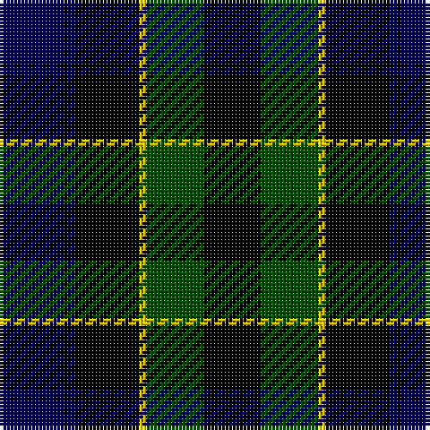

This page is one **sett** — a single exact thread-count. It belongs to the [tartan](/tartans/db18k1db2k18y2g16k16/)
(the same proportion at any scale), whose colour order is pattern [BKBKYGK](/stripes/bkbkygk/).

Sourced from weddslist.  It is a [7 stripe tartan](/stripes/stripes7/).

Original link http://www.weddslist.com/cgi-bin/tartans/pg.pl?source=rb

2 attestations — the source records this cloth was collapsed from (oldest owns this page)

<ul>
<li>undated — Mowat (weddslist, <a href="http://www.weddslist.com/cgi-bin/tartans/pg.pl?source=rb">record</a>)</li>
<li>undated — Mowat (weddslist, <a href="http://www.weddslist.com/cgi-bin/tartans/pg.pl?source=x">record</a>)</li>
</ul>

## Thread count
DB/18 K1 DB2 K18 Y2 G16 K/16

## Palette
Each colour and the base-6 reference it is a variant of.

| Colour | Shade | Base |
|---|---|---|
| DB | <code style="background-color:#00004C;">#00004C</code> `oklch(18.8% 0.130 264.1)` <small>#00004C</small> | B <code style="background-color:#2A418A;">#2A418A</code> |
| G | <code style="background-color:#004C00;">#004C00</code> `oklch(36.1% 0.123 142.5)` <small>#004C00</small> | G <code style="background-color:#006100;">#006100</code> |
| K | <code style="background-color:#000000;">#000000</code> `oklch(0.0% 0.000 0.0)` <small>#000000</small> | K <code style="background-color:#000000;">#000000</code> |
| Y | <code style="background-color:#FFC800;">#FFC800</code> `oklch(85.7% 0.175 88.5)` <small>#FFC800</small> | Y <code style="background-color:#F2BF00;">#F2BF00</code> |

# Sample pattern

## Nearest tartans

The nearest existing variants by ΔTartan distance, with this tartan at the top so the swatches line up against it.

ΔTartan

Tartan

Sett

—

<a href="/ttd/edit/#slug=db18k1db2k18ly2dg16k16">Mowat</a> <a class="nn-out" href="/setts/s7/db18k1db2k18ly2dg16k16/" title="open its dictionary page">↗</a>

0.38

<a href="/ttd/edit/#slug=db18k1db2k18ly2dg16k16~x2">Mowat</a> <a class="nn-out" href="/setts/s7/db18k1db2k18ly2dg16k16~x2/" title="open its dictionary page">↗</a>

1.15

<a href="/ttd/edit/#slug=dg14lr1dg7k7db2k2db2k2db7~x2">Abercrombie</a> <a class="nn-out" href="/setts/s9/dg14lr1dg7k7db2k2db2k2db7~x2/" title="open its dictionary page">↗</a>

1.15

<a href="/ttd/edit/#slug=dg14lr1dg7k7db2k2db2k2db7">Abercrombie</a> <a class="nn-out" href="/setts/s9/dg14lr1dg7k7db2k2db2k2db7/" title="open its dictionary page">↗</a>

1.21

<a href="/ttd/edit/#slug=dg14lb1dg7k7db2k2db2k2db7">Abercrombie</a> <a class="nn-out" href="/setts/s9/dg14lb1dg7k7db2k2db2k2db7/" title="open its dictionary page">↗</a>

1.21

<a href="/ttd/edit/#slug=k4db16k12dg24r1dg2k2~x2">Dundas</a> <a class="nn-out" href="/setts/s7/k4db16k12dg24r1dg2k2~x2/" title="open its dictionary page">↗</a>

1.24

<a href="/ttd/edit/#slug=dg16b2dg1k12db12k1~x2">Graham of Menteith</a> <a class="nn-out" href="/setts/s6/dg16b2dg1k12db12k1~x2/" title="open its dictionary page">↗</a>

1.35

<a href="/ttd/edit/#slug=dg2db12dg1k12dg12r2">Gunn</a> <a class="nn-out" href="/setts/s6/dg2db12dg1k12dg12r2/" title="open its dictionary page">↗</a>

1.35

<a href="/ttd/edit/#slug=dg14lr1dg7k7db2k2db2k2db14~x2">Abercrombie D</a> <a class="nn-out" href="/setts/s9/dg14lr1dg7k7db2k2db2k2db14~x2/" title="open its dictionary page">↗</a>

1.35

<a href="/ttd/edit/#slug=dg14lr1dg7k7db2k2db2k2db14">Abercrombie D</a> <a class="nn-out" href="/setts/s9/dg14lr1dg7k7db2k2db2k2db14/" title="open its dictionary page">↗</a>

1.38

<a href="/ttd/edit/#slug=k40dt4k12dt21g17k4~x2">Granger Family Tartan Tartan Number: 2226. Earliest known date: 1994 Designed by Steve Granger as a private family tartan. See products available Copyright © Blair Urquhart, Comrie, 2015</a> <a class="nn-out" href="/setts/s6/k40dt4k12dt21g17k4~x2/" title="open its dictionary page">↗</a>

## Neighbour map

Every grey dot is one of 14299 variants placed by the first two principal components of the ΔTartan feature space (44% of its variance). Red is this tartan; blue dots are its nearest — click one to open its page.

<svg viewBox="0 0 640 380" role="img" style="max-width:100%;height:auto;border:1px solid #e0e0e0;border-radius:4px;display:block" xmlns="http://www.w3.org/2000/svg"><image href="/nn/cloud.v1.png" width="640" height="380"/><a href="/setts/s7/db18k1db2k18ly2dg16k16~x2/"><circle cx="278.4" cy="219.9" r="4" fill="#3465a4"><title>Mowat</title></circle></a><a href="/setts/s9/dg14lr1dg7k7db2k2db2k2db7~x2/"><circle cx="268.7" cy="208.3" r="4" fill="#3465a4"><title>Abercrombie</title></circle></a><a href="/setts/s9/dg14lr1dg7k7db2k2db2k2db7/"><circle cx="268.7" cy="208.3" r="4" fill="#3465a4"><title>Abercrombie</title></circle></a><a href="/setts/s9/dg14lb1dg7k7db2k2db2k2db7/"><circle cx="256.7" cy="203.0" r="4" fill="#3465a4"><title>Abercrombie</title></circle></a><a href="/setts/s7/k4db16k12dg24r1dg2k2~x2/"><circle cx="275.4" cy="187.7" r="4" fill="#3465a4"><title>Dundas</title></circle></a><a href="/setts/s6/dg16b2dg1k12db12k1~x2/"><circle cx="243.0" cy="220.0" r="4" fill="#3465a4"><title>Graham of Menteith</title></circle></a><a href="/setts/s6/dg2db12dg1k12dg12r2/"><circle cx="203.8" cy="228.4" r="4" fill="#3465a4"><title>Gunn</title></circle></a><a href="/setts/s9/dg14lr1dg7k7db2k2db2k2db14~x2/"><circle cx="252.8" cy="207.4" r="4" fill="#3465a4"><title>Abercrombie D</title></circle></a><a href="/setts/s9/dg14lr1dg7k7db2k2db2k2db14/"><circle cx="252.8" cy="207.4" r="4" fill="#3465a4"><title>Abercrombie D</title></circle></a><a href="/setts/s6/k40dt4k12dt21g17k4~x2/"><circle cx="300.6" cy="251.2" r="4" fill="#3465a4"><title>Granger Family Tartan Tartan Number: 2226. Earliest known date: 1994 Designed by Steve Granger as a private family tartan. See products available Copyright © Blair Urquhart, Comrie, 2015</title></circle></a><circle cx="267.7" cy="214.5" r="5" fill="#c00000"/></svg>

ID: /setts/s7/db18k1db2k18ly2dg16k16/
