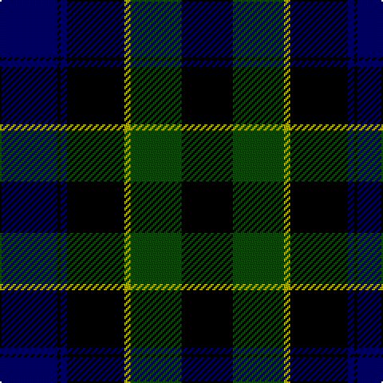

In pattern [BKBKYGK](/stripes/bkbkygk/).

This was sourced from weddslist.  It is a [7 stripe tartan](/stripes/stripes7/).

Original link http://www.weddslist.com/cgi-bin/tartans/pg.pl?source=tinsel

## Register references

External register numbers recorded for this tartan.

- Scottish Register of Tartans: [1166](https://www.tartanregister.gov.uk/tartanDetails.aspx?ref=1166)
- Scottish Register of Tartans: [1510](https://www.tartanregister.gov.uk/tartanDetails.aspx?ref=1510)
- Scottish Register of Tartans: [1758](https://www.tartanregister.gov.uk/tartanDetails.aspx?ref=1758)
- Scottish Register of Tartans: [2307](https://www.tartanregister.gov.uk/tartanDetails.aspx?ref=2307)
- Scottish Register of Tartans: [2349](https://www.tartanregister.gov.uk/tartanDetails.aspx?ref=2349)
- Scottish Register of Tartans: [2540](https://www.tartanregister.gov.uk/tartanDetails.aspx?ref=2540)
- Scottish Register of Tartans: [2582](https://www.tartanregister.gov.uk/tartanDetails.aspx?ref=2582)
- Scottish Register of Tartans: [2585](https://www.tartanregister.gov.uk/tartanDetails.aspx?ref=2585)
- Scottish Register of Tartans: [2625](https://www.tartanregister.gov.uk/tartanDetails.aspx?ref=2625)
- Scottish Register of Tartans: [2730](https://www.tartanregister.gov.uk/tartanDetails.aspx?ref=2730)
- Scottish Register of Tartans: [2862](https://www.tartanregister.gov.uk/tartanDetails.aspx?ref=2862)
- Scottish Register of Tartans: [3072](https://www.tartanregister.gov.uk/tartanDetails.aspx?ref=3072)
- Scottish Register of Tartans: [3555](https://www.tartanregister.gov.uk/tartanDetails.aspx?ref=3555)
- Scottish Register of Tartans: [4925](https://www.tartanregister.gov.uk/tartanDetails.aspx?ref=4925)
- Scottish Register of Tartans: [696](https://www.tartanregister.gov.uk/tartanDetails.aspx?ref=696)
- Scottish Register of Tartans: [697](https://www.tartanregister.gov.uk/tartanDetails.aspx?ref=697)
- Scottish Register of Tartans: [982](https://www.tartanregister.gov.uk/tartanDetails.aspx?ref=982)
- Scottish Tartans Authority (ITI): 1277
- Scottish Tartans Authority (ITI): 1429
- Scottish Tartans Authority (ITI): 218
- Scottish Tartans Authority (ITI): 977
- Scottish Tartans World Register: 1042
- Scottish Tartans World Register: 127
- Scottish Tartans World Register: 1277
- Scottish Tartans World Register: 1399
- Scottish Tartans World Register: 1429
- Scottish Tartans World Register: 1593
- Scottish Tartans World Register: 218
- Scottish Tartans World Register: 2218
- Scottish Tartans World Register: 3061
- Scottish Tartans World Register: 441
- Scottish Tartans World Register: 737
- Scottish Tartans World Register: 858
- Scottish Tartans World Register: 864
- Scottish Tartans World Register: 873
- Scottish Tartans World Register: 897
- Scottish Tartans World Register: 977
- Scottish Tartans World Register: 978

## Thread count
DB/36 K2 DB4 K36 LG4 DG32 K/32

## Palette
Each colour and its ΔE from the base-6 reference it is a variant of.

| Colour | Shade | Base | ΔE (OKLab) |
|---|---|---|---|
| DB | <code style="background-color:#000052;">#000052</code> `#000052` | B <code style="background-color:#2A418A;">#2A418A</code> | 0.20 |
| DG | <code style="background-color:#11450D;">#11450D</code> `#11450D` | G <code style="background-color:#006100;">#006100</code> | 0.09 |
| K | <code style="background-color:#000000;">#000000</code> `#000000` | K <code style="background-color:#000000;">#000000</code> | 0.00 |
| LG | <code style="background-color:#AAAA00;">#AAAA00</code> `#AAAA00` | Y <code style="background-color:#F2BF00;">#F2BF00</code> | 0.13 |

# Sample pattern

## Nearest tartans

The nearest existing variants by ΔTartan distance.

1. [Mowat](/setts/s7/db18k1db2k18ly2dg16k16/) — ΔT 0.38
1. [Abercrombie](/setts/s9/dg14lr1dg7k7db2k2db2k2db7~x2/) — ΔT 1.12
1. [Abercrombie](/setts/s9/dg14lr1dg7k7db2k2db2k2db7/) — ΔT 1.12
1. [Graham of Menteith](/setts/s6/dg16b2dg1k12db12k1~x2/) — ΔT 1.15
1. [Dundas](/setts/s7/k4db16k12dg24r1dg2k2~x2/) — ΔT 1.24
1. [Abercrombie D](/setts/s9/dg14lr1dg7k7db2k2db2k2db14~x2/) — ΔT 1.25
1. [Abercrombie D](/setts/s9/dg14lr1dg7k7db2k2db2k2db14/) — ΔT 1.25
1. [Granger Family Tartan Tartan Number: 2226. Earliest known date: 1994 Designed by Steve Granger as a private family tartan. See products available Copyright © Blair Urquhart, Comrie, 2015](/setts/s6/k40dt4k12dt21g17k4~x2/) — ΔT 1.26
1. [Abercrombie](/setts/s9/dg14lb1dg7k7db2k2db2k2db7/) — ΔT 1.31
1. [Gunn](/setts/s6/dg2db12dg1k12dg12r2~x2/) — ΔT 1.32

## Neighbour map

Every grey dot is one of 14299 variants placed by the first two principal components of the ΔTartan feature space (44% of its variance). Red is this tartan; blue dots are its nearest — click one to open its page.

<svg viewBox="0 0 640 380" role="img" style="max-width:100%;height:auto;border:1px solid #e0e0e0;border-radius:4px;display:block" xmlns="http://www.w3.org/2000/svg"><image href="/nn/cloud.v1.png" width="640" height="380"/><a href="/setts/s7/db18k1db2k18ly2dg16k16/"><circle cx="267.7" cy="214.5" r="4" fill="#3465a4"><title>Mowat</title></circle></a><a href="/setts/s9/dg14lr1dg7k7db2k2db2k2db7~x2/"><circle cx="268.7" cy="208.3" r="4" fill="#3465a4"><title>Abercrombie</title></circle></a><a href="/setts/s9/dg14lr1dg7k7db2k2db2k2db7/"><circle cx="268.7" cy="208.3" r="4" fill="#3465a4"><title>Abercrombie</title></circle></a><a href="/setts/s6/dg16b2dg1k12db12k1~x2/"><circle cx="243.0" cy="220.0" r="4" fill="#3465a4"><title>Graham of Menteith</title></circle></a><a href="/setts/s7/k4db16k12dg24r1dg2k2~x2/"><circle cx="275.4" cy="187.7" r="4" fill="#3465a4"><title>Dundas</title></circle></a><a href="/setts/s9/dg14lr1dg7k7db2k2db2k2db14~x2/"><circle cx="252.8" cy="207.4" r="4" fill="#3465a4"><title>Abercrombie D</title></circle></a><a href="/setts/s9/dg14lr1dg7k7db2k2db2k2db14/"><circle cx="252.8" cy="207.4" r="4" fill="#3465a4"><title>Abercrombie D</title></circle></a><a href="/setts/s6/k40dt4k12dt21g17k4~x2/"><circle cx="300.6" cy="251.2" r="4" fill="#3465a4"><title>Granger Family Tartan Tartan Number: 2226. Earliest known date: 1994 Designed by Steve Granger as a private family tartan. See products available Copyright © Blair Urquhart, Comrie, 2015</title></circle></a><a href="/setts/s9/dg14lb1dg7k7db2k2db2k2db7/"><circle cx="256.7" cy="203.0" r="4" fill="#3465a4"><title>Abercrombie</title></circle></a><a href="/setts/s6/dg2db12dg1k12dg12r2~x2/"><circle cx="218.1" cy="235.5" r="4" fill="#3465a4"><title>Gunn</title></circle></a><circle cx="278.4" cy="219.9" r="5" fill="#c00000"/></svg>

ID: /setts/s7/db18k1db2k18ly2dg16k16~x2/
