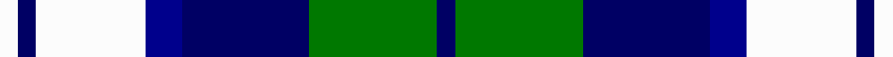
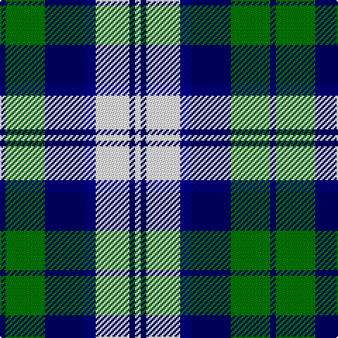

**Bands:** [BGBBWBW](/stripes/bgbbwbw/) · **Stripes:** [DB G DB DB W DB W](/stripes/stripes7/) DB G DB DB W DB W

This was sourced from tartans-authority.  It is a [7 band tartan](/bands/bands7/).

Original link http://www.tartansauthority.com/tartan-ferret/display/3705/

## Attestations

This cloth appears in 2 source records; the oldest owns this page.

- 1972 — Blue Boy, The (Fashion) (tartans-authority, [record](http://www.tartansauthority.com/tartan-ferret/display/3705/))
- undated — Blue Boy, The (register-of-tartans, [record](https://www.tartanregister.gov.uk/tartanDetails.aspx?ref=5371))

## Register references

External register numbers recorded for this tartan.

- Scottish Register of Tartans: [5371](https://www.tartanregister.gov.uk/tartanDetails.aspx?ref=5371)
- Scottish Tartans Authority (ITI): 3705

## Thread count
W/4 DBa4 W24 DB8 DBa28 G28 DBa/4

## Palette
Each colour and its ΔE from the base-6 reference it is a variant of.

| Colour | Shade | Base | ΔE (OKLab) |
|---|---|---|---|
| DB | <code style="background-color:#00008C;">#00008C</code> `#00008C` | B <code style="background-color:#2A418A;">#2A418A</code> | 0.13 |
| DBa | <code style="background-color:#000064;">#000064</code> `#000064` | B <code style="background-color:#2A418A;">#2A418A</code> | 0.18 |
| G | <code style="background-color:#007800;">#007800</code> `#007800` | G <code style="background-color:#006100;">#006100</code> | 0.07 |
| W | <code style="background-color:#FCFCFC;">#FCFCFC</code> `#FCFCFC` | W <code style="background-color:#F7F7F7;">#F7F7F7</code> | 0.01 |

# Sample pattern

## Nearest tartans

The nearest existing variants by ΔTartan distance.

1. [Strathclyde](/setts/s7/k2b16w2k16w15k2w2~x2/) — ΔT 0.95
1. [Loch Leven, Check](/setts/s6/k2g13k11t4w9k2~x2/) — ΔT 1.03
1. [Loch Leven Check Trade Tartan Tartan Number: 108. Earliest known date: 1976 Sample presented by Clan Crest Textiles Ltd in 1976. See products available Copyright © Blair Urquhart, Comrie, 2015](/setts/s6/db2g13db11t4w9db2~x2/) — ΔT 1.06
1. [Business Air](/setts/s8/b4ly2b16db15g16w3g3w4~x2/) — ΔT 1.22
1. [Bannockbane Blue #1](/setts/s8/k4lo2k13lo1w8b13lo2b4~x2/) — ΔT 1.24
1. [Thompson (Dance)](/setts/s6/b1lb6db1b3k3b1~x8/) — ΔT 1.28
1. [Strathclyde](/setts/s7/k4db2k15w10b15db2b4~x2/) — ΔT 1.32
1. [Investors Group](/setts/s10/lb7k2w2k2w2k2lb7t4k10w2~x4/) — ΔT 1.40
1. [Breton District Tartan Tartan Number: 3902. Earliest known date: 2001 Commissioned by Richard Duclos of Le Coudray-Montceaux, France and produced by House of Tartan. See products available Copyright © Blair Urquhart, Comrie, 2015](/setts/s9/g6db11w8k4w8k4w8k27w4~x2/) — ΔT 1.41
1. [Sibbald Blue (2014)](/setts/s9/dg4db22dt6w10db3w6dp4dt3w4~x2/) — ΔT 1.43

## Neighbour map

Every grey dot is one of 14299 variants placed by the first two principal components of the ΔTartan feature space (44% of its variance). Red is this tartan; blue dots are its nearest — click one to open its page.

<svg viewBox="0 0 640 380" role="img" style="max-width:100%;height:auto;border:1px solid #e0e0e0;border-radius:4px;display:block" xmlns="http://www.w3.org/2000/svg"><image href="/nn/cloud.v1.png" width="640" height="380"/><a href="/setts/s7/k2b16w2k16w15k2w2~x2/"><circle cx="129.1" cy="187.9" r="4" fill="#3465a4"><title>Strathclyde</title></circle></a><a href="/setts/s6/k2g13k11t4w9k2~x2/"><circle cx="113.1" cy="227.8" r="4" fill="#3465a4"><title>Loch Leven, Check</title></circle></a><a href="/setts/s6/db2g13db11t4w9db2~x2/"><circle cx="131.3" cy="232.4" r="4" fill="#3465a4"><title>Loch Leven Check Trade Tartan Tartan Number: 108. Earliest known date: 1976 Sample presented by Clan Crest Textiles Ltd in 1976. See products available Copyright © Blair Urquhart, Comrie, 2015</title></circle></a><a href="/setts/s8/b4ly2b16db15g16w3g3w4~x2/"><circle cx="95.4" cy="181.6" r="4" fill="#3465a4"><title>Business Air</title></circle></a><a href="/setts/s8/k4lo2k13lo1w8b13lo2b4~x2/"><circle cx="149.3" cy="172.1" r="4" fill="#3465a4"><title>Bannockbane Blue #1</title></circle></a><a href="/setts/s6/b1lb6db1b3k3b1~x8/"><circle cx="134.7" cy="214.5" r="4" fill="#3465a4"><title>Thompson (Dance)</title></circle></a><a href="/setts/s7/k4db2k15w10b15db2b4~x2/"><circle cx="129.5" cy="207.5" r="4" fill="#3465a4"><title>Strathclyde</title></circle></a><a href="/setts/s10/lb7k2w2k2w2k2lb7t4k10w2~x4/"><circle cx="119.4" cy="200.1" r="4" fill="#3465a4"><title>Investors Group</title></circle></a><a href="/setts/s9/g6db11w8k4w8k4w8k27w4~x2/"><circle cx="159.0" cy="191.1" r="4" fill="#3465a4"><title>Breton District Tartan Tartan Number: 3902. Earliest known date: 2001 Commissioned by Richard Duclos of Le Coudray-Montceaux, France and produced by House of Tartan. See products available Copyright © Blair Urquhart, Comrie, 2015</title></circle></a><a href="/setts/s9/dg4db22dt6w10db3w6dp4dt3w4~x2/"><circle cx="123.4" cy="164.9" r="4" fill="#3465a4"><title>Sibbald Blue (2014)</title></circle></a><circle cx="116.2" cy="202.4" r="5" fill="#c00000"/></svg>

ID: /setts/s7/db1g7db7db2w6db1w1~x4/
