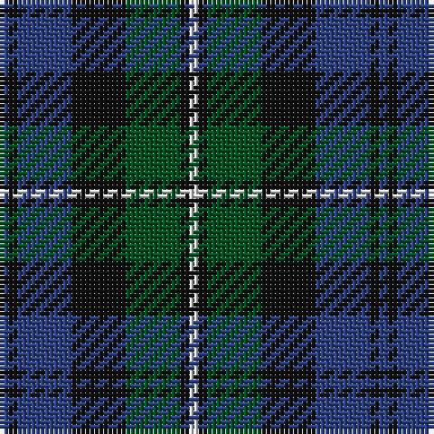

In pattern [BKBKGKW](/stripes/bkbkgkw/).

This was sourced from register-of-tartans.  It is a [7 stripe tartan](/stripes/stripes7/).

Original link https://www.tartanregister.gov.uk/tartanDetails.aspx?ref=1217

## Also known as

This cloth is also recorded under:

- Forbes #4

## Register references

External register numbers recorded for this tartan.

- Scottish Register of Tartans: [1217](https://www.tartanregister.gov.uk/tartanDetails.aspx?ref=1217)
- Scottish Tartans World Register: 301

## Thread count
B/2 K2 B12 K12 G12 K2 LN/2

## Palette
Each colour and the base-6 reference it is a variant of.

| Colour | Shade | Base |
|---|---|---|
| B | <code style="background-color:#2C4084;">#2C4084</code> `oklch(39.4% 0.117 268.3)` <small>#2C4084</small> | B <code style="background-color:#2A418A;">#2A418A</code> |
| G | <code style="background-color:#005020;">#005020</code> `oklch(37.7% 0.105 149.6)` <small>#005020</small> | G <code style="background-color:#006100;">#006100</code> |
| K | <code style="background-color:#101010;">#101010</code> `oklch(17.3% 0.000 89.9)` <small>#101010</small> | K <code style="background-color:#000000;">#000000</code> |
| LN | <code style="background-color:#E0E0E0;">#E0E0E0</code> `oklch(90.7% 0.000 89.9)` <small>#E0E0E0</small> | W <code style="background-color:#F7F7F7;">#F7F7F7</code> |

# Sample pattern

## Nearest tartans

The nearest existing variants by ΔTartan distance.

1. [Inneryne (Personal)](/setts/s7/db4k3db16k14g14r3g3~x2/) — ΔT 0.51
1. [Callum Beg (Fashion)](/setts/s6/g1db6k6g6r1g1~x6/) — ΔT 0.67
1. [Brabender](/setts/s8/k1g4r1k4db1k1db7g1~x6/) — ΔT 0.68
1. [Graham of Menteith](/setts/s6/g8b1g1k6db6k1~x4/) — ΔT 0.75
1. [Renfrew](/setts/s7/db6k2db18k18g18k3r2~x2/) — ΔT 0.75
1. [Ferguson of Balquhidder #2](/setts/s6/k4g25k24r3db24g4~x2/) — ΔT 0.76
1. [Gallamore](/setts/s6/k3db14r2k14g14k3~x2/) — ΔT 0.77
1. [Graham of Menteith (Clan)](/setts/s6/g8t1g1k6db6k1~x4/) — ΔT 0.84
1. [Campbell of Argyll (Smiths)](/setts/s6/db2k2db12k11g16w2~x2/) — ΔT 0.84
1. [Forbes #3](/setts/s9/db8k2db2k2db2k8dg7k1w1~x2/) — ΔT 0.85

## Neighbour map

Every grey dot is one of 14299 variants placed by the first two principal components of the ΔTartan feature space (44% of its variance). Red is this tartan; blue dots are its nearest — click one to open its page.

<svg viewBox="0 0 640 380" role="img" style="max-width:100%;height:auto;border:1px solid #e0e0e0;border-radius:4px;display:block" xmlns="http://www.w3.org/2000/svg"><image href="/nn/cloud.v1.png" width="640" height="380"/><a href="/setts/s7/db4k3db16k14g14r3g3~x2/"><circle cx="179.6" cy="259.6" r="4" fill="#3465a4"><title>Inneryne (Personal)</title></circle></a><a href="/setts/s6/g1db6k6g6r1g1~x6/"><circle cx="197.7" cy="260.1" r="4" fill="#3465a4"><title>Callum Beg (Fashion)</title></circle></a><a href="/setts/s8/k1g4r1k4db1k1db7g1~x6/"><circle cx="223.5" cy="233.1" r="4" fill="#3465a4"><title>Brabender</title></circle></a><a href="/setts/s6/g8b1g1k6db6k1~x4/"><circle cx="220.4" cy="250.2" r="4" fill="#3465a4"><title>Graham of Menteith</title></circle></a><a href="/setts/s7/db6k2db18k18g18k3r2~x2/"><circle cx="219.3" cy="238.9" r="4" fill="#3465a4"><title>Renfrew</title></circle></a><a href="/setts/s6/k4g25k24r3db24g4~x2/"><circle cx="204.4" cy="248.3" r="4" fill="#3465a4"><title>Ferguson of Balquhidder #2</title></circle></a><a href="/setts/s6/k3db14r2k14g14k3~x2/"><circle cx="214.2" cy="260.7" r="4" fill="#3465a4"><title>Gallamore</title></circle></a><a href="/setts/s6/g8t1g1k6db6k1~x4/"><circle cx="218.0" cy="248.8" r="4" fill="#3465a4"><title>Graham of Menteith (Clan)</title></circle></a><a href="/setts/s6/db2k2db12k11g16w2~x2/"><circle cx="184.6" cy="237.1" r="4" fill="#3465a4"><title>Campbell of Argyll (Smiths)</title></circle></a><a href="/setts/s9/db8k2db2k2db2k8dg7k1w1~x2/"><circle cx="226.4" cy="233.2" r="4" fill="#3465a4"><title>Forbes #3</title></circle></a><circle cx="191.9" cy="246.8" r="5" fill="#c00000"/></svg>

ID: /setts/s7/db1k1db6k6dg6k1w1~x2/
