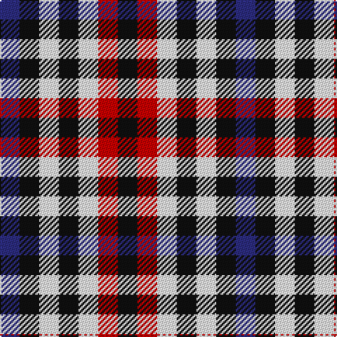

**Bands:** [BKWKWRK](/stripes/bkwkwrk/) · **Stripes:** [DB K W K W R K](/stripes/stripes7/) DB K W K W R K

This was sourced from tartans-authority.  It is a [7 band tartan](/bands/bands7/).

Original link http://www.tartansauthority.com/tartan-ferret/display/370/

## Variants

Other setts woven to the same stripe pattern.

- [Bell, South.](/setts/s7/db1k1w1k1w1r1k1~x8/)
- [Border Bell](/setts/s7/db1k1w1k1w1r1k1~x16/)

## Thread count
DB/14 K14 W14 K14 W14 R14 K/14

## Palette
Each colour and its ΔE from the base-6 reference it is a variant of.

| Colour | Shade | Base | ΔE (OKLab) |
|---|---|---|---|
| DB | <code style="background-color:#2C2C80;">#2C2C80</code> `#2C2C80` | B <code style="background-color:#2A418A;">#2A418A</code> | 0.06 |
| K | <code style="background-color:#101010;">#101010</code> `#101010` | K <code style="background-color:#000000;">#000000</code> | 0.17 |
| R | <code style="background-color:#C80000;">#C80000</code> `#C80000` | R <code style="background-color:#CC0000;">#CC0000</code> | 0.01 |
| W | <code style="background-color:#FCFCFC;">#FCFCFC</code> `#FCFCFC` | W <code style="background-color:#F7F7F7;">#F7F7F7</code> | 0.01 |

# Sample pattern

## Nearest tartans

The nearest existing variants by ΔTartan distance.

1. [Border Bell](/setts/s7/db1k1w1k1w1r1k1~x16/) — ΔT 0.00
1. [Dupplin Check](/setts/s9/do1lb1k1lb1do1lb1k1lb1r1~x6/) — ΔT 0.75
1. [Bell, South.](/setts/s7/db1k1w1k1w1r1k1~x8/) — ΔT 0.81
1. [Strathspey (Estate Check)](/setts/s9/do1w1k1w1do1w1k1w1dt1~x6/) — ΔT 1.00
1. [Buccleuch, Check](/setts/s8/db1w1k1w1k1w1k1w1~x12/) — ΔT 1.57
1. [Antonelli (Oklahoma), John (Personal)](/setts/s6/db1g1db1r1lt1k1~x25/) — ΔT 1.76
1. [Hogg](/setts/s4/k1w1do1w1~x8/) — ΔT 1.86
1. [Seaforth (Estate Check)](/setts/s9/r1o1k1o1y1o1k1o1y1~x12/) — ΔT 1.97
1. [Seaforth Estate Check Estate Check Weavers Tartan Tartan Number: 5344. Earliest known date: pre 1990 No details. See products available Copyright © Blair Urquhart, Comrie, 2015](/setts/s9/r1o1k1o1y1o1k1o1y1~x6/) — ΔT 1.97
1. [Buccleuch Check (9 squares)](/setts/s11/b5w4k4w4k4w4k4w4k4w4k4~x2/) — ΔT 2.00

## Neighbour map

Every grey dot is one of 14313 variants placed by the first two principal components of the ΔTartan feature space (44% of its variance). Red is this tartan; blue dots are its nearest — click one to open its page.

<svg viewBox="0 0 640 380" role="img" style="max-width:100%;height:auto;border:1px solid #e0e0e0;border-radius:4px;display:block" xmlns="http://www.w3.org/2000/svg"><image href="/nn/cloud.v1.png" width="640" height="380"/><a href="/setts/s7/db1k1w1k1w1r1k1~x16/"><circle cx="14.0" cy="366.0" r="4" fill="#3465a4"><title>Border Bell</title></circle></a><a href="/setts/s9/do1lb1k1lb1do1lb1k1lb1r1~x6/"><circle cx="14.0" cy="366.0" r="4" fill="#3465a4"><title>Dupplin Check</title></circle></a><a href="/setts/s7/db1k1w1k1w1r1k1~x8/"><circle cx="14.0" cy="366.0" r="4" fill="#3465a4"><title>Bell, South.</title></circle></a><a href="/setts/s9/do1w1k1w1do1w1k1w1dt1~x6/"><circle cx="14.0" cy="366.0" r="4" fill="#3465a4"><title>Strathspey (Estate Check)</title></circle></a><a href="/setts/s8/db1w1k1w1k1w1k1w1~x12/"><circle cx="27.1" cy="366.0" r="4" fill="#3465a4"><title>Buccleuch, Check</title></circle></a><a href="/setts/s6/db1g1db1r1lt1k1~x25/"><circle cx="14.0" cy="366.0" r="4" fill="#3465a4"><title>Antonelli (Oklahoma), John (Personal)</title></circle></a><a href="/setts/s4/k1w1do1w1~x8/"><circle cx="35.3" cy="366.0" r="4" fill="#3465a4"><title>Hogg</title></circle></a><a href="/setts/s9/r1o1k1o1y1o1k1o1y1~x12/"><circle cx="14.0" cy="366.0" r="4" fill="#3465a4"><title>Seaforth (Estate Check)</title></circle></a><a href="/setts/s9/r1o1k1o1y1o1k1o1y1~x6/"><circle cx="14.0" cy="366.0" r="4" fill="#3465a4"><title>Seaforth Estate Check Estate Check Weavers Tartan Tartan Number: 5344. Earliest known date: pre 1990 No details. See products available Copyright © Blair Urquhart, Comrie, 2015</title></circle></a><a href="/setts/s11/b5w4k4w4k4w4k4w4k4w4k4~x2/"><circle cx="33.2" cy="358.8" r="4" fill="#3465a4"><title>Buccleuch Check (9 squares)</title></circle></a><circle cx="14.0" cy="366.0" r="5" fill="#c00000"/></svg>

ID: /setts/s7/db1k1w1k1w1r1k1~x14/
