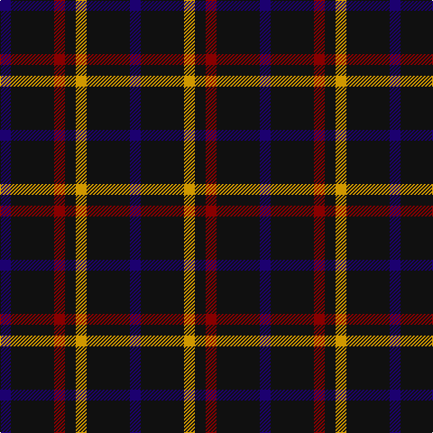

In pattern [BKRKYKB](/stripes/bkrkykb/).

This was sourced from register-of-tartans.  It is a [7 stripe tartan](/stripes/stripes7/).

Original link https://www.tartanregister.gov.uk/tartanDetails.aspx?ref=1916

## Also known as

This cloth is also recorded under:

- Justus #1

## Attestations

This cloth appears in 2 source records; the oldest owns this page.

- 01/01/1990 — Justus (Personal) (register-of-tartans, [record](https://www.tartanregister.gov.uk/tartanDetails.aspx?ref=1916))
- 1990 — Justus #1 (Personal) (tartans-authority, [record](http://www.tartansauthority.com/tartan-ferret/display/2100/))

## Register references

External register numbers recorded for this tartan.

- Scottish Register of Tartans: [1916](https://www.tartanregister.gov.uk/tartanDetails.aspx?ref=1916)
- Scottish Tartans Authority (ITI): 2100
- Scottish Tartans World Register: 2100

## Thread count
DB/12 K48 DR12 K12 DY12 K48 DB/12

## Palette
Each colour and the base-6 reference it is a variant of.

| Colour | Shade | Base |
|---|---|---|
| DB | <code style="background-color:#1C0070;">#1C0070</code> `oklch(26.3% 0.162 277.1)` <small>#1C0070</small> | B <code style="background-color:#2A418A;">#2A418A</code> |
| DR | <code style="background-color:#880000;">#880000</code> `oklch(39.4% 0.162 29.2)` <small>#880000</small> | R <code style="background-color:#CC0000;">#CC0000</code> |
| DY | <code style="background-color:#D09800;">#D09800</code> `oklch(71.4% 0.147 82.1)` <small>#D09800</small> | Y <code style="background-color:#F2BF00;">#F2BF00</code> |
| K | <code style="background-color:#101010;">#101010</code> `oklch(17.3% 0.000 89.9)` <small>#101010</small> | K <code style="background-color:#000000;">#000000</code> |

# Sample pattern

## Nearest tartans

The nearest existing variants by ΔTartan distance, with this tartan at the top so the swatches line up against it.

ΔTartan

Tartan

Sett

—

<a href="/ttd/edit/#slug=db1k4r1k1lo1k4db1~x12">Justus (Personal)</a> <a class="nn-out" href="/setts/s7/db1k4r1k1lo1k4db1~x12/" title="open its dictionary page">↗</a>

0.91

<a href="/ttd/edit/#slug=db1k4r1k1ly1k4db1~x6">Justus Family Tartan Tartan Number: 2100. Earliest known date: 1990 Submitted as the Justus family sett but awaits the approval of the proposed Justus Family Society of North America. Sample supplied in 9 tpi. See products available Copyright © Blair Urquhart, Comrie, 2015</a> <a class="nn-out" href="/setts/s7/db1k4r1k1ly1k4db1~x6/" title="open its dictionary page">↗</a>

1.69

<a href="/ttd/edit/#slug=k16b2k8r3lr3r3k8~x2">Benson (New England)</a> <a class="nn-out" href="/setts/s7/k16b2k8r3lr3r3k8~x2/" title="open its dictionary page">↗</a>

1.81

<a href="/ttd/edit/#slug=k25ly5k5g25k25b3k10~x2">London Community Gospel Choir</a> <a class="nn-out" href="/setts/s7/k25ly5k5g25k25b3k10~x2/" title="open its dictionary page">↗</a>

1.84

<a href="/ttd/edit/#slug=k17r6k2lb6k17lo2~x2">Black (symmetrical)</a> <a class="nn-out" href="/setts/s6/k17r6k2lb6k17lo2~x2/" title="open its dictionary page">↗</a>

1.92

<a href="/ttd/edit/#slug=r4k11n8dg2n8k13dg2k13r5k2~x2">Process Safety Solutions Ltd</a> <a class="nn-out" href="/setts/s10/r4k11n8dg2n8k13dg2k13r5k2~x2/" title="open its dictionary page">↗</a>

1.99

<a href="/ttd/edit/#slug=g10k3g3k20dp3k5g3k20g3k3g10~x2">Pike (Personal)</a> <a class="nn-out" href="/setts/s11/g10k3g3k20dp3k5g3k20g3k3g10~x2/" title="open its dictionary page">↗</a>

2.00

<a href="/ttd/edit/#slug=db24w4db24lo4r5k4~x2">de Grussa (Personal)</a> <a class="nn-out" href="/setts/s6/db24w4db24lo4r5k4~x2/" title="open its dictionary page">↗</a>

2.01

<a href="/ttd/edit/#slug=db6dg41db20r15dg41r15db6">Bean Hunting Clan Tartan Tartan Number: 106. Earliest known date: 1987 The weaving and wearing of this tartan is 'Restricted'. This is not a legal definition and is applied by the Scottish Tartans Society irrespective of Design Patent or Copyright, in the spirit of a gentlemans agreement. Interested parties should contact the person listed under 'Source:' in this document. See products available Copyright © Blair Urquhart, Comrie, 2015</a> <a class="nn-out" href="/setts/s7/db6dg41db20r15dg41r15db6/" title="open its dictionary page">↗</a>

2.01

<a href="/ttd/edit/#slug=t3k16dg16k16db3t3~x2">Murray</a> <a class="nn-out" href="/setts/s6/t3k16dg16k16db3t3~x2/" title="open its dictionary page">↗</a>

2.03

<a href="/ttd/edit/#slug=k25lo5k5dg25k25db3k10~x2">London Community Gospel Choir, The</a> <a class="nn-out" href="/setts/s7/k25lo5k5dg25k25db3k10~x2/" title="open its dictionary page">↗</a>

## Neighbour map

Every grey dot is one of 14299 variants placed by the first two principal components of the ΔTartan feature space (44% of its variance). Red is this tartan; blue dots are its nearest — click one to open its page.

<svg viewBox="0 0 640 380" role="img" style="max-width:100%;height:auto;border:1px solid #e0e0e0;border-radius:4px;display:block" xmlns="http://www.w3.org/2000/svg"><image href="/nn/cloud.v1.png" width="640" height="380"/><a href="/setts/s7/db1k4r1k1ly1k4db1~x6/"><circle cx="336.0" cy="255.8" r="4" fill="#3465a4"><title>Justus Family Tartan Tartan Number: 2100. Earliest known date: 1990 Submitted as the Justus family sett but awaits the approval of the proposed Justus Family Society of North America. Sample supplied in 9 tpi. See products available Copyright © Blair Urquhart, Comrie, 2015</title></circle></a><a href="/setts/s7/k16b2k8r3lr3r3k8~x2/"><circle cx="403.6" cy="228.2" r="4" fill="#3465a4"><title>Benson (New England)</title></circle></a><a href="/setts/s7/k25ly5k5g25k25b3k10~x2/"><circle cx="350.5" cy="241.7" r="4" fill="#3465a4"><title>London Community Gospel Choir</title></circle></a><a href="/setts/s6/k17r6k2lb6k17lo2~x2/"><circle cx="381.5" cy="227.4" r="4" fill="#3465a4"><title>Black (symmetrical)</title></circle></a><a href="/setts/s10/r4k11n8dg2n8k13dg2k13r5k2~x2/"><circle cx="294.1" cy="249.4" r="4" fill="#3465a4"><title>Process Safety Solutions Ltd</title></circle></a><a href="/setts/s11/g10k3g3k20dp3k5g3k20g3k3g10~x2/"><circle cx="339.1" cy="226.4" r="4" fill="#3465a4"><title>Pike (Personal)</title></circle></a><a href="/setts/s6/db24w4db24lo4r5k4~x2/"><circle cx="377.3" cy="220.5" r="4" fill="#3465a4"><title>de Grussa (Personal)</title></circle></a><a href="/setts/s7/db6dg41db20r15dg41r15db6/"><circle cx="306.4" cy="258.4" r="4" fill="#3465a4"><title>Bean Hunting Clan Tartan Tartan Number: 106. Earliest known date: 1987 The weaving and wearing of this tartan is 'Restricted'. This is not a legal definition and is applied by the Scottish Tartans Society irrespective of Design Patent or Copyright, in the spirit of a gentlemans agreement. Interested parties should contact the person listed under 'Source:' in this document. See products available Copyright © Blair Urquhart, Comrie, 2015</title></circle></a><a href="/setts/s6/t3k16dg16k16db3t3~x2/"><circle cx="300.9" cy="281.4" r="4" fill="#3465a4"><title>Murray</title></circle></a><a href="/setts/s7/k25lo5k5dg25k25db3k10~x2/"><circle cx="408.5" cy="273.4" r="4" fill="#3465a4"><title>London Community Gospel Choir, The</title></circle></a><circle cx="361.5" cy="270.9" r="5" fill="#c00000"/></svg>

ID: /setts/s7/db1k4r1k1lo1k4db1~x12/
