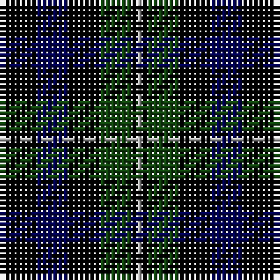

In pattern [BKBKGKY](/stripes/bkbkgky/).

This was sourced from weddslist.  It is a [7 stripe tartan](/stripes/stripes7/).

Original link http://www.weddslist.com/cgi-bin/tartans/pg.pl?source=x

## Register references

External register numbers recorded for this tartan.

- Scottish Register of Tartans: [1166](https://www.tartanregister.gov.uk/tartanDetails.aspx?ref=1166)
- Scottish Register of Tartans: [1758](https://www.tartanregister.gov.uk/tartanDetails.aspx?ref=1758)
- Scottish Register of Tartans: [2307](https://www.tartanregister.gov.uk/tartanDetails.aspx?ref=2307)
- Scottish Register of Tartans: [2540](https://www.tartanregister.gov.uk/tartanDetails.aspx?ref=2540)
- Scottish Register of Tartans: [2625](https://www.tartanregister.gov.uk/tartanDetails.aspx?ref=2625)
- Scottish Register of Tartans: [2862](https://www.tartanregister.gov.uk/tartanDetails.aspx?ref=2862)
- Scottish Register of Tartans: [982](https://www.tartanregister.gov.uk/tartanDetails.aspx?ref=982)
- Scottish Tartans Authority (ITI): 1429
- Scottish Tartans Authority (ITI): 218
- Scottish Tartans World Register: 1042
- Scottish Tartans World Register: 127
- Scottish Tartans World Register: 1429
- Scottish Tartans World Register: 218
- Scottish Tartans World Register: 2218
- Scottish Tartans World Register: 737
- Scottish Tartans World Register: 897

## Thread count
DB/1 K6 DB6 K6 DG6 K1 N/1

## Palette
Each colour and its ΔE from the base-6 reference it is a variant of.

| Colour | Shade | Base | ΔE (OKLab) |
|---|---|---|---|
| DB | <code style="background-color:#000052;">#000052</code> `#000052` | B <code style="background-color:#2A418A;">#2A418A</code> | 0.20 |
| DG | <code style="background-color:#11450D;">#11450D</code> `#11450D` | G <code style="background-color:#006100;">#006100</code> | 0.09 |
| K | <code style="background-color:#000000;">#000000</code> `#000000` | K <code style="background-color:#000000;">#000000</code> | 0.00 |
| N | <code style="background-color:#AAAAAA;">#AAAAAA</code> `#AAAAAA` | Y <code style="background-color:#F2BF00;">#F2BF00</code> | 0.19 |

# Sample pattern

## Nearest tartans

The nearest existing variants by ΔTartan distance.

1. [Forbes LC](/setts/s7/db1k6db6k6dg6k1lr1~x2/) — ΔT 0.00
1. [Forbes LC](/setts/s7/db1k6db6k6dg6k1lb1/) — ΔT 0.36
1. [Printing Industries of America](/setts/s8/k7r2k2k6lo1k1lo1k4~x4/) — ΔT 0.94
1. [MacCallum](/setts/s7/dg8k2b1dg4k6db6k1~x2/) — ΔT 0.95
1. [Fletcher](/setts/s7/db6k1db6k8r1dg8k2/) — ΔT 1.05
1. [Fletcher](/setts/s7/db6k1db6k8r1dg8k2~x2/) — ΔT 1.18
1. [MacCallum](/setts/s7/dg8k2lb1dg4k6db6k1~x2/) — ΔT 1.19
1. [Fletcher C](/setts/s7/db6k1db6k8r1dg8r2~x2/) — ΔT 1.22
1. [Fletcher C](/setts/s7/db6k1db6k8r1dg8r2/) — ΔT 1.28
1. [Forbes - 1947 (Lyon Court)](/setts/s7/db1k6db6k6g6k1w1~x6/) — ΔT 1.32

## Neighbour map

Every grey dot is one of 14299 variants placed by the first two principal components of the ΔTartan feature space (44% of its variance). Red is this tartan; blue dots are its nearest — click one to open its page.

<svg viewBox="0 0 640 380" role="img" style="max-width:100%;height:auto;border:1px solid #e0e0e0;border-radius:4px;display:block" xmlns="http://www.w3.org/2000/svg"><image href="/nn/cloud.v1.png" width="640" height="380"/><a href="/setts/s7/db1k6db6k6dg6k1lr1~x2/"><circle cx="222.9" cy="263.8" r="4" fill="#3465a4"><title>Forbes LC</title></circle></a><a href="/setts/s7/db1k6db6k6dg6k1lb1/"><circle cx="212.6" cy="258.9" r="4" fill="#3465a4"><title>Forbes LC</title></circle></a><a href="/setts/s8/k7r2k2k6lo1k1lo1k4~x4/"><circle cx="231.3" cy="236.5" r="4" fill="#3465a4"><title>Printing Industries of America</title></circle></a><a href="/setts/s7/dg8k2b1dg4k6db6k1~x2/"><circle cx="216.5" cy="256.2" r="4" fill="#3465a4"><title>MacCallum</title></circle></a><a href="/setts/s7/db6k1db6k8r1dg8k2/"><circle cx="197.2" cy="257.1" r="4" fill="#3465a4"><title>Fletcher</title></circle></a><a href="/setts/s7/db6k1db6k8r1dg8k2~x2/"><circle cx="205.3" cy="261.0" r="4" fill="#3465a4"><title>Fletcher</title></circle></a><a href="/setts/s7/dg8k2lb1dg4k6db6k1~x2/"><circle cx="194.4" cy="245.0" r="4" fill="#3465a4"><title>MacCallum</title></circle></a><a href="/setts/s7/db6k1db6k8r1dg8r2~x2/"><circle cx="183.2" cy="251.1" r="4" fill="#3465a4"><title>Fletcher C</title></circle></a><a href="/setts/s7/db6k1db6k8r1dg8r2/"><circle cx="168.2" cy="243.1" r="4" fill="#3465a4"><title>Fletcher C</title></circle></a><a href="/setts/s7/db1k6db6k6g6k1w1~x6/"><circle cx="216.3" cy="253.9" r="4" fill="#3465a4"><title>Forbes - 1947 (Lyon Court)</title></circle></a><circle cx="222.9" cy="263.8" r="5" fill="#c00000"/></svg>

ID: /setts/s7/db1k6db6k6dg6k1lr1/
