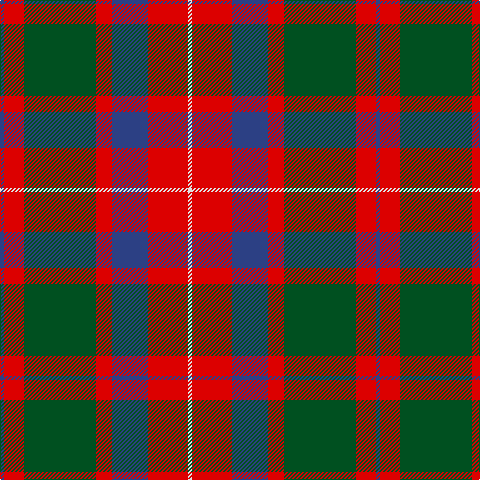

**Bands:** [BRGRBRW](/stripes/brgrbrw/) · **Stripes:** [DB R DG R DB R W](/stripes/stripes7/) DB R DG R DB R W

This was sourced from register-of-tartans.  It is a [7 band tartan](/bands/bands7/).

Original link https://www.tartanregister.gov.uk/tartanDetails.aspx?ref=2573

## Also known as

This cloth is also recorded under:

- MacKintosh, Geddes

## Register references

External register numbers recorded for this tartan.

- Scottish Register of Tartans: [2573](https://www.tartanregister.gov.uk/tartanDetails.aspx?ref=2573)
- Scottish Tartans World Register: 543

## Thread count
B/4 R20 G72 R16 B36 R40 LN/4

## Palette
Each colour and its ΔE from the base-6 reference it is a variant of.

| Colour | Shade | Base | ΔE (OKLab) |
|---|---|---|---|
| B | <code style="background-color:#2C4084;">#2C4084</code> `#2C4084` | B <code style="background-color:#2A418A;">#2A418A</code> | 0.01 |
| G | <code style="background-color:#005020;">#005020</code> `#005020` | G <code style="background-color:#006100;">#006100</code> | 0.07 |
| LN | <code style="background-color:#E0E0E0;">#E0E0E0</code> `#E0E0E0` | W <code style="background-color:#F7F7F7;">#F7F7F7</code> | 0.07 |
| R | <code style="background-color:#DC0000;">#DC0000</code> `#DC0000` | R <code style="background-color:#CC0000;">#CC0000</code> | 0.03 |

# Sample pattern

## Nearest tartans

The nearest existing variants by ΔTartan distance.

1. [Geddes](/setts/s7/dp1r5g15r3dp9r10w1~x4/) — ΔT 0.60
1. [Logan with Yellow](/setts/s7/dp8r3ly1r3g14r3ly1~x4/) — ΔT 0.67
1. [Cook (Name)](/setts/s7/dg12g6dg6r15k1r1k2~x2/) — ΔT 0.67
1. [MacKintosh, Geddes](/setts/s7/db1r5g18r4db9r10w1~x4/) — ΔT 0.73
1. [Cranston Dress](/setts/s8/r15db2r1db2r3db7g13g3~x2/) — ΔT 0.76
1. [Unidentified #15](/setts/s6/k6r2dg17r16k1t2~x2/) — ΔT 0.76
1. [Wyeth (Personal)](/setts/s8/db18r18dp2g12db1~x4/) — ΔT 0.77
1. [Skene, of Cromar](/setts/s8/k4r37db37r2db37g37r37k4/) — ΔT 0.78
1. [Logan - 1819 (with yellow)](/setts/s7/dp8r3ly1r3dg14r3ly1~x4/) — ΔT 0.79
1. [Abernethy (Colerain USA) (Personal)](/setts/s7/lo1db14r28g14r1g14lo1~x2/) — ΔT 0.81

## Neighbour map

Every grey dot is one of 14299 variants placed by the first two principal components of the ΔTartan feature space (44% of its variance). Red is this tartan; blue dots are its nearest — click one to open its page.

<svg viewBox="0 0 640 380" role="img" style="max-width:100%;height:auto;border:1px solid #e0e0e0;border-radius:4px;display:block" xmlns="http://www.w3.org/2000/svg"><image href="/nn/cloud.v1.png" width="640" height="380"/><a href="/setts/s7/dp1r5g15r3dp9r10w1~x4/"><circle cx="243.5" cy="187.3" r="4" fill="#3465a4"><title>Geddes</title></circle></a><a href="/setts/s7/dp8r3ly1r3g14r3ly1~x4/"><circle cx="247.4" cy="177.9" r="4" fill="#3465a4"><title>Logan with Yellow</title></circle></a><a href="/setts/s7/dg12g6dg6r15k1r1k2~x2/"><circle cx="253.2" cy="191.0" r="4" fill="#3465a4"><title>Cook (Name)</title></circle></a><a href="/setts/s7/db1r5g18r4db9r10w1~x4/"><circle cx="249.2" cy="182.2" r="4" fill="#3465a4"><title>MacKintosh, Geddes</title></circle></a><a href="/setts/s8/r15db2r1db2r3db7g13g3~x2/"><circle cx="229.4" cy="169.2" r="4" fill="#3465a4"><title>Cranston Dress</title></circle></a><a href="/setts/s6/k6r2dg17r16k1t2~x2/"><circle cx="258.7" cy="178.4" r="4" fill="#3465a4"><title>Unidentified #15</title></circle></a><a href="/setts/s8/db18r18dp2g12db1~x4/"><circle cx="251.9" cy="188.6" r="4" fill="#3465a4"><title>Wyeth (Personal)</title></circle></a><a href="/setts/s8/k4r37db37r2db37g37r37k4/"><circle cx="228.8" cy="188.1" r="4" fill="#3465a4"><title>Skene, of Cromar</title></circle></a><a href="/setts/s7/dp8r3ly1r3dg14r3ly1~x4/"><circle cx="248.6" cy="180.2" r="4" fill="#3465a4"><title>Logan - 1819 (with yellow)</title></circle></a><a href="/setts/s7/lo1db14r28g14r1g14lo1~x2/"><circle cx="278.9" cy="161.8" r="4" fill="#3465a4"><title>Abernethy (Colerain USA) (Personal)</title></circle></a><circle cx="249.9" cy="180.0" r="5" fill="#c00000"/></svg>

ID: /setts/s7/db1r5dg18r4db9r10w1~x4/
