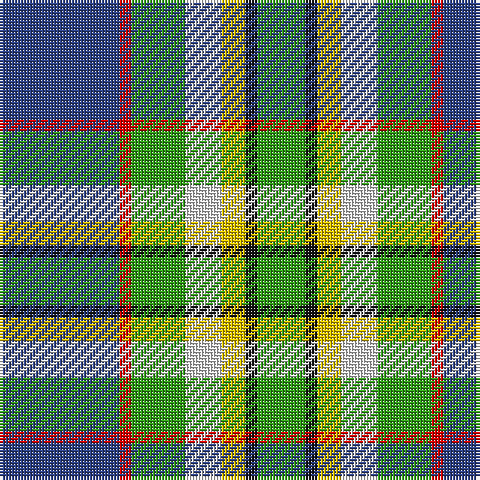

In pattern [BRGWYKG](/stripes/brgwykg/).

This was sourced from register-of-tartans.  It is a [7 stripe tartan](/stripes/stripes7/).

Original link https://www.tartanregister.gov.uk/tartanDetails.aspx?ref=5879

## Attestations

This cloth appears in 2 source records; the oldest owns this page.

- 01/03/2005 — Crofters (Personal) (register-of-tartans, [record](https://www.tartanregister.gov.uk/tartanDetails.aspx?ref=5879))
- pre 2006 — Crofters (Corporate?) (tartans-authority, [record](http://www.tartansauthority.com/tartan-ferret/display/7068/))

## Register references

External register numbers recorded for this tartan.

- Scottish Register of Tartans: [5879](https://www.tartanregister.gov.uk/tartanDetails.aspx?ref=5879)
- Scottish Tartans Authority (ITI): 7068
- Scottish Tartans World Register: 3146

## Thread count
B/40 R4 G18 LN12 Y8 K4 G/16

## Palette
Each colour and the base-6 reference it is a variant of.

| Colour | Shade | Base |
|---|---|---|
| B | <code style="background-color:#2C4084;">#2C4084</code> `oklch(39.4% 0.117 268.3)` <small>#2C4084</small> | B <code style="background-color:#2A418A;">#2A418A</code> |
| G | <code style="background-color:#309C18;">#309C18</code> `oklch(60.8% 0.188 140.8)` <small>#309C18</small> | G <code style="background-color:#006100;">#006100</code> |
| K | <code style="background-color:#101010;">#101010</code> `oklch(17.3% 0.000 89.9)` <small>#101010</small> | K <code style="background-color:#000000;">#000000</code> |
| LN | <code style="background-color:#E0E0E0;">#E0E0E0</code> `oklch(90.7% 0.000 89.9)` <small>#E0E0E0</small> | W <code style="background-color:#F7F7F7;">#F7F7F7</code> |
| R | <code style="background-color:#DC0000;">#DC0000</code> `oklch(56.2% 0.230 29.2)` <small>#DC0000</small> | R <code style="background-color:#CC0000;">#CC0000</code> |
| Y | <code style="background-color:#E8C000;">#E8C000</code> `oklch(81.9% 0.168 93.7)` <small>#E8C000</small> | Y <code style="background-color:#F2BF00;">#F2BF00</code> |

# Sample pattern

## Nearest tartans

The nearest existing variants by ΔTartan distance, with this tartan at the top so the swatches line up against it.

ΔTartan

Tartan

Sett

—

<a href="/ttd/edit/#slug=db20r2g9w6ly4k2g8~x2">Crofters (Personal)</a> <a class="nn-out" href="/setts/s7/db20r2g9w6ly4k2g8~x2/" title="open its dictionary page">↗</a>

0.85

<a href="/ttd/edit/#slug=g20g6w15dt5w2dt15o4dt10r2~x2">Copar a'Beannichte Dress (Personal)</a> <a class="nn-out" href="/setts/s9/g20g6w15dt5w2dt15o4dt10r2~x2/" title="open its dictionary page">↗</a>

0.86

<a href="/ttd/edit/#slug=k3ly3db20g25lb18w3~x2">Porteous (Clan)</a> <a class="nn-out" href="/setts/s6/k3ly3db20g25lb18w3~x2/" title="open its dictionary page">↗</a>

0.89

<a href="/ttd/edit/#slug=dt36y20dg6w12k6r3~x2">Sirens &amp; Swords</a> <a class="nn-out" href="/setts/s6/dt36y20dg6w12k6r3~x2/" title="open its dictionary page">↗</a>

0.99

<a href="/ttd/edit/#slug=db2w12k8g8r2g8k1lo2~x2">MacLaren Dress</a> <a class="nn-out" href="/setts/s8/db2w12k8g8r2g8k1lo2~x2/" title="open its dictionary page">↗</a>

1.05

<a href="/ttd/edit/#slug=k6r3g30ly10db30w3~x2">Turnbull of Thornton (Personal)</a> <a class="nn-out" href="/setts/s6/k6r3g30ly10db30w3~x2/" title="open its dictionary page">↗</a>

1.05

<a href="/ttd/edit/#slug=db2r1db10w1y4g8lo1g2~x4">Ayrshire (District)</a> <a class="nn-out" href="/setts/s8/db2r1db10w1y4g8lo1g2~x4/" title="open its dictionary page">↗</a>

1.07

<a href="/ttd/edit/#slug=m5g2m2g26k9lr9lb13w5~x2">Alexander of Menstry Hunting</a> <a class="nn-out" href="/setts/s8/m5g2m2g26k9lr9lb13w5~x2/" title="open its dictionary page">↗</a>

1.07

<a href="/ttd/edit/#slug=o5dt30w3dg15ly8r4~x2">Carleton College Rugby</a> <a class="nn-out" href="/setts/s6/o5dt30w3dg15ly8r4~x2/" title="open its dictionary page">↗</a>

1.10

<a href="/ttd/edit/#slug=r6b2g20k3db8g2b4~x2">Royal British Legion, The</a> <a class="nn-out" href="/setts/s7/r6b2g20k3db8g2b4~x2/" title="open its dictionary page">↗</a>

1.12

<a href="/ttd/edit/#slug=db8w33k15dg17t3dg17t3~x2">MacRobart Dress (Personal)</a> <a class="nn-out" href="/setts/s7/db8w33k15dg17t3dg17t3~x2/" title="open its dictionary page">↗</a>

## Neighbour map

Every grey dot is one of 14299 variants placed by the first two principal components of the ΔTartan feature space (44% of its variance). Red is this tartan; blue dots are its nearest — click one to open its page.

<svg viewBox="0 0 640 380" role="img" style="max-width:100%;height:auto;border:1px solid #e0e0e0;border-radius:4px;display:block" xmlns="http://www.w3.org/2000/svg"><image href="/nn/cloud.v1.png" width="640" height="380"/><a href="/setts/s9/g20g6w15dt5w2dt15o4dt10r2~x2/"><circle cx="107.8" cy="165.8" r="4" fill="#3465a4"><title>Copar a'Beannichte Dress (Personal)</title></circle></a><a href="/setts/s6/k3ly3db20g25lb18w3~x2/"><circle cx="99.1" cy="179.0" r="4" fill="#3465a4"><title>Porteous (Clan)</title></circle></a><a href="/setts/s6/dt36y20dg6w12k6r3~x2/"><circle cx="154.2" cy="162.6" r="4" fill="#3465a4"><title>Sirens &amp; Swords</title></circle></a><a href="/setts/s8/db2w12k8g8r2g8k1lo2~x2/"><circle cx="98.0" cy="144.7" r="4" fill="#3465a4"><title>MacLaren Dress</title></circle></a><a href="/setts/s6/k6r3g30ly10db30w3~x2/"><circle cx="143.9" cy="173.0" r="4" fill="#3465a4"><title>Turnbull of Thornton (Personal)</title></circle></a><a href="/setts/s8/db2r1db10w1y4g8lo1g2~x4/"><circle cx="152.8" cy="153.2" r="4" fill="#3465a4"><title>Ayrshire (District)</title></circle></a><a href="/setts/s8/m5g2m2g26k9lr9lb13w5~x2/"><circle cx="132.4" cy="145.8" r="4" fill="#3465a4"><title>Alexander of Menstry Hunting</title></circle></a><a href="/setts/s6/o5dt30w3dg15ly8r4~x2/"><circle cx="172.0" cy="167.9" r="4" fill="#3465a4"><title>Carleton College Rugby</title></circle></a><a href="/setts/s7/r6b2g20k3db8g2b4~x2/"><circle cx="168.6" cy="164.2" r="4" fill="#3465a4"><title>Royal British Legion, The</title></circle></a><a href="/setts/s7/db8w33k15dg17t3dg17t3~x2/"><circle cx="114.9" cy="174.8" r="4" fill="#3465a4"><title>MacRobart Dress (Personal)</title></circle></a><circle cx="130.5" cy="163.7" r="5" fill="#c00000"/></svg>

ID: /setts/s7/db20r2g9w6ly4k2g8~x2/
