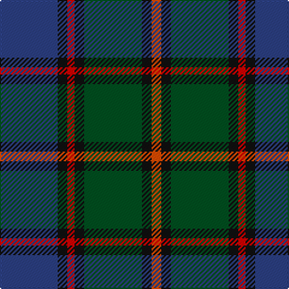

**Bands:** [BKRKGKR](/stripes/bkrkgkr/) · **Stripes:** [DB K R K DG K R](/stripes/stripes7/) DB K R K DG K R

This was sourced from register-of-tartans.  It is a [7 band tartan](/bands/bands7/).

Original link https://www.tartanregister.gov.uk/tartanDetails.aspx?ref=3802

## Register references

External register numbers recorded for this tartan.

- Scottish Register of Tartans: [3802](https://www.tartanregister.gov.uk/tartanDetails.aspx?ref=3802)
- Scottish Tartans World Register: 363

## Thread count
B/48 K8 R6 K8 G48 K8 Ra/8

## Palette
Each colour and its ΔE from the base-6 reference it is a variant of.

| Colour | Shade | Base | ΔE (OKLab) |
|---|---|---|---|
| B | <code style="background-color:#2C4084;">#2C4084</code> `#2C4084` | B <code style="background-color:#2A418A;">#2A418A</code> | 0.01 |
| G | <code style="background-color:#005020;">#005020</code> `#005020` | G <code style="background-color:#006100;">#006100</code> | 0.07 |
| K | <code style="background-color:#101010;">#101010</code> `#101010` | K <code style="background-color:#000000;">#000000</code> | 0.17 |
| R | <code style="background-color:#DC0000;">#DC0000</code> `#DC0000` | R <code style="background-color:#CC0000;">#CC0000</code> | 0.03 |
| Ra | <code style="background-color:#FA4B00;">#FA4B00</code> `#FA4B00` | R <code style="background-color:#CC0000;">#CC0000</code> | 0.13 |

# Sample pattern

## Nearest tartans

The nearest existing variants by ΔTartan distance.

1. [McEwan '1856', The](/setts/s7/db2dy3db16k18g18k2r2~x2/) — ΔT 0.59
1. [Antique 2000](/setts/s8/dt10r1dt1r1dt1k6y9b2~x2/) — ΔT 0.64
1. [Wood (Personal)](/setts/s8/g11t3g5r3g5k22db22k5~x2/) — ΔT 0.80
1. [Scotch House 2000 Original](/setts/s8/db22r3db2r3db2k17g18lo4~x2/) — ΔT 0.81
1. [MacLeod Small Clan Tartan Tartan Number: 15833. Earliest known date: See products available Copyright © Blair Urquhart, Comrie, 2015](/setts/s7/ly1k1db10k5g7k1r1~x2/) — ΔT 0.85
1. [Greenock](/setts/s7/g2k2g17k16r2db17ly2~x2/) — ΔT 0.87
1. [MacPhail Hunting](/setts/s6/r2db23k14dg16k2w2~x2/) — ΔT 0.89
1. [Mantle (Personal)](/setts/s8/g3db16w2k14g18r3g2r3~x2/) — ΔT 0.89
1. [MacDonald (Flora.. )](/setts/s7/dg17ly2k14r2db9r2db10~x2/) — ΔT 0.92
1. [Lyle and Scott](/setts/s6/dg5b2dg9dt19r9ly2~x2/) — ΔT 0.95

## Neighbour map

Every grey dot is one of 14313 variants placed by the first two principal components of the ΔTartan feature space (44% of its variance). Red is this tartan; blue dots are its nearest — click one to open its page.

<svg viewBox="0 0 640 380" role="img" style="max-width:100%;height:auto;border:1px solid #e0e0e0;border-radius:4px;display:block" xmlns="http://www.w3.org/2000/svg"><image href="/nn/cloud.v1.png" width="640" height="380"/><a href="/setts/s7/db2dy3db16k18g18k2r2~x2/"><circle cx="186.4" cy="214.3" r="4" fill="#3465a4"><title>McEwan '1856', The</title></circle></a><a href="/setts/s8/dt10r1dt1r1dt1k6y9b2~x2/"><circle cx="204.1" cy="189.3" r="4" fill="#3465a4"><title>Antique 2000</title></circle></a><a href="/setts/s8/g11t3g5r3g5k22db22k5~x2/"><circle cx="172.3" cy="216.7" r="4" fill="#3465a4"><title>Wood (Personal)</title></circle></a><a href="/setts/s8/db22r3db2r3db2k17g18lo4~x2/"><circle cx="188.2" cy="189.2" r="4" fill="#3465a4"><title>Scotch House 2000 Original</title></circle></a><a href="/setts/s7/ly1k1db10k5g7k1r1~x2/"><circle cx="196.2" cy="194.4" r="4" fill="#3465a4"><title>MacLeod Small Clan Tartan Tartan Number: 15833. Earliest known date: See products available Copyright © Blair Urquhart, Comrie, 2015</title></circle></a><a href="/setts/s7/g2k2g17k16r2db17ly2~x2/"><circle cx="166.8" cy="203.9" r="4" fill="#3465a4"><title>Greenock</title></circle></a><a href="/setts/s6/r2db23k14dg16k2w2~x2/"><circle cx="214.8" cy="209.7" r="4" fill="#3465a4"><title>MacPhail Hunting</title></circle></a><a href="/setts/s8/g3db16w2k14g18r3g2r3~x2/"><circle cx="174.5" cy="195.7" r="4" fill="#3465a4"><title>Mantle (Personal)</title></circle></a><a href="/setts/s7/dg17ly2k14r2db9r2db10~x2/"><circle cx="160.7" cy="220.4" r="4" fill="#3465a4"><title>MacDonald (Flora.. )</title></circle></a><a href="/setts/s6/dg5b2dg9dt19r9ly2~x2/"><circle cx="220.3" cy="225.4" r="4" fill="#3465a4"><title>Lyle and Scott</title></circle></a><circle cx="200.8" cy="207.7" r="5" fill="#c00000"/></svg>

ID: /setts/s7/db24k4r3k4dg24k4r4~x2/
