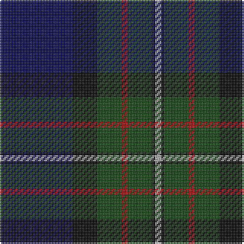

In pattern [BKGRGKY](/stripes/bkgrgky/).

This was sourced from weddslist.  It is a [7 stripe tartan](/stripes/stripes7/).

Original link http://www.weddslist.com/cgi-bin/tartans/pg.pl?source=tinsel

## Thread count
DB/48 K16 DG16 DR4 DG16 K2 N/4

## Palette
Each colour and the base-6 reference it is a variant of.

| Colour | Shade | Base |
|---|---|---|
| DB | <code style="background-color:#000052;">#000052</code> `oklch(19.8% 0.137 264.1)` <small>#000052</small> | B <code style="background-color:#2A418A;">#2A418A</code> |
| DG | <code style="background-color:#11450D;">#11450D</code> `oklch(34.4% 0.101 142.1)` <small>#11450D</small> | G <code style="background-color:#006100;">#006100</code> |
| DR | <code style="background-color:#AA0000;">#AA0000</code> `oklch(46.3% 0.190 29.2)` <small>#AA0000</small> | R <code style="background-color:#CC0000;">#CC0000</code> |
| K | <code style="background-color:#000000;">#000000</code> `oklch(0.0% 0.000 0.0)` <small>#000000</small> | K <code style="background-color:#000000;">#000000</code> |
| N | <code style="background-color:#AAAAAA;">#AAAAAA</code> `oklch(73.8% 0.000 89.9)` <small>#AAAAAA</small> | Y <code style="background-color:#F2BF00;">#F2BF00</code> |

# Sample pattern

## Nearest tartans

The nearest existing variants by ΔTartan distance, with this tartan at the top so the swatches line up against it.

ΔTartan

Tartan

Sett

—

<a href="/ttd/edit/#slug=db24k8dg8r2dg8k1lr2~x2">Fergusson</a> <a class="nn-out" href="/setts/s7/db24k8dg8r2dg8k1lr2~x2/" title="open its dictionary page">↗</a>

0.00

<a href="/ttd/edit/#slug=db24k8dg8r2dg8k1lr2">Fergusson</a> <a class="nn-out" href="/setts/s7/db24k8dg8r2dg8k1lr2/" title="open its dictionary page">↗</a>

0.12

<a href="/ttd/edit/#slug=db24k8dg8r2dg8k1ly2~x2">MacLaren</a> <a class="nn-out" href="/setts/s7/db24k8dg8r2dg8k1ly2~x2/" title="open its dictionary page">↗</a>

0.50

<a href="/ttd/edit/#slug=db24k8dg8r2dg8k1lb2">Fergusson</a> <a class="nn-out" href="/setts/s7/db24k8dg8r2dg8k1lb2/" title="open its dictionary page">↗</a>

0.63

<a href="/ttd/edit/#slug=db24k8dg8r2dg8k1ly2">MacLaren</a> <a class="nn-out" href="/setts/s7/db24k8dg8r2dg8k1ly2/" title="open its dictionary page">↗</a>

0.66

<a href="/ttd/edit/#slug=db4k2db16lr1k8dg24r4~x2">Colqhoun VS</a> <a class="nn-out" href="/setts/s7/db4k2db16lr1k8dg24r4~x2/" title="open its dictionary page">↗</a>

0.82

<a href="/ttd/edit/#slug=db4k2db16lb1k8dg24r4">Colquhoun VS</a> <a class="nn-out" href="/setts/s7/db4k2db16lb1k8dg24r4/" title="open its dictionary page">↗</a>

0.86

<a href="/ttd/edit/#slug=k6db3dg28w1db28db2w3~x2">Weisfeld</a> <a class="nn-out" href="/setts/s7/k6db3dg28w1db28db2w3~x2/" title="open its dictionary page">↗</a>

0.87

<a href="/ttd/edit/#slug=db28ly1db2k16dg24k1dg2r3~x2">Ogilvy VS</a> <a class="nn-out" href="/setts/s8/db28ly1db2k16dg24k1dg2r3~x2/" title="open its dictionary page">↗</a>

0.88

<a href="/ttd/edit/#slug=db24k8g8dp2g8k1w2~x2">Alexander</a> <a class="nn-out" href="/setts/s7/db24k8g8dp2g8k1w2~x2/" title="open its dictionary page">↗</a>

0.97

<a href="/ttd/edit/#slug=k10r4dg34db34k1lo3~x2">Singh, Gopal (Personal)</a> <a class="nn-out" href="/setts/s6/k10r4dg34db34k1lo3~x2/" title="open its dictionary page">↗</a>

## Neighbour map

Every grey dot is one of 14299 variants placed by the first two principal components of the ΔTartan feature space (44% of its variance). Red is this tartan; blue dots are its nearest — click one to open its page.

<svg viewBox="0 0 640 380" role="img" style="max-width:100%;height:auto;border:1px solid #e0e0e0;border-radius:4px;display:block" xmlns="http://www.w3.org/2000/svg"><image href="/nn/cloud.v1.png" width="640" height="380"/><a href="/setts/s7/db24k8dg8r2dg8k1lr2/"><circle cx="268.1" cy="169.3" r="4" fill="#3465a4"><title>Fergusson</title></circle></a><a href="/setts/s7/db24k8dg8r2dg8k1ly2~x2/"><circle cx="267.5" cy="169.2" r="4" fill="#3465a4"><title>MacLaren</title></circle></a><a href="/setts/s7/db24k8dg8r2dg8k1lb2/"><circle cx="254.2" cy="162.3" r="4" fill="#3465a4"><title>Fergusson</title></circle></a><a href="/setts/s7/db24k8dg8r2dg8k1ly2/"><circle cx="249.8" cy="159.7" r="4" fill="#3465a4"><title>MacLaren</title></circle></a><a href="/setts/s7/db4k2db16lr1k8dg24r4~x2/"><circle cx="248.6" cy="171.1" r="4" fill="#3465a4"><title>Colqhoun VS</title></circle></a><a href="/setts/s7/db4k2db16lb1k8dg24r4/"><circle cx="232.7" cy="163.1" r="4" fill="#3465a4"><title>Colquhoun VS</title></circle></a><a href="/setts/s7/k6db3dg28w1db28db2w3~x2/"><circle cx="253.9" cy="149.1" r="4" fill="#3465a4"><title>Weisfeld</title></circle></a><a href="/setts/s8/db28ly1db2k16dg24k1dg2r3~x2/"><circle cx="250.2" cy="147.2" r="4" fill="#3465a4"><title>Ogilvy VS</title></circle></a><a href="/setts/s7/db24k8g8dp2g8k1w2~x2/"><circle cx="255.0" cy="159.1" r="4" fill="#3465a4"><title>Alexander</title></circle></a><a href="/setts/s6/k10r4dg34db34k1lo3~x2/"><circle cx="282.0" cy="168.7" r="4" fill="#3465a4"><title>Singh, Gopal (Personal)</title></circle></a><circle cx="268.1" cy="169.3" r="5" fill="#c00000"/></svg>

ID: /setts/s7/db24k8dg8r2dg8k1lr2~x2/
