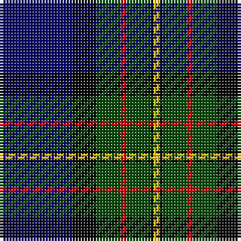

This page is one **sett** — a single exact thread-count. It belongs to the [tartan](/tartans/db24k8dg8r2dg8k1ly2/)
(the same proportion at any scale), whose colour order is pattern [BKGRGKY](/stripes/bkgrgky/).

Sourced from weddslist.  It is a [7 stripe tartan](/stripes/stripes7/).

Original link http://www.weddslist.com/cgi-bin/tartans/pg.pl?source=rb

2 attestations — the source records this cloth was collapsed from (oldest owns this page)

<ul>
<li>undated — MacLaren (weddslist, <a href="http://www.weddslist.com/cgi-bin/tartans/pg.pl?source=rb">record</a>)</li>
<li>undated — MacLaren (weddslist, <a href="http://www.weddslist.com/cgi-bin/tartans/pg.pl?source=x">record</a>)</li>
</ul>

## Thread count
DB/24 K8 G8 R2 G8 K1 Y/2

## Palette

Palette: <strong>Tartan Register</strong> <small style="color:#888">(4 of 5 colours)</small>
<table><thead><tr><th>Colour</th><th>Threads</th><th>Shade</th><th>Base</th><th>OKLCh</th></tr></thead><tbody><tr><td>DB/</td><td style="text-align:right;font-variant-numeric:tabular-nums">24</td><td><code style="background-color:#000064;">#000064</code> <small style="color:#888">#000064</small></td><td>B <code style="background-color:#2A418A;">#2A418A</code></td><td><small style="color:#888">oklch(22.7% 0.158 264.1)</small></td></tr><tr><td>K</td><td style="text-align:right;font-variant-numeric:tabular-nums">8</td><td><code style="background-color:#000000;">#000000</code> <small style="color:#888">#000000</small></td><td>K <code style="background-color:#000000;">#000000</code></td><td><small style="color:#888">oklch(0.0% 0.000 0.0)</small></td></tr><tr><td>G</td><td style="text-align:right;font-variant-numeric:tabular-nums">8</td><td><code style="background-color:#004C00;">#004C00</code> <small style="color:#888">#004C00</small></td><td>G <code style="background-color:#006100;">#006100</code></td><td><small style="color:#888">oklch(36.1% 0.123 142.5)</small></td></tr><tr><td>R</td><td style="text-align:right;font-variant-numeric:tabular-nums">2</td><td><code style="background-color:#C80000;">#C80000</code> <small style="color:#888">#C80000</small></td><td>R <code style="background-color:#CC0000;">#CC0000</code></td><td><small style="color:#888">oklch(52.3% 0.215 29.2)</small></td></tr><tr><td>G</td><td style="text-align:right;font-variant-numeric:tabular-nums">8</td><td><code style="background-color:#004C00;">#004C00</code> <small style="color:#888">#004C00</small></td><td>G <code style="background-color:#006100;">#006100</code></td><td><small style="color:#888">oklch(36.1% 0.123 142.5)</small></td></tr><tr><td>K</td><td style="text-align:right;font-variant-numeric:tabular-nums">1</td><td><code style="background-color:#000000;">#000000</code> <small style="color:#888">#000000</small></td><td>K <code style="background-color:#000000;">#000000</code></td><td><small style="color:#888">oklch(0.0% 0.000 0.0)</small></td></tr><tr><td>Y/</td><td style="text-align:right;font-variant-numeric:tabular-nums">2</td><td><code style="background-color:#FFC800;">#FFC800</code> <small style="color:#888">#FFC800</small></td><td>Y <code style="background-color:#F2BF00;">#F2BF00</code></td><td><small style="color:#888">oklch(85.7% 0.175 88.5)</small></td></tr></tbody></table>

# Sample pattern

## Nearest tartans

The nearest existing variants by ΔTartan distance, with this tartan at the top so the swatches line up against it.

ΔTartan

Tartan

Sett

—

<a href="/ttd/edit/#slug=db24k8dg8r2dg8k1ly2">MacLaren</a> <a class="nn-out" href="/setts/s7/db24k8dg8r2dg8k1ly2/" title="open its dictionary page">↗</a>

0.23

<a href="/ttd/edit/#slug=db24k8dg8r2dg8k1lb2">Fergusson</a> <a class="nn-out" href="/setts/s7/db24k8dg8r2dg8k1lb2/" title="open its dictionary page">↗</a>

0.61

<a href="/ttd/edit/#slug=db24k8dg8r2dg8k1ly2~x2">MacLaren</a> <a class="nn-out" href="/setts/s7/db24k8dg8r2dg8k1ly2~x2/" title="open its dictionary page">↗</a>

0.63

<a href="/ttd/edit/#slug=db24k8dg8r2dg8k1lr2~x2">Fergusson</a> <a class="nn-out" href="/setts/s7/db24k8dg8r2dg8k1lr2~x2/" title="open its dictionary page">↗</a>

0.63

<a href="/ttd/edit/#slug=db24k8dg8r2dg8k1lr2">Fergusson</a> <a class="nn-out" href="/setts/s7/db24k8dg8r2dg8k1lr2/" title="open its dictionary page">↗</a>

0.64

<a href="/ttd/edit/#slug=db4k2db16lb1k8dg24r4">Colquhoun VS</a> <a class="nn-out" href="/setts/s7/db4k2db16lb1k8dg24r4/" title="open its dictionary page">↗</a>

0.71

<a href="/ttd/edit/#slug=db24k8g8dp2g8k1w2~x2">Alexander</a> <a class="nn-out" href="/setts/s7/db24k8g8dp2g8k1w2~x2/" title="open its dictionary page">↗</a>

0.80

<a href="/ttd/edit/#slug=k6db3dg28w1db28db2w3~x2">Weisfeld</a> <a class="nn-out" href="/setts/s7/k6db3dg28w1db28db2w3~x2/" title="open its dictionary page">↗</a>

0.86

<a href="/ttd/edit/#slug=r3k2dg15k10db21k1ly2">MacLeod</a> <a class="nn-out" href="/setts/s7/r3k2dg15k10db21k1ly2/" title="open its dictionary page">↗</a>

0.92

<a href="/ttd/edit/#slug=db4k2db16lr1k8dg24r4~x2">Colqhoun VS</a> <a class="nn-out" href="/setts/s7/db4k2db16lr1k8dg24r4~x2/" title="open its dictionary page">↗</a>

0.96

<a href="/ttd/edit/#slug=db28ly1db2k16dg24k1dg2r3~x2">Ogilvy VS</a> <a class="nn-out" href="/setts/s8/db28ly1db2k16dg24k1dg2r3~x2/" title="open its dictionary page">↗</a>

## Neighbour map

Every grey dot is one of 14299 variants placed by the first two principal components of the ΔTartan feature space (44% of its variance). Red is this tartan; blue dots are its nearest — click one to open its page.

<svg viewBox="0 0 640 380" role="img" style="max-width:100%;height:auto;border:1px solid #e0e0e0;border-radius:4px;display:block" xmlns="http://www.w3.org/2000/svg"><image href="/nn/cloud.v1.png" width="640" height="380"/><a href="/setts/s7/db24k8dg8r2dg8k1lb2/"><circle cx="254.2" cy="162.3" r="4" fill="#3465a4"><title>Fergusson</title></circle></a><a href="/setts/s7/db24k8dg8r2dg8k1ly2~x2/"><circle cx="267.5" cy="169.2" r="4" fill="#3465a4"><title>MacLaren</title></circle></a><a href="/setts/s7/db24k8dg8r2dg8k1lr2~x2/"><circle cx="268.1" cy="169.3" r="4" fill="#3465a4"><title>Fergusson</title></circle></a><a href="/setts/s7/db24k8dg8r2dg8k1lr2/"><circle cx="268.1" cy="169.3" r="4" fill="#3465a4"><title>Fergusson</title></circle></a><a href="/setts/s7/db4k2db16lb1k8dg24r4/"><circle cx="232.7" cy="163.1" r="4" fill="#3465a4"><title>Colquhoun VS</title></circle></a><a href="/setts/s7/db24k8g8dp2g8k1w2~x2/"><circle cx="255.0" cy="159.1" r="4" fill="#3465a4"><title>Alexander</title></circle></a><a href="/setts/s7/k6db3dg28w1db28db2w3~x2/"><circle cx="253.9" cy="149.1" r="4" fill="#3465a4"><title>Weisfeld</title></circle></a><a href="/setts/s7/r3k2dg15k10db21k1ly2/"><circle cx="203.0" cy="161.7" r="4" fill="#3465a4"><title>MacLeod</title></circle></a><a href="/setts/s7/db4k2db16lr1k8dg24r4~x2/"><circle cx="248.6" cy="171.1" r="4" fill="#3465a4"><title>Colqhoun VS</title></circle></a><a href="/setts/s8/db28ly1db2k16dg24k1dg2r3~x2/"><circle cx="250.2" cy="147.2" r="4" fill="#3465a4"><title>Ogilvy VS</title></circle></a><circle cx="249.8" cy="159.7" r="5" fill="#c00000"/></svg>

ID: /setts/s7/db24k8dg8r2dg8k1ly2/
