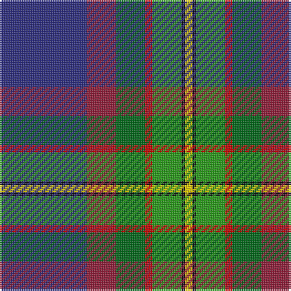

In pattern [BRGRGKY](/stripes/brgrgky/).

This was sourced from tartans-authority.  It is a [7 stripe tartan](/stripes/stripes7/).

Original link http://www.tartansauthority.com/tartan-ferret/display/3824/

## Also known as

This cloth is also recorded under:

- Scout Mapping Service #1

## Thread count
DB/48 DR16 Ga16 R4 G16 K2 Y/4

## Palette
Each colour and the base-6 reference it is a variant of.

| Colour | Shade | Base |
|---|---|---|
| DB | <code style="background-color:#2C2C80;">#2C2C80</code> `oklch(35.0% 0.138 276.6)` <small>#2C2C80</small> | B <code style="background-color:#2A418A;">#2A418A</code> |
| DR | <code style="background-color:#901C38;">#901C38</code> `oklch(43.2% 0.150 13.1)` <small>#901C38</small> | R <code style="background-color:#CC0000;">#CC0000</code> |
| G | <code style="background-color:#289C18;">#289C18</code> `oklch(60.6% 0.191 141.6)` <small>#289C18</small> | G <code style="background-color:#006100;">#006100</code> |
| Ga | <code style="background-color:#006818;">#006818</code> `oklch(45.0% 0.142 145.0)` <small>#006818</small> | G <code style="background-color:#006100;">#006100</code> |
| K | <code style="background-color:#101010;">#101010</code> `oklch(17.3% 0.000 89.9)` <small>#101010</small> | K <code style="background-color:#000000;">#000000</code> |
| R | <code style="background-color:#C80000;">#C80000</code> `oklch(52.3% 0.215 29.2)` <small>#C80000</small> | R <code style="background-color:#CC0000;">#CC0000</code> |
| Y | <code style="background-color:#FCCC00;">#FCCC00</code> `oklch(86.2% 0.176 91.5)` <small>#FCCC00</small> | Y <code style="background-color:#F2BF00;">#F2BF00</code> |

# Sample pattern

## Nearest tartans

The nearest existing variants by ΔTartan distance, with this tartan at the top so the swatches line up against it.

ΔTartan

Tartan

Sett

—

<a href="/ttd/edit/#slug=db24r8g8r2g8k1ly2~x2">Scout Mapping Service #1 (Corporate)</a> <a class="nn-out" href="/setts/s7/db24r8g8r2g8k1ly2~x2/" title="open its dictionary page">↗</a>

0.88

<a href="/ttd/edit/#slug=db20y1w1lo3g14n4y1dp4~x2">St. Columba (one green)</a> <a class="nn-out" href="/setts/s8/db20y1w1lo3g14n4y1dp4~x2/" title="open its dictionary page">↗</a>

1.16

<a href="/ttd/edit/#slug=lo3k2o15k10dt23r2dt1w2~x2">Vienna Highlander (Fashion)</a> <a class="nn-out" href="/setts/s8/lo3k2o15k10dt23r2dt1w2~x2/" title="open its dictionary page">↗</a>

1.18

<a href="/ttd/edit/#slug=dp2g8r1ly1db6t15w1~x4">Manx National District Tartan Tartan Number: 186. Earliest known date: pre 2003 Thread count of the sample donated by Dr. D.G. Teall in 1987, when the cloth was commercially available on the island. It differs slightly from the sett recorded by Stewart in 1959, but the design is essentially the same. D C Stewart's Nomindex (Name Index) notes. Th is seven-colour tartan was designed by Miss Patricia 'Paddy' McQaid as the Manx National Tartan at the instigation in 1958 of the Rt. Hon the Lord Sempill who was Chairman of Ellynyn ny Gael - a Manx Gaelic Society. The colours were explained as follows: light blue of the sky, dark blue of the sea, green of the hills &amp; valleys, white of the cottages, purple of the heather, gold of the gorse in bloom and reddish brown of the bracken. The tartan was registered with the Tartans Society on 3rd November 1959 and Paddy McQuaid held the sole rights to production for some years. The tartan was very popular with the Royal Family of the day. See products available Copyright © Blair Urquhart, Comrie, 2015</a> <a class="nn-out" href="/setts/s7/dp2g8r1ly1db6t15w1~x4/" title="open its dictionary page">↗</a>

1.19

<a href="/ttd/edit/#slug=db39dy3k14dy3t14ly4w2dy2~x2">Unidentified Lady's kilt</a> <a class="nn-out" href="/setts/s8/db39dy3k14dy3t14ly4w2dy2~x2/" title="open its dictionary page">↗</a>

1.21

<a href="/ttd/edit/#slug=y5lo1r2y25k14db19w2y4~x2">Tooth (Personal)</a> <a class="nn-out" href="/setts/s8/y5lo1r2y25k14db19w2y4~x2/" title="open its dictionary page">↗</a>

1.25

<a href="/ttd/edit/#slug=w4k2b18ly4b18dy26g18k1m2~x2">Hughes Interconnection Int. (Pers)</a> <a class="nn-out" href="/setts/s9/w4k2b18ly4b18dy26g18k1m2~x2/" title="open its dictionary page">↗</a>

1.30

<a href="/ttd/edit/#slug=g28r4k3o2k1dg2r3db20ly2~x2">Stirling University Corporate Tartan Tartan Number: 2074. Earliest known date: Aug 1992 This is a simplified Stirling and Bannockburn district sett with the Universities 'Green and Grey' striped through the black. See products available Copyright © Blair Urquhart, Comrie, 2015</a> <a class="nn-out" href="/setts/s9/g28r4k3o2k1dg2r3db20ly2~x2/" title="open its dictionary page">↗</a>

1.31

<a href="/ttd/edit/#slug=lo2k8db48lb9o12m3o9m3o12dg8lo2~x2">Heston (Name)</a> <a class="nn-out" href="/setts/s11/lo2k8db48lb9o12m3o9m3o12dg8lo2~x2/" title="open its dictionary page">↗</a>

1.32

<a href="/ttd/edit/#slug=w1db6dp9r12k12g32k6ly1~x2">Fujitsu</a> <a class="nn-out" href="/setts/s8/w1db6dp9r12k12g32k6ly1~x2/" title="open its dictionary page">↗</a>

1.34

<a href="/ttd/edit/#slug=db39o3k14o3t14ly4w2dr2~x2">Unidentified, Lady's kilt</a> <a class="nn-out" href="/setts/s8/db39o3k14o3t14ly4w2dr2~x2/" title="open its dictionary page">↗</a>

## Neighbour map

Every grey dot is one of 14299 variants placed by the first two principal components of the ΔTartan feature space (44% of its variance). Red is this tartan; blue dots are its nearest — click one to open its page.

<svg viewBox="0 0 640 380" role="img" style="max-width:100%;height:auto;border:1px solid #e0e0e0;border-radius:4px;display:block" xmlns="http://www.w3.org/2000/svg"><image href="/nn/cloud.v1.png" width="640" height="380"/><a href="/setts/s8/db20y1w1lo3g14n4y1dp4~x2/"><circle cx="206.6" cy="121.1" r="4" fill="#3465a4"><title>St. Columba (one green)</title></circle></a><a href="/setts/s8/lo3k2o15k10dt23r2dt1w2~x2/"><circle cx="201.9" cy="119.3" r="4" fill="#3465a4"><title>Vienna Highlander (Fashion)</title></circle></a><a href="/setts/s7/dp2g8r1ly1db6t15w1~x4/"><circle cx="186.1" cy="130.8" r="4" fill="#3465a4"><title>Manx National District Tartan Tartan Number: 186. Earliest known date: pre 2003 Thread count of the sample donated by Dr. D.G. Teall in 1987, when the cloth was commercially available on the island. It differs slightly from the sett recorded by Stewart in 1959, but the design is essentially the same. D C Stewart's Nomindex (Name Index) notes. Th is seven-colour tartan was designed by Miss Patricia 'Paddy' McQaid as the Manx National Tartan at the instigation in 1958 of the Rt. Hon the Lord Sempill who was Chairman of Ellynyn ny Gael - a Manx Gaelic Society. The colours were explained as follows: light blue of the sky, dark blue of the sea, green of the hills &amp; valleys, white of the cottages, purple of the heather, gold of the gorse in bloom and reddish brown of the bracken. The tartan was registered with the Tartans Society on 3rd November 1959 and Paddy McQuaid held the sole rights to production for some years. The tartan was very popular with the Royal Family of the day. See products available Copyright © Blair Urquhart, Comrie, 2015</title></circle></a><a href="/setts/s8/db39dy3k14dy3t14ly4w2dy2~x2/"><circle cx="231.5" cy="114.8" r="4" fill="#3465a4"><title>Unidentified Lady's kilt</title></circle></a><a href="/setts/s8/y5lo1r2y25k14db19w2y4~x2/"><circle cx="257.8" cy="137.5" r="4" fill="#3465a4"><title>Tooth (Personal)</title></circle></a><a href="/setts/s9/w4k2b18ly4b18dy26g18k1m2~x2/"><circle cx="182.1" cy="120.4" r="4" fill="#3465a4"><title>Hughes Interconnection Int. (Pers)</title></circle></a><a href="/setts/s9/g28r4k3o2k1dg2r3db20ly2~x2/"><circle cx="234.2" cy="92.4" r="4" fill="#3465a4"><title>Stirling University Corporate Tartan Tartan Number: 2074. Earliest known date: Aug 1992 This is a simplified Stirling and Bannockburn district sett with the Universities 'Green and Grey' striped through the black. See products available Copyright © Blair Urquhart, Comrie, 2015</title></circle></a><a href="/setts/s11/lo2k8db48lb9o12m3o9m3o12dg8lo2~x2/"><circle cx="191.7" cy="82.8" r="4" fill="#3465a4"><title>Heston (Name)</title></circle></a><a href="/setts/s8/w1db6dp9r12k12g32k6ly1~x2/"><circle cx="200.6" cy="112.1" r="4" fill="#3465a4"><title>Fujitsu</title></circle></a><a href="/setts/s8/db39o3k14o3t14ly4w2dr2~x2/"><circle cx="207.9" cy="101.0" r="4" fill="#3465a4"><title>Unidentified, Lady's kilt</title></circle></a><circle cx="204.8" cy="118.5" r="5" fill="#c00000"/></svg>

ID: /setts/s7/db24r8g8r2g8k1ly2~x2/
