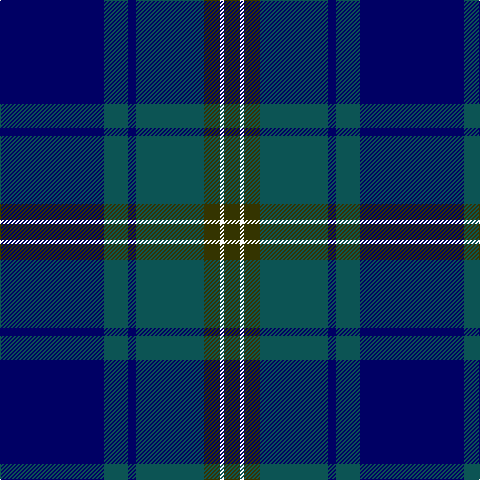

**Bands:** [GWGGBGB](/stripes/gwggbgb/) · **Stripes:** [DY W DY DG DB DG DB](/stripes/stripes7/) DY W DY DG DB DG DB

This was sourced from register-of-tartans.  It is a [7 band tartan](/bands/bands7/).

Original link https://www.tartanregister.gov.uk/tartanDetails.aspx?ref=952

## Attestations

This cloth appears in 2 source records; the oldest owns this page.

- 01/01/1972 — Doral (register-of-tartans, [record](https://www.tartanregister.gov.uk/tartanDetails.aspx?ref=952))
- 1972 — Doral (Fashion) (tartans-authority, [record](http://www.tartansauthority.com/tartan-ferret/display/4691/))

## Register references

External register numbers recorded for this tartan.

- Scottish Register of Tartans: [952](https://www.tartanregister.gov.uk/tartanDetails.aspx?ref=952)
- Scottish Tartans Authority (ITI): 4691

## Thread count
DB/104 G24 DB8 G68 T16 W4 T/16

## Palette
Each colour and its ΔE from the base-6 reference it is a variant of.

| Colour | Shade | Base | ΔE (OKLab) |
|---|---|---|---|
| DB | <code style="background-color:#000064;">#000064</code> `#000064` | B <code style="background-color:#2A418A;">#2A418A</code> | 0.18 |
| G | <code style="background-color:#0C5454;">#0C5454</code> `#0C5454` | G <code style="background-color:#006100;">#006100</code> | 0.12 |
| T | <code style="background-color:#343400;">#343400</code> `#343400` | G <code style="background-color:#006100;">#006100</code> | 0.15 |
| W | <code style="background-color:#FCFCFC;">#FCFCFC</code> `#FCFCFC` | W <code style="background-color:#F7F7F7;">#F7F7F7</code> | 0.01 |

# Sample pattern

## Nearest tartans

The nearest existing variants by ΔTartan distance.

1. [Hutton](/setts/s6/k2dg7db2dg7db16r1~x6/) — ΔT 1.25
1. [MacFadzean](/setts/s6/db48w2k20dg22r3dg4~x2/) — ΔT 1.32
1. [Caledonian Canals (Corporate)](/setts/s7/dg2k1db29k2dg9k27lo2~x2/) — ΔT 1.34
1. [Laurie](/setts/s7/dp6r2dp1dg25db16k2db4~x2/) — ΔT 1.40
1. [Deighan (Burham Kent) (Name)](/setts/s5/n4db43k20n7o2~x2/) — ΔT 1.42
1. [Lawrie](/setts/s7/dp6y2dp1g25db16k2db4~x2/) — ΔT 1.43
1. [Lowry](/setts/s7/dp6ly2dp1g25db16k2db4~x2/) — ΔT 1.43
1. [Dollar Academy (1999)](/setts/s8/lb2dt19k4dt4k4g9db2k1~x4/) — ΔT 1.43
1. [Johnstone/Johnston](/setts/s8/k3db3k3db22dg26k2db1ly3~x2/) — ΔT 1.44
1. [Casely of Mannerston (Personal)](/setts/s7/db50g4k22g23r1g1r2~x2/) — ΔT 1.44

## Neighbour map

Every grey dot is one of 14299 variants placed by the first two principal components of the ΔTartan feature space (44% of its variance). Red is this tartan; blue dots are its nearest — click one to open its page.

<svg viewBox="0 0 640 380" role="img" style="max-width:100%;height:auto;border:1px solid #e0e0e0;border-radius:4px;display:block" xmlns="http://www.w3.org/2000/svg"><image href="/nn/cloud.v1.png" width="640" height="380"/><a href="/setts/s6/k2dg7db2dg7db16r1~x6/"><circle cx="360.6" cy="234.7" r="4" fill="#3465a4"><title>Hutton</title></circle></a><a href="/setts/s6/db48w2k20dg22r3dg4~x2/"><circle cx="314.7" cy="182.8" r="4" fill="#3465a4"><title>MacFadzean</title></circle></a><a href="/setts/s7/dg2k1db29k2dg9k27lo2~x2/"><circle cx="360.5" cy="201.6" r="4" fill="#3465a4"><title>Caledonian Canals (Corporate)</title></circle></a><a href="/setts/s7/dp6r2dp1dg25db16k2db4~x2/"><circle cx="324.4" cy="178.2" r="4" fill="#3465a4"><title>Laurie</title></circle></a><a href="/setts/s5/n4db43k20n7o2~x2/"><circle cx="403.1" cy="225.5" r="4" fill="#3465a4"><title>Deighan (Burham Kent) (Name)</title></circle></a><a href="/setts/s7/dp6y2dp1g25db16k2db4~x2/"><circle cx="311.0" cy="171.6" r="4" fill="#3465a4"><title>Lawrie</title></circle></a><a href="/setts/s7/dp6ly2dp1g25db16k2db4~x2/"><circle cx="304.0" cy="169.6" r="4" fill="#3465a4"><title>Lowry</title></circle></a><a href="/setts/s8/lb2dt19k4dt4k4g9db2k1~x4/"><circle cx="306.3" cy="182.4" r="4" fill="#3465a4"><title>Dollar Academy (1999)</title></circle></a><a href="/setts/s8/k3db3k3db22dg26k2db1ly3~x2/"><circle cx="321.1" cy="171.1" r="4" fill="#3465a4"><title>Johnstone/Johnston</title></circle></a><a href="/setts/s7/db50g4k22g23r1g1r2~x2/"><circle cx="367.3" cy="153.3" r="4" fill="#3465a4"><title>Casely of Mannerston (Personal)</title></circle></a><circle cx="348.8" cy="199.2" r="5" fill="#c00000"/></svg>

ID: /setts/s7/db26dg6db2dg17dy4w1dy4~x4/
