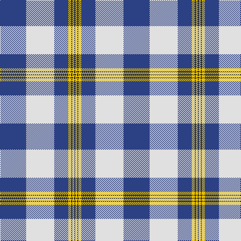

In pattern [BWBYKYK](/stripes/bwbykyk/).

This was sourced from register-of-tartans.  It is a [7 stripe tartan](/stripes/stripes7/).

Original link https://www.tartanregister.gov.uk/tartanDetails.aspx?ref=5865

## Register references

External register numbers recorded for this tartan.

- Scottish Register of Tartans: [5865](https://www.tartanregister.gov.uk/tartanDetails.aspx?ref=5865)
- Scottish Tartans World Register: 3201

## Thread count
B/52 LN56 B28 Y6 K2 Y4 K/2

## Palette
Each colour and its ΔE from the base-6 reference it is a variant of.

| Colour | Shade | Base | ΔE (OKLab) |
|---|---|---|---|
| B | <code style="background-color:#2C4084;">#2C4084</code> `#2C4084` | B <code style="background-color:#2A418A;">#2A418A</code> | 0.01 |
| K | <code style="background-color:#101010;">#101010</code> `#101010` | K <code style="background-color:#000000;">#000000</code> | 0.17 |
| LN | <code style="background-color:#E0E0E0;">#E0E0E0</code> `#E0E0E0` | W <code style="background-color:#F7F7F7;">#F7F7F7</code> | 0.07 |
| Y | <code style="background-color:#E8C000;">#E8C000</code> `#E8C000` | Y <code style="background-color:#F2BF00;">#F2BF00</code> | 0.02 |

# Sample pattern

## Nearest tartans

The nearest existing variants by ΔTartan distance.

1. [Gothenburg](/setts/s7/b26w28b14ly3k1ly2k1~x2/) — ΔT 0.93
1. [Harmony, Eildon](/setts/s8/db41t2w2t2db5b12w31db4~x2/) — ΔT 0.99
1. [Cunningham, Dress Blue (Dance) Fashion Tartan Tartan Number: 4642. Earliest known date: 01/01/2002 Like so many of the invented 'Dance' tartans this one is not known by the relevant Clan Cunningham Association (USA). /Threadcount and colours aren't 100% original. Generated manually./ See products available Copyright © Blair Urquhart, Comrie, 2015](/setts/s7/t2db1k1db20w20db1w2~x4/) — ΔT 1.00
1. [Harmony Eildon (Dance)](/setts/s8/db41t2w2t2db5t12w31db4~x2/) — ΔT 1.09
1. [Muir, John](/setts/s7/ly2w21db16b8db30w8db1~x2/) — ΔT 1.10
1. [Caithness Glass (Corporate)](/setts/s6/r1w10ly2w16db40w1~x2/) — ΔT 1.16
1. [Lochnagar Dress fashion Tartan Tartan Number: 8196. Earliest known date: Threadcount and colours aren't 100% original. Generated manually. See products available Copyright © Blair Urquhart, Comrie, 2015](/setts/s10/w8k1w40m1k16db16w6db3m3db6~x2/) — ΔT 1.18
1. [Longniddry, dress (Turquoise)](/setts/s8/t42k2w2k2t5n12w32t4~x2/) — ΔT 1.26
1. [Mount Vernon Primary School](/setts/s5/lt25db11r5w1k1~x4/) — ΔT 1.27
1. [Mount Vernon Primary School (Corp)](/setts/s5/lb25db11r5w1k1~x4/) — ΔT 1.27

## Neighbour map

Every grey dot is one of 14299 variants placed by the first two principal components of the ΔTartan feature space (44% of its variance). Red is this tartan; blue dots are its nearest — click one to open its page.

<svg viewBox="0 0 640 380" role="img" style="max-width:100%;height:auto;border:1px solid #e0e0e0;border-radius:4px;display:block" xmlns="http://www.w3.org/2000/svg"><image href="/nn/cloud.v1.png" width="640" height="380"/><a href="/setts/s7/b26w28b14ly3k1ly2k1~x2/"><circle cx="313.4" cy="134.0" r="4" fill="#3465a4"><title>Gothenburg</title></circle></a><a href="/setts/s8/db41t2w2t2db5b12w31db4~x2/"><circle cx="286.7" cy="135.3" r="4" fill="#3465a4"><title>Harmony, Eildon</title></circle></a><a href="/setts/s7/t2db1k1db20w20db1w2~x4/"><circle cx="289.3" cy="128.7" r="4" fill="#3465a4"><title>Cunningham, Dress Blue (Dance) Fashion Tartan Tartan Number: 4642. Earliest known date: 01/01/2002 Like so many of the invented 'Dance' tartans this one is not known by the relevant Clan Cunningham Association (USA). /Threadcount and colours aren't 100% original. Generated manually./ See products available Copyright © Blair Urquhart, Comrie, 2015</title></circle></a><a href="/setts/s8/db41t2w2t2db5t12w31db4~x2/"><circle cx="279.3" cy="133.8" r="4" fill="#3465a4"><title>Harmony Eildon (Dance)</title></circle></a><a href="/setts/s7/ly2w21db16b8db30w8db1~x2/"><circle cx="288.9" cy="150.0" r="4" fill="#3465a4"><title>Muir, John</title></circle></a><a href="/setts/s6/r1w10ly2w16db40w1~x2/"><circle cx="353.4" cy="113.5" r="4" fill="#3465a4"><title>Caithness Glass (Corporate)</title></circle></a><a href="/setts/s10/w8k1w40m1k16db16w6db3m3db6~x2/"><circle cx="297.4" cy="89.4" r="4" fill="#3465a4"><title>Lochnagar Dress fashion Tartan Tartan Number: 8196. Earliest known date: Threadcount and colours aren't 100% original. Generated manually. See products available Copyright © Blair Urquhart, Comrie, 2015</title></circle></a><a href="/setts/s8/t42k2w2k2t5n12w32t4~x2/"><circle cx="297.4" cy="137.8" r="4" fill="#3465a4"><title>Longniddry, dress (Turquoise)</title></circle></a><a href="/setts/s5/lt25db11r5w1k1~x4/"><circle cx="300.9" cy="132.8" r="4" fill="#3465a4"><title>Mount Vernon Primary School</title></circle></a><a href="/setts/s5/lb25db11r5w1k1~x4/"><circle cx="315.2" cy="135.8" r="4" fill="#3465a4"><title>Mount Vernon Primary School (Corp)</title></circle></a><circle cx="309.0" cy="132.3" r="5" fill="#c00000"/></svg>

ID: /setts/s7/db26w28db14ly3k1ly2k1~x2/
