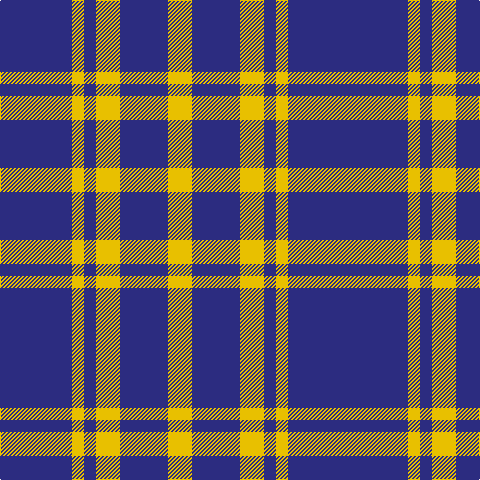

**Bands:** [BBYBYBY](/stripes/bbybyby/) · **Stripes:** [DB DB LY DB LY DB LY](/stripes/stripes7/) DB DB LY DB LY DB LY

This was sourced from tartans-authority.  It is a [7 band tartan](/bands/bands7/).

Original link http://www.tartansauthority.com/tartan-ferret/display/4610/

## Thread count
DB/24 DBa48 Y12 DB12 Ya24 DBa48 Ya/24

## Palette
Each colour and its ΔE from the base-6 reference it is a variant of.

| Colour | Shade | Base | ΔE (OKLab) |
|---|---|---|---|
| DB | <code style="background-color:#2C2C80;">#2C2C80</code> `#2C2C80` | B <code style="background-color:#2A418A;">#2A418A</code> | 0.06 |
| DBa | <code style="background-color:#2C2C80;">#2C2C80</code> `#2C2C80` | B <code style="background-color:#2A418A;">#2A418A</code> | 0.06 |
| Y | <code style="background-color:#E8C000;">#E8C000</code> `#E8C000` | Y <code style="background-color:#F2BF00;">#F2BF00</code> | 0.02 |
| Ya | <code style="background-color:#E8C000;">#E8C000</code> `#E8C000` | Y <code style="background-color:#F2BF00;">#F2BF00</code> | 0.02 |

# Sample pattern

## Nearest tartans

The nearest existing variants by ΔTartan distance.

1. [City of Pointe-Claire](/setts/s10/b4w1o1k2b4o2w1o1w1o1~x4/) — ΔT 1.22
1. [City of Pointe-Claire (District)](/setts/s10/db4w1dy1k2db4dy2w1dy1w1dy1~x4/) — ΔT 1.25
1. [International Highland Games Fed.](/setts/s4/db13r5g5w3~x8/) — ΔT 1.35
1. [Broz Sanz Elementary (Corporate)](/setts/s9/k4db1k1db1k1db4r2db4w2~x4/) — ΔT 1.40
1. [Kilmarnock Football Club (Old)](/setts/s8/db3w3db5k6ly1k6db5w3~x4/) — ΔT 1.42
1. [Johore Regiment (Military)](/setts/s5/db20k5db18lo26k6~x2/) — ΔT 1.43
1. [Unidentified #55](/setts/s11/lo2db10r3lo2lb3lo2db3r3db3lb3lo2~x4/) — ΔT 1.45
1. [Battle of Prestonpans (1745) Heritage Trust, The](/setts/s5/db9r12g9db5w2~x4/) — ΔT 1.46
1. [Commonwealth, Games 1986](/setts/s10/db12w4r12w5k4w12db20r4db5r4~x2/) — ΔT 1.46
1. [Johore Regiment](/setts/s8/db20k5db18lo26k6lo26db18k5~x2/) — ΔT 1.46

## Neighbour map

Every grey dot is one of 14313 variants placed by the first two principal components of the ΔTartan feature space (44% of its variance). Red is this tartan; blue dots are its nearest — click one to open its page.

<svg viewBox="0 0 640 380" role="img" style="max-width:100%;height:auto;border:1px solid #e0e0e0;border-radius:4px;display:block" xmlns="http://www.w3.org/2000/svg"><image href="/nn/cloud.v1.png" width="640" height="380"/><a href="/setts/s10/b4w1o1k2b4o2w1o1w1o1~x4/"><circle cx="130.8" cy="220.3" r="4" fill="#3465a4"><title>City of Pointe-Claire</title></circle></a><a href="/setts/s10/db4w1dy1k2db4dy2w1dy1w1dy1~x4/"><circle cx="148.6" cy="229.6" r="4" fill="#3465a4"><title>City of Pointe-Claire (District)</title></circle></a><a href="/setts/s4/db13r5g5w3~x8/"><circle cx="194.3" cy="270.1" r="4" fill="#3465a4"><title>International Highland Games Fed.</title></circle></a><a href="/setts/s9/k4db1k1db1k1db4r2db4w2~x4/"><circle cx="186.5" cy="246.1" r="4" fill="#3465a4"><title>Broz Sanz Elementary (Corporate)</title></circle></a><a href="/setts/s8/db3w3db5k6ly1k6db5w3~x4/"><circle cx="124.6" cy="250.2" r="4" fill="#3465a4"><title>Kilmarnock Football Club (Old)</title></circle></a><a href="/setts/s5/db20k5db18lo26k6~x2/"><circle cx="227.2" cy="274.9" r="4" fill="#3465a4"><title>Johore Regiment (Military)</title></circle></a><a href="/setts/s11/lo2db10r3lo2lb3lo2db3r3db3lb3lo2~x4/"><circle cx="137.8" cy="205.6" r="4" fill="#3465a4"><title>Unidentified #55</title></circle></a><a href="/setts/s5/db9r12g9db5w2~x4/"><circle cx="120.7" cy="251.8" r="4" fill="#3465a4"><title>Battle of Prestonpans (1745) Heritage Trust, The</title></circle></a><a href="/setts/s10/db12w4r12w5k4w12db20r4db5r4~x2/"><circle cx="153.3" cy="206.6" r="4" fill="#3465a4"><title>Commonwealth, Games 1986</title></circle></a><a href="/setts/s8/db20k5db18lo26k6lo26db18k5~x2/"><circle cx="196.0" cy="252.0" r="4" fill="#3465a4"><title>Johore Regiment</title></circle></a><circle cx="163.0" cy="256.2" r="5" fill="#c00000"/></svg>

ID: /setts/s7/db2db4ly1db1ly2db4ly2~x12/
