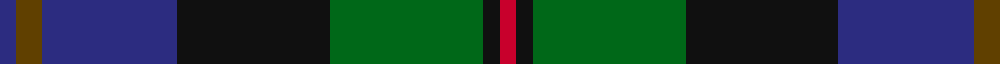

**Bands:** [BGBKGKR](/stripes/bgbkgkr/) · **Stripes:** [DB DY DB K G K R](/stripes/stripes7/) DB DY DB K G K R

This was sourced from register-of-tartans.  It is a [7 band tartan](/bands/bands7/).

Original link https://www.tartanregister.gov.uk/tartanDetails.aspx?ref=2880

## Attestations

This cloth appears in 2 source records; the oldest owns this page.

- 01/01/1995 — McEwan '1856', The (register-of-tartans, [record](https://www.tartanregister.gov.uk/tartanDetails.aspx?ref=2880))
- 1997 — McEwan '1856', The (Corporate) (tartans-authority, [record](http://www.tartansauthority.com/tartan-ferret/display/2299/))

## Register references

External register numbers recorded for this tartan.

- Scottish Register of Tartans: [2880](https://www.tartanregister.gov.uk/tartanDetails.aspx?ref=2880)
- Scottish Tartans Authority (ITI): 2299
- Scottish Tartans World Register: 2299

## Thread count
DB/4 T6 DB32 K36 G36 K4 R/4

## Palette
Each colour and its ΔE from the base-6 reference it is a variant of.

| Colour | Shade | Base | ΔE (OKLab) |
|---|---|---|---|
| DB | <code style="background-color:#2C2C80;">#2C2C80</code> `#2C2C80` | B <code style="background-color:#2A418A;">#2A418A</code> | 0.06 |
| G | <code style="background-color:#006818;">#006818</code> `#006818` | G <code style="background-color:#006100;">#006100</code> | 0.02 |
| K | <code style="background-color:#101010;">#101010</code> `#101010` | K <code style="background-color:#000000;">#000000</code> | 0.17 |
| R | <code style="background-color:#C8002C;">#C8002C</code> `#C8002C` | R <code style="background-color:#CC0000;">#CC0000</code> | 0.03 |
| T | <code style="background-color:#604000;">#604000</code> `#604000` | G <code style="background-color:#006100;">#006100</code> | 0.14 |

# Sample pattern

## Nearest tartans

The nearest existing variants by ΔTartan distance.

1. [Skene](/setts/s7/db24k4r3k4dg24k4r4~x2/) — ΔT 0.59
1. [Wood (Personal)](/setts/s8/g11t3g5r3g5k22db22k5~x2/) — ΔT 0.62
1. [Junior Chamber International (Corp)](/setts/s7/r4dg16k16db4dg3db12lo2~x2/) — ΔT 0.68
1. [Deloughery, Paul](/setts/s7/db20k6o4db3k16g20w2~x2/) — ΔT 0.68
1. [MacDonald (Flora.. )](/setts/s7/dg17ly2k14r2db9r2db10~x2/) — ΔT 0.73
1. [Argyll](/setts/s7/r2k1db8k8g8k1t2~x2/) — ΔT 0.73
1. [Campbell of Cawdor](/setts/s7/r2k1db8k8g8k1t2~x4/) — ΔT 0.73
1. [Greenock](/setts/s7/g2k2g17k16r2db17ly2~x2/) — ΔT 0.75
1. [Scotch House 2000 Original](/setts/s8/db22r3db2r3db2k17g18lo4~x2/) — ΔT 0.76
1. [Campbell of Cawdor Clan Tartan Tartan Number: 2. Earliest known date: 1798 Campbell of Cawdor is one of Wilson's variations based on the military sett. It was originally a numbered pattern, acquiring the name 'Argyle' in 1798 and 'Argylle' in 1819. It is not until W. and A. Smith's work of 1850 that the full title is given, 'Campbell of Cawdor'. This sett is authorized by the present Clan Chief, MacCailien Mor. See products available Copyright © Blair Urquhart, Comrie, 2015](/setts/s7/r2k1db8k8g8k1y2~x2/) — ΔT 0.78

## Neighbour map

Every grey dot is one of 14313 variants placed by the first two principal components of the ΔTartan feature space (44% of its variance). Red is this tartan; blue dots are its nearest — click one to open its page.

<svg viewBox="0 0 640 380" role="img" style="max-width:100%;height:auto;border:1px solid #e0e0e0;border-radius:4px;display:block" xmlns="http://www.w3.org/2000/svg"><image href="/nn/cloud.v1.png" width="640" height="380"/><a href="/setts/s7/db24k4r3k4dg24k4r4~x2/"><circle cx="200.8" cy="207.7" r="4" fill="#3465a4"><title>Skene</title></circle></a><a href="/setts/s8/g11t3g5r3g5k22db22k5~x2/"><circle cx="172.3" cy="216.7" r="4" fill="#3465a4"><title>Wood (Personal)</title></circle></a><a href="/setts/s7/r4dg16k16db4dg3db12lo2~x2/"><circle cx="161.3" cy="226.8" r="4" fill="#3465a4"><title>Junior Chamber International (Corp)</title></circle></a><a href="/setts/s7/db20k6o4db3k16g20w2~x2/"><circle cx="167.0" cy="215.8" r="4" fill="#3465a4"><title>Deloughery, Paul</title></circle></a><a href="/setts/s7/dg17ly2k14r2db9r2db10~x2/"><circle cx="160.7" cy="220.4" r="4" fill="#3465a4"><title>MacDonald (Flora.. )</title></circle></a><a href="/setts/s7/r2k1db8k8g8k1t2~x2/"><circle cx="150.7" cy="216.7" r="4" fill="#3465a4"><title>Argyll</title></circle></a><a href="/setts/s7/r2k1db8k8g8k1t2~x4/"><circle cx="150.7" cy="216.7" r="4" fill="#3465a4"><title>Campbell of Cawdor</title></circle></a><a href="/setts/s7/g2k2g17k16r2db17ly2~x2/"><circle cx="166.8" cy="203.9" r="4" fill="#3465a4"><title>Greenock</title></circle></a><a href="/setts/s8/db22r3db2r3db2k17g18lo4~x2/"><circle cx="188.2" cy="189.2" r="4" fill="#3465a4"><title>Scotch House 2000 Original</title></circle></a><a href="/setts/s7/r2k1db8k8g8k1y2~x2/"><circle cx="149.3" cy="215.7" r="4" fill="#3465a4"><title>Campbell of Cawdor Clan Tartan Tartan Number: 2. Earliest known date: 1798 Campbell of Cawdor is one of Wilson's variations based on the military sett. It was originally a numbered pattern, acquiring the name 'Argyle' in 1798 and 'Argylle' in 1819. It is not until W. and A. Smith's work of 1850 that the full title is given, 'Campbell of Cawdor'. This sett is authorized by the present Clan Chief, MacCailien Mor. See products available Copyright © Blair Urquhart, Comrie, 2015</title></circle></a><circle cx="186.4" cy="214.3" r="5" fill="#c00000"/></svg>

ID: /setts/s7/db2dy3db16k18g18k2r2~x2/
