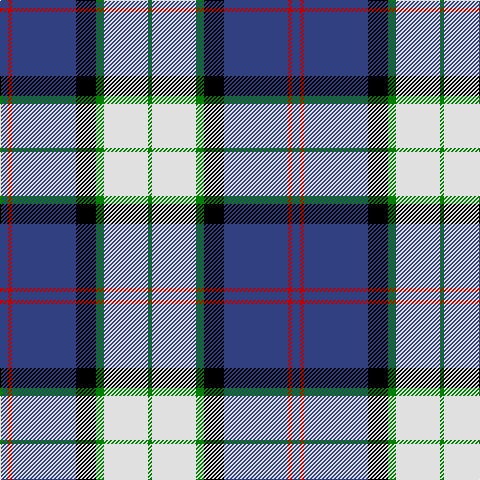

In pattern [BRBKGWG](/stripes/brbkgwg/).

This was sourced from weddslist.  It is a [7 stripe tartan](/stripes/stripes7/).

Original link http://www.weddslist.com/cgi-bin/tartans/pg.pl?source=sts

## Thread count
B/8 R4 B64 K20 G8 LN44 G/4

## Palette
Each colour and the base-6 reference it is a variant of.

| Colour | Shade | Base |
|---|---|---|
| B | <code style="background-color:#304080;">#304080</code> `oklch(39.4% 0.109 270.2)` <small>#304080</small> | B <code style="background-color:#2A418A;">#2A418A</code> |
| G | <code style="background-color:#008000;">#008000</code> `oklch(52.0% 0.177 142.5)` <small>#008000</small> | G <code style="background-color:#006100;">#006100</code> |
| K | <code style="background-color:#000000;">#000000</code> `oklch(0.0% 0.000 0.0)` <small>#000000</small> | K <code style="background-color:#000000;">#000000</code> |
| LN | <code style="background-color:#E0E0E0;">#E0E0E0</code> `oklch(90.7% 0.000 89.9)` <small>#E0E0E0</small> | W <code style="background-color:#F7F7F7;">#F7F7F7</code> |
| R | <code style="background-color:#C00000;">#C00000</code> `oklch(50.7% 0.208 29.2)` <small>#C00000</small> | R <code style="background-color:#CC0000;">#CC0000</code> |

# Sample pattern

## Nearest tartans

The nearest existing variants by ΔTartan distance.

1. [Sinclair Dress (Dance)](/setts/s7/db4r2db31k10g4w21g2~x2/) — ΔT 0.57
1. [Comrie, Navy Blue (Dance)](/setts/s8/dt42t2w2t2dt5k12w32db4~x2/) — ΔT 0.73
1. [Clunie (Personal)](/setts/s6/w12db48k13o22k3ly6/) — ΔT 0.84
1. [Thomson Dress (Blue)](/setts/s6/r1b10k2w4k4ly1~x6/) — ΔT 1.02
1. [Ferguson Dress #2](/setts/s7/db68k42w32r5w32dg4w6/) — ΔT 1.05
1. [Afternoon Tea / Earl Grey](/setts/s6/r15t98db72ly25db8w15/) — ΔT 1.05
1. [Loch Ness in Scotland](/setts/s7/g2db14lg6lr1g1lr6r1~x4/) — ΔT 1.06
1. [Solberg-Bell](/setts/s6/ly8k2dt20t4w1k2~x4/) — ΔT 1.11
1. [NEWYORKER](/setts/s9/r3k1lb12k2db2k2k14lb2k2~x2/) — ΔT 1.13
1. [Bahamas District Tartan Tartan Number: 2089. Earliest known date: 1966 Designed by Gordon Rees of the Scottish Shop in Nassau, now owned by Colin and Beverley Honnes. It was intended to perpetuate the memory of early Scottish settlers in the Bahamas including Thompson, Sands, Forsythe, Munroe, Johnston, Russell, Christie, Roberts, Kelly, MacKinney, Saunders, Malcolm, Crawford, MacPherson, Clark and Rae. The tartan was formally approved by the Bahamas Government in 1966. See products available Copyright © Blair Urquhart, Comrie, 2015](/setts/s8/db6ly2db22g7r2w11g11db3~x2/) — ΔT 1.15

## Neighbour map

Every grey dot is one of 14299 variants placed by the first two principal components of the ΔTartan feature space (44% of its variance). Red is this tartan; blue dots are its nearest — click one to open its page.

<svg viewBox="0 0 640 380" role="img" style="max-width:100%;height:auto;border:1px solid #e0e0e0;border-radius:4px;display:block" xmlns="http://www.w3.org/2000/svg"><image href="/nn/cloud.v1.png" width="640" height="380"/><a href="/setts/s7/db4r2db31k10g4w21g2~x2/"><circle cx="213.9" cy="143.1" r="4" fill="#3465a4"><title>Sinclair Dress (Dance)</title></circle></a><a href="/setts/s8/dt42t2w2t2dt5k12w32db4~x2/"><circle cx="230.7" cy="115.3" r="4" fill="#3465a4"><title>Comrie, Navy Blue (Dance)</title></circle></a><a href="/setts/s6/w12db48k13o22k3ly6/"><circle cx="197.6" cy="160.5" r="4" fill="#3465a4"><title>Clunie (Personal)</title></circle></a><a href="/setts/s6/r1b10k2w4k4ly1~x6/"><circle cx="179.9" cy="178.2" r="4" fill="#3465a4"><title>Thomson Dress (Blue)</title></circle></a><a href="/setts/s7/db68k42w32r5w32dg4w6/"><circle cx="160.2" cy="148.1" r="4" fill="#3465a4"><title>Ferguson Dress #2</title></circle></a><a href="/setts/s6/r15t98db72ly25db8w15/"><circle cx="186.0" cy="168.3" r="4" fill="#3465a4"><title>Afternoon Tea / Earl Grey</title></circle></a><a href="/setts/s7/g2db14lg6lr1g1lr6r1~x4/"><circle cx="200.2" cy="156.6" r="4" fill="#3465a4"><title>Loch Ness in Scotland</title></circle></a><a href="/setts/s6/ly8k2dt20t4w1k2~x4/"><circle cx="267.0" cy="141.0" r="4" fill="#3465a4"><title>Solberg-Bell</title></circle></a><a href="/setts/s9/r3k1lb12k2db2k2k14lb2k2~x2/"><circle cx="170.6" cy="129.2" r="4" fill="#3465a4"><title>NEWYORKER</title></circle></a><a href="/setts/s8/db6ly2db22g7r2w11g11db3~x2/"><circle cx="200.9" cy="174.4" r="4" fill="#3465a4"><title>Bahamas District Tartan Tartan Number: 2089. Earliest known date: 1966 Designed by Gordon Rees of the Scottish Shop in Nassau, now owned by Colin and Beverley Honnes. It was intended to perpetuate the memory of early Scottish settlers in the Bahamas including Thompson, Sands, Forsythe, Munroe, Johnston, Russell, Christie, Roberts, Kelly, MacKinney, Saunders, Malcolm, Crawford, MacPherson, Clark and Rae. The tartan was formally approved by the Bahamas Government in 1966. See products available Copyright © Blair Urquhart, Comrie, 2015</title></circle></a><circle cx="210.0" cy="139.2" r="5" fill="#c00000"/></svg>

ID: /setts/s7/db2r1db16k5g2w11g1~x4/
