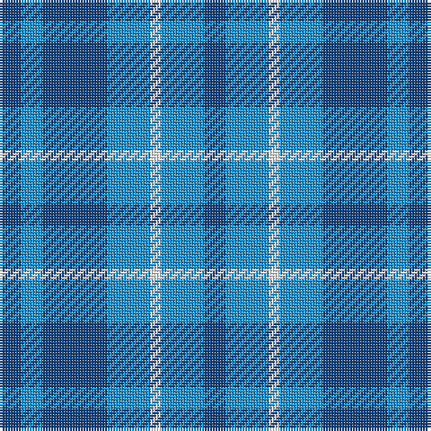

**Bands:** [BBBBWBB](/stripes/bbbbwbb/) · **Stripes:** [DB T DB T W T DB](/stripes/stripes7/) DB T DB T W T DB

This was sourced from register-of-tartans.  It is a [7 band tartan](/bands/bands7/).

Original link https://www.tartanregister.gov.uk/tartanDetails.aspx?ref=10103

## Register references

External register numbers recorded for this tartan.

- Scottish Register of Tartans: [10103](https://www.tartanregister.gov.uk/tartanDetails.aspx?ref=10103)

## Thread count
B/8 Ba8 B24 Ba16 W4 Ba16 B/8

## Palette
Each colour and its ΔE from the base-6 reference it is a variant of.

| Colour | Shade | Base | ΔE (OKLab) |
|---|---|---|---|
| B | <code style="background-color:#144683;">#144683</code> `#144683` | B <code style="background-color:#2A418A;">#2A418A</code> | 0.03 |
| Ba | <code style="background-color:#2194D3;">#2194D3</code> `#2194D3` | B <code style="background-color:#2A418A;">#2A418A</code> | 0.24 |
| W | <code style="background-color:#FFFFFF;">#FFFFFF</code> `#FFFFFF` | W <code style="background-color:#F7F7F7;">#F7F7F7</code> | 0.02 |

# Sample pattern

## Nearest tartans

The nearest existing variants by ΔTartan distance.

1. [Manx Cornaa (Personal)](/setts/s6/db5t5w1t5db5t1~x4/) — ΔT 0.79
1. [Langdons (Corporate)](/setts/s7/t2lb4w1lb4t6lb2t2~x4/) — ΔT 1.38
1. [Manx Cornaa (Personal)](/setts/s4/t1db5t5w1~x4/) — ΔT 1.51
1. [Manx, Cornaa](/setts/s4/b1db5b5w1~x4/) — ΔT 1.86
1. [Mercer, Charles](/setts/s8/db9b2db2ly1b7db2r1b4~x4/) — ΔT 1.95
1. [Norris (1957)](/setts/s6/g6b1g7w1b7r1~x4/) — ΔT 1.98
1. [Outdoorsmen (Fashion)](/setts/s7/b3k1g4k1b4g9k2~x4/) — ΔT 2.02
1. [von Prondzynski (2016)](/setts/s7/b4lb4b8o8b12lb12ly1~x2/) — ΔT 2.08
1. [Keith Clan](/setts/s8/g9b4k4b3k4b4g9k2~x4/) — ΔT 2.10
1. [Murray Taylor](/setts/s6/db3t3db16t16db16w3~x2/) — ΔT 2.15

## Neighbour map

Every grey dot is one of 14313 variants placed by the first two principal components of the ΔTartan feature space (44% of its variance). Red is this tartan; blue dots are its nearest — click one to open its page.

<svg viewBox="0 0 640 380" role="img" style="max-width:100%;height:auto;border:1px solid #e0e0e0;border-radius:4px;display:block" xmlns="http://www.w3.org/2000/svg"><image href="/nn/cloud.v1.png" width="640" height="380"/><a href="/setts/s6/db5t5w1t5db5t1~x4/"><circle cx="277.6" cy="304.4" r="4" fill="#3465a4"><title>Manx Cornaa (Personal)</title></circle></a><a href="/setts/s7/t2lb4w1lb4t6lb2t2~x4/"><circle cx="259.6" cy="275.1" r="4" fill="#3465a4"><title>Langdons (Corporate)</title></circle></a><a href="/setts/s4/t1db5t5w1~x4/"><circle cx="278.3" cy="295.4" r="4" fill="#3465a4"><title>Manx Cornaa (Personal)</title></circle></a><a href="/setts/s4/b1db5b5w1~x4/"><circle cx="295.0" cy="295.2" r="4" fill="#3465a4"><title>Manx, Cornaa</title></circle></a><a href="/setts/s8/db9b2db2ly1b7db2r1b4~x4/"><circle cx="305.8" cy="237.9" r="4" fill="#3465a4"><title>Mercer, Charles</title></circle></a><a href="/setts/s6/g6b1g7w1b7r1~x4/"><circle cx="312.3" cy="249.7" r="4" fill="#3465a4"><title>Norris (1957)</title></circle></a><a href="/setts/s7/b3k1g4k1b4g9k2~x4/"><circle cx="298.4" cy="245.6" r="4" fill="#3465a4"><title>Outdoorsmen (Fashion)</title></circle></a><a href="/setts/s7/b4lb4b8o8b12lb12ly1~x2/"><circle cx="240.7" cy="224.3" r="4" fill="#3465a4"><title>von Prondzynski (2016)</title></circle></a><a href="/setts/s8/g9b4k4b3k4b4g9k2~x4/"><circle cx="190.6" cy="282.7" r="4" fill="#3465a4"><title>Keith Clan</title></circle></a><a href="/setts/s6/db3t3db16t16db16w3~x2/"><circle cx="323.6" cy="272.0" r="4" fill="#3465a4"><title>Murray Taylor</title></circle></a><circle cx="271.1" cy="289.9" r="5" fill="#c00000"/></svg>

ID: /setts/s7/db2t4w1t4db6t2db2~x4/
