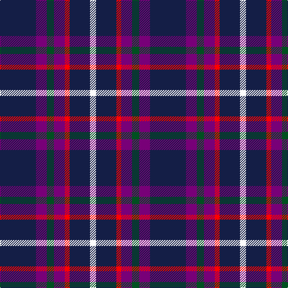

This page is one **sett** — a single exact thread-count. It belongs to the [tartan](/tartans/db30dp9dg6dp9r4db17w5/)
(the same proportion at any scale), whose colour order is pattern [BBGBRBW](/stripes/bbgbrbw/).

Sourced from register-of-tartans.  It is a [7 stripe tartan](/stripes/stripes7/).

Original link https://www.tartanregister.gov.uk/tartanDetails.aspx?ref=11126

## Register references

External register numbers recorded for this tartan.

- Scottish Register of Tartans: [11126](https://www.tartanregister.gov.uk/tartanDetails.aspx?ref=11126)

## Thread count
DB/60 P18 G12 P18 R8 DB34 W/10

## Palette

Palette: <strong>Tartan Register</strong>
<table><thead><tr><th>Colour</th><th>Threads</th><th>Shade</th><th>Base</th><th>OKLCh</th></tr></thead><tbody><tr><td>DB/</td><td style="text-align:right;font-variant-numeric:tabular-nums">60</td><td><code style="background-color:#141E46;">#141E46</code> <small style="color:#888">#141E46</small></td><td>B <code style="background-color:#2A418A;">#2A418A</code></td><td><small style="color:#888">oklch(25.2% 0.076 269.7)</small></td></tr><tr><td>P</td><td style="text-align:right;font-variant-numeric:tabular-nums">18</td><td><code style="background-color:#780078;">#780078</code> <small style="color:#888">#780078</small></td><td>B <code style="background-color:#2A418A;">#2A418A</code></td><td><small style="color:#888">oklch(40.2% 0.185 328.4)</small></td></tr><tr><td>G</td><td style="text-align:right;font-variant-numeric:tabular-nums">12</td><td><code style="background-color:#005020;">#005020</code> <small style="color:#888">#005020</small></td><td>G <code style="background-color:#006100;">#006100</code></td><td><small style="color:#888">oklch(37.7% 0.105 149.6)</small></td></tr><tr><td>P</td><td style="text-align:right;font-variant-numeric:tabular-nums">18</td><td><code style="background-color:#780078;">#780078</code> <small style="color:#888">#780078</small></td><td>B <code style="background-color:#2A418A;">#2A418A</code></td><td><small style="color:#888">oklch(40.2% 0.185 328.4)</small></td></tr><tr><td>R</td><td style="text-align:right;font-variant-numeric:tabular-nums">8</td><td><code style="background-color:#FF0000;">#FF0000</code> <small style="color:#888">#FF0000</small></td><td>R <code style="background-color:#CC0000;">#CC0000</code></td><td><small style="color:#888">oklch(62.8% 0.258 29.2)</small></td></tr><tr><td>DB</td><td style="text-align:right;font-variant-numeric:tabular-nums">34</td><td><code style="background-color:#141E46;">#141E46</code> <small style="color:#888">#141E46</small></td><td>B <code style="background-color:#2A418A;">#2A418A</code></td><td><small style="color:#888">oklch(25.2% 0.076 269.7)</small></td></tr><tr><td>W/</td><td style="text-align:right;font-variant-numeric:tabular-nums">10</td><td><code style="background-color:#FCFCFC;">#FCFCFC</code> <small style="color:#888">#FCFCFC</small></td><td>W <code style="background-color:#F7F7F7;">#F7F7F7</code></td><td><small style="color:#888">oklch(99.1% 0.000 89.9)</small></td></tr></tbody></table>

# Sample pattern

## Nearest tartans

The nearest existing variants by ΔTartan distance, with this tartan at the top so the swatches line up against it.

ΔTartan

Tartan

Sett

—

<a href="/ttd/edit/#slug=db30dp9dg6dp9r4db17w5~x2">Woodcock (2014)</a> <a class="nn-out" href="/setts/s7/db30dp9dg6dp9r4db17w5~x2/" title="open its dictionary page">↗</a>

0.85

<a href="/ttd/edit/#slug=o3k15r2k15n15p3~x2">H.M.S. DUNCAN</a> <a class="nn-out" href="/setts/s6/o3k15r2k15n15p3~x2/" title="open its dictionary page">↗</a>

0.90

<a href="/ttd/edit/#slug=w1db6dy5k1db6ly1~x4">Ancient Atlantic</a> <a class="nn-out" href="/setts/s6/w1db6dy5k1db6ly1~x4/" title="open its dictionary page">↗</a>

1.05

<a href="/ttd/edit/#slug=db30dp9g6dp9r4db17w5~x2">Woodcock (2014)</a> <a class="nn-out" href="/setts/s7/db30dp9g6dp9r4db17w5~x2/" title="open its dictionary page">↗</a>

1.10

<a href="/ttd/edit/#slug=dp46p15k12m8g8dp8~x2">Haut (Personal)</a> <a class="nn-out" href="/setts/s6/dp46p15k12m8g8dp8~x2/" title="open its dictionary page">↗</a>

1.12

<a href="/ttd/edit/#slug=db36r4db6g18db15k18w4~x2">Grainger (Name)</a> <a class="nn-out" href="/setts/s7/db36r4db6g18db15k18w4~x2/" title="open its dictionary page">↗</a>

1.16

<a href="/ttd/edit/#slug=r1db12k5o3db5w1~x4">Massachusetts</a> <a class="nn-out" href="/setts/s6/r1db12k5o3db5w1~x4/" title="open its dictionary page">↗</a>

1.17

<a href="/ttd/edit/#slug=r3db21r3db3k13db13t3db3w2~x2">Fitzgerald, Blue</a> <a class="nn-out" href="/setts/s9/r3db21r3db3k13db13t3db3w2~x2/" title="open its dictionary page">↗</a>

1.22

<a href="/ttd/edit/#slug=r1db12k5lo3db5lb1~x4">Massachusetts (Unofficial)</a> <a class="nn-out" href="/setts/s6/r1db12k5lo3db5lb1~x4/" title="open its dictionary page">↗</a>

1.34

<a href="/ttd/edit/#slug=db3r13db13r9db5w2dp9db21ly2~x2">Telfer, Brian William (Personal)</a> <a class="nn-out" href="/setts/s9/db3r13db13r9db5w2dp9db21ly2~x2/" title="open its dictionary page">↗</a>

1.35

<a href="/ttd/edit/#slug=db32r4db4ly4db9o9db4o16w7~x2">Nevada State American District Tartan Tartan Number: 3091. Earliest known date: 2001 Blue and Silver represent the state colours of Nevada. Red represents the Virgin Valley black fire opal, the official state precious gemstone, and the red rock formations of southern Nevada; Yellow represents sagebrush, the official state flower; White represents the name of this state meaning snow-covered; Other synbolic reference are made in the US Senate Bill No. 347. See products available Copyright © Blair Urquhart, Comrie, 2015</a> <a class="nn-out" href="/setts/s9/db32r4db4ly4db9o9db4o16w7~x2/" title="open its dictionary page">↗</a>

## Neighbour map

Every grey dot is one of 14299 variants placed by the first two principal components of the ΔTartan feature space (44% of its variance). Red is this tartan; blue dots are its nearest — click one to open its page.

<svg viewBox="0 0 640 380" role="img" style="max-width:100%;height:auto;border:1px solid #e0e0e0;border-radius:4px;display:block" xmlns="http://www.w3.org/2000/svg"><image href="/nn/cloud.v1.png" width="640" height="380"/><a href="/setts/s6/o3k15r2k15n15p3~x2/"><circle cx="252.0" cy="221.0" r="4" fill="#3465a4"><title>H.M.S. DUNCAN</title></circle></a><a href="/setts/s6/w1db6dy5k1db6ly1~x4/"><circle cx="271.9" cy="229.3" r="4" fill="#3465a4"><title>Ancient Atlantic</title></circle></a><a href="/setts/s7/db30dp9g6dp9r4db17w5~x2/"><circle cx="282.2" cy="213.4" r="4" fill="#3465a4"><title>Woodcock (2014)</title></circle></a><a href="/setts/s6/dp46p15k12m8g8dp8~x2/"><circle cx="258.4" cy="215.2" r="4" fill="#3465a4"><title>Haut (Personal)</title></circle></a><a href="/setts/s7/db36r4db6g18db15k18w4~x2/"><circle cx="264.0" cy="213.6" r="4" fill="#3465a4"><title>Grainger (Name)</title></circle></a><a href="/setts/s6/r1db12k5o3db5w1~x4/"><circle cx="317.1" cy="193.6" r="4" fill="#3465a4"><title>Massachusetts</title></circle></a><a href="/setts/s9/r3db21r3db3k13db13t3db3w2~x2/"><circle cx="306.4" cy="174.3" r="4" fill="#3465a4"><title>Fitzgerald, Blue</title></circle></a><a href="/setts/s6/r1db12k5lo3db5lb1~x4/"><circle cx="324.5" cy="198.6" r="4" fill="#3465a4"><title>Massachusetts (Unofficial)</title></circle></a><a href="/setts/s9/db3r13db13r9db5w2dp9db21ly2~x2/"><circle cx="257.7" cy="182.8" r="4" fill="#3465a4"><title>Telfer, Brian William (Personal)</title></circle></a><a href="/setts/s9/db32r4db4ly4db9o9db4o16w7~x2/"><circle cx="242.4" cy="174.4" r="4" fill="#3465a4"><title>Nevada State American District Tartan Tartan Number: 3091. Earliest known date: 2001 Blue and Silver represent the state colours of Nevada. Red represents the Virgin Valley black fire opal, the official state precious gemstone, and the red rock formations of southern Nevada; Yellow represents sagebrush, the official state flower; White represents the name of this state meaning snow-covered; Other synbolic reference are made in the US Senate Bill No. 347. See products available Copyright © Blair Urquhart, Comrie, 2015</title></circle></a><circle cx="269.1" cy="208.0" r="5" fill="#c00000"/></svg>

ID: /setts/s7/db30dp9dg6dp9r4db17w5~x2/
