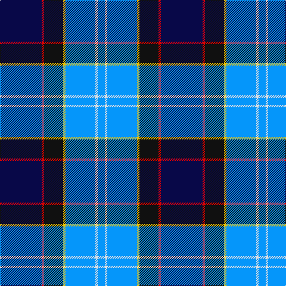

This page is one **sett** — a single exact thread-count. It belongs to the [tartan](/tartans/db35r2k16y2b25ln2b6/)
(the same proportion at any scale), whose colour order is pattern [BRKYBWB](/stripes/brkybwb/).

Sourced from register-of-tartans.  It is a [7 stripe tartan](/stripes/stripes7/).

Original link https://www.tartanregister.gov.uk/tartanDetails.aspx?ref=4224

## Also known as

This cloth is also recorded under:

- US Forces Regimental
- Unidentified #23

2 attestations — the source records this cloth was collapsed from (oldest owns this page)

<ul>
<li>undated — Unidentified #23 (register-of-tartans, <a href="https://www.tartanregister.gov.uk/tartanDetails.aspx?ref=4224">record</a>)</li>
<li>undated — Unidentified 7 (weddslist, <a href="http://www.weddslist.com/cgi-bin/tartans/pg.pl?source=sts">record</a>)</li>
</ul>

## Register references

External register numbers recorded for this tartan.

- Scottish Register of Tartans: [4224](https://www.tartanregister.gov.uk/tartanDetails.aspx?ref=4224)
- Scottish Tartans World Register: 549

## Thread count
DB/70 R4 K32 Y4 B50 LN4 B/12

## Palette
Each colour and the base-6 reference it is a variant of.

| Colour | Shade | Base |
|---|---|---|
| B | <code style="background-color:#0596FA;">#0596FA</code> `oklch(66.0% 0.180 248.9)` <small>#0596FA</small> | B <code style="background-color:#2A418A;">#2A418A</code> |
| DB | <code style="background-color:#080848;">#080848</code> `oklch(20.2% 0.112 270.4)` <small>#080848</small> | B <code style="background-color:#2A418A;">#2A418A</code> |
| K | <code style="background-color:#101010;">#101010</code> `oklch(17.3% 0.000 89.9)` <small>#101010</small> | K <code style="background-color:#000000;">#000000</code> |
| LN | <code style="background-color:#E0E0E0;">#E0E0E0</code> `oklch(90.7% 0.000 89.9)` <small>#E0E0E0</small> | W <code style="background-color:#F7F7F7;">#F7F7F7</code> |
| R | <code style="background-color:#DC0000;">#DC0000</code> `oklch(56.2% 0.230 29.2)` <small>#DC0000</small> | R <code style="background-color:#CC0000;">#CC0000</code> |
| Y | <code style="background-color:#E8C000;">#E8C000</code> `oklch(81.9% 0.168 93.7)` <small>#E8C000</small> | Y <code style="background-color:#F2BF00;">#F2BF00</code> |

# Sample pattern

## Nearest tartans

The nearest existing variants by ΔTartan distance, with this tartan at the top so the swatches line up against it.

ΔTartan

Tartan

Sett

—

<a href="/ttd/edit/#slug=db35r2k16ly2b25w2b6~x2">Unidentified #23</a> <a class="nn-out" href="/setts/s7/db35r2k16ly2b25w2b6~x2/" title="open its dictionary page">↗</a>

0.84

<a href="/ttd/edit/#slug=db35r2k16ly2t25w2t6~x2">US Forces (Thurso) Regimental Tartan Tartan Number: 549. Earliest known date: 1986 Originally listed as MacNeil, this sett was identified by Ken Dalgliesh, weaver in Selkirk, in 1999. See products available Copyright © Blair Urquhart, Comrie, 2015</a> <a class="nn-out" href="/setts/s7/db35r2k16ly2t25w2t6~x2/" title="open its dictionary page">↗</a>

1.16

<a href="/ttd/edit/#slug=r2t5k4lo1k4db16k3g2~x4">Arundel County (Dalgleish)</a> <a class="nn-out" href="/setts/s8/r2t5k4lo1k4db16k3g2~x4/" title="open its dictionary page">↗</a>

1.16

<a href="/ttd/edit/#slug=db44k3k20r3db8lg34db3db2lg15~x2">US Air Force Reserve Pipe Band Military Tartan Tartan Number: 2437. Earliest known date: 01/01/1988 One of a series of US Military tartans woven exclusively by the Strathmore Woollen Company of Forfar and adopted by the Band of the Air Force Reserve, Georgia, USA in the early 1990s. Although this has no official US Military recognition, it has been widely accepted by US servicemen and their families with Air Force connections as a representative design. Originally called 'Lady Jane of St Cirus', the design was shown to members of the pipe band who liked it sufficiently to adopt it (with Strathmore's agreement). See products available Copyright © Blair Urquhart, Comrie, 2015</a> <a class="nn-out" href="/setts/s9/db44k3k20r3db8lg34db3db2lg15~x2/" title="open its dictionary page">↗</a>

1.19

<a href="/ttd/edit/#slug=db44lo3k20r3db8lg34db3db2lg15~x2">US Air Force Reserve Pipe Band</a> <a class="nn-out" href="/setts/s9/db44lo3k20r3db8lg34db3db2lg15~x2/" title="open its dictionary page">↗</a>

1.22

<a href="/ttd/edit/#slug=b16ly3b8db12b1db6k32r1w2~x2">Wrens</a> <a class="nn-out" href="/setts/s9/b16ly3b8db12b1db6k32r1w2~x2/" title="open its dictionary page">↗</a>

1.23

<a href="/ttd/edit/#slug=m1g2t10r1db15w1~x4">Oren Peterson</a> <a class="nn-out" href="/setts/s6/m1g2t10r1db15w1~x4/" title="open its dictionary page">↗</a>

1.25

<a href="/ttd/edit/#slug=k17lb2k3db16t28db2t3lo2~x2">Banff and Buchan</a> <a class="nn-out" href="/setts/s8/k17lb2k3db16t28db2t3lo2~x2/" title="open its dictionary page">↗</a>

1.27

<a href="/ttd/edit/#slug=db26w2db3db15t26db2t3ly4~x2">Banff, and Buchan</a> <a class="nn-out" href="/setts/s8/db26w2db3db15t26db2t3ly4~x2/" title="open its dictionary page">↗</a>

1.31

<a href="/ttd/edit/#slug=w4k24ly2n24t5k4ly4~x2">Mina Perhonen</a> <a class="nn-out" href="/setts/s7/w4k24ly2n24t5k4ly4~x2/" title="open its dictionary page">↗</a>

1.35

<a href="/ttd/edit/#slug=k16w6k4b64m19k8g42ly6">Unidentified (Woven sample)</a> <a class="nn-out" href="/setts/s8/k16w6k4b64m19k8g42ly6/" title="open its dictionary page">↗</a>

## Neighbour map

Every grey dot is one of 14299 variants placed by the first two principal components of the ΔTartan feature space (44% of its variance). Red is this tartan; blue dots are its nearest — click one to open its page.

<svg viewBox="0 0 640 380" role="img" style="max-width:100%;height:auto;border:1px solid #e0e0e0;border-radius:4px;display:block" xmlns="http://www.w3.org/2000/svg"><image href="/nn/cloud.v1.png" width="640" height="380"/><a href="/setts/s7/db35r2k16ly2t25w2t6~x2/"><circle cx="198.9" cy="146.7" r="4" fill="#3465a4"><title>US Forces (Thurso) Regimental Tartan Tartan Number: 549. Earliest known date: 1986 Originally listed as MacNeil, this sett was identified by Ken Dalgliesh, weaver in Selkirk, in 1999. See products available Copyright © Blair Urquhart, Comrie, 2015</title></circle></a><a href="/setts/s8/r2t5k4lo1k4db16k3g2~x4/"><circle cx="184.9" cy="142.7" r="4" fill="#3465a4"><title>Arundel County (Dalgleish)</title></circle></a><a href="/setts/s9/db44k3k20r3db8lg34db3db2lg15~x2/"><circle cx="230.7" cy="139.1" r="4" fill="#3465a4"><title>US Air Force Reserve Pipe Band Military Tartan Tartan Number: 2437. Earliest known date: 01/01/1988 One of a series of US Military tartans woven exclusively by the Strathmore Woollen Company of Forfar and adopted by the Band of the Air Force Reserve, Georgia, USA in the early 1990s. Although this has no official US Military recognition, it has been widely accepted by US servicemen and their families with Air Force connections as a representative design. Originally called 'Lady Jane of St Cirus', the design was shown to members of the pipe band who liked it sufficiently to adopt it (with Strathmore's agreement). See products available Copyright © Blair Urquhart, Comrie, 2015</title></circle></a><a href="/setts/s9/db44lo3k20r3db8lg34db3db2lg15~x2/"><circle cx="231.2" cy="138.4" r="4" fill="#3465a4"><title>US Air Force Reserve Pipe Band</title></circle></a><a href="/setts/s9/b16ly3b8db12b1db6k32r1w2~x2/"><circle cx="202.3" cy="100.1" r="4" fill="#3465a4"><title>Wrens</title></circle></a><a href="/setts/s6/m1g2t10r1db15w1~x4/"><circle cx="246.2" cy="144.0" r="4" fill="#3465a4"><title>Oren Peterson</title></circle></a><a href="/setts/s8/k17lb2k3db16t28db2t3lo2~x2/"><circle cx="199.5" cy="156.4" r="4" fill="#3465a4"><title>Banff and Buchan</title></circle></a><a href="/setts/s8/db26w2db3db15t26db2t3ly4~x2/"><circle cx="182.2" cy="164.4" r="4" fill="#3465a4"><title>Banff, and Buchan</title></circle></a><a href="/setts/s7/w4k24ly2n24t5k4ly4~x2/"><circle cx="187.5" cy="168.3" r="4" fill="#3465a4"><title>Mina Perhonen</title></circle></a><a href="/setts/s8/k16w6k4b64m19k8g42ly6/"><circle cx="161.8" cy="135.5" r="4" fill="#3465a4"><title>Unidentified (Woven sample)</title></circle></a><circle cx="177.9" cy="138.7" r="5" fill="#c00000"/></svg>

ID: /setts/s7/db35r2k16ly2b25w2b6~x2/
