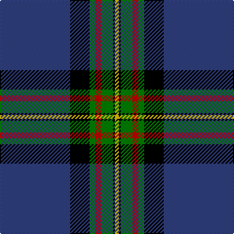

In pattern [BKGRGKY](/stripes/bkgrgky/).

This was sourced from weddslist.  It is a [7 stripe tartan](/stripes/stripes7/).

Original link http://www.weddslist.com/cgi-bin/tartans/pg.pl?source=sts

## Also known as

This cloth is also recorded under:

- MacLaurin, of Brioch

## Attestations

This cloth appears in 2 source records; the oldest owns this page.

- undated — MacLaurin, of Brioch (weddslist, [record](http://www.weddslist.com/cgi-bin/tartans/pg.pl?source=sts))
- undated — MacLaurin of Brioch Clan Tartan Tartan Number: 344. Earliest known date: 1856 This sett was approved by the Chief and accepted by the A.G.M. of the Clan MacLaren Society as Dress MacLaren in 1981. The sett has been designed by changing the blue ground of the usual MacLaren sett to white and then centering a blue stripe on the white ground. This illustration is based on a kilt belonging to the designer, Mr I.G.Campbell MacLaren. See products available Copyright © Blair Urquhart, Comrie, 2015 (house-of-tartan, [record](http://www.house-of-tartan.scotland.net/house/TartanViewjs.asp?colr=Def&tnam=344))

## Thread count
B/72 K20 G6 R6 G12 K2 Y/4

## Palette
Each colour and the base-6 reference it is a variant of.

| Colour | Shade | Base |
|---|---|---|
| B | <code style="background-color:#304080;">#304080</code> `oklch(39.4% 0.109 270.2)` <small>#304080</small> | B <code style="background-color:#2A418A;">#2A418A</code> |
| G | <code style="background-color:#008000;">#008000</code> `oklch(52.0% 0.177 142.5)` <small>#008000</small> | G <code style="background-color:#006100;">#006100</code> |
| K | <code style="background-color:#000000;">#000000</code> `oklch(0.0% 0.000 0.0)` <small>#000000</small> | K <code style="background-color:#000000;">#000000</code> |
| R | <code style="background-color:#C00000;">#C00000</code> `oklch(50.7% 0.208 29.2)` <small>#C00000</small> | R <code style="background-color:#CC0000;">#CC0000</code> |
| Y | <code style="background-color:#F0C000;">#F0C000</code> `oklch(82.7% 0.169 90.5)` <small>#F0C000</small> | Y <code style="background-color:#F2BF00;">#F2BF00</code> |

# Sample pattern

## Nearest tartans

The nearest existing variants by ΔTartan distance, with this tartan at the top so the swatches line up against it.

ΔTartan

Tartan

Sett

—

<a href="/ttd/edit/#slug=db36k10g3r3g6k1ly2~x2">MacLaurin, of Brioch</a> <a class="nn-out" href="/setts/s7/db36k10g3r3g6k1ly2~x2/" title="open its dictionary page">↗</a>

0.87

<a href="/ttd/edit/#slug=r4k2w6k2b40k80g10w6r3">Italian American (Corporate)</a> <a class="nn-out" href="/setts/s9/r4k2w6k2b40k80g10w6r3/" title="open its dictionary page">↗</a>

0.96

<a href="/ttd/edit/#slug=db64k11r2k4r2k4g32y4~x2">Sinclair-Brown</a> <a class="nn-out" href="/setts/s8/db64k11r2k4r2k4g32y4~x2/" title="open its dictionary page">↗</a>

1.01

<a href="/ttd/edit/#slug=r4k2w6k2db40k80dg10w6r3">Italian American</a> <a class="nn-out" href="/setts/s9/r4k2w6k2db40k80dg10w6r3/" title="open its dictionary page">↗</a>

1.12

<a href="/ttd/edit/#slug=db47g14dr5o2r3g7~x2">Round Table of Britain and Ireland, RtbI.</a> <a class="nn-out" href="/setts/s6/db47g14dr5o2r3g7~x2/" title="open its dictionary page">↗</a>

1.14

<a href="/ttd/edit/#slug=w2db40g22ly3g2r3g2w2~x2">Tartan Day SA (Corporate)</a> <a class="nn-out" href="/setts/s8/w2db40g22ly3g2r3g2w2~x2/" title="open its dictionary page">↗</a>

1.14

<a href="/ttd/edit/#slug=db20dy1db1dy1dg8k1w3~x2">Chestico</a> <a class="nn-out" href="/setts/s7/db20dy1db1dy1dg8k1w3~x2/" title="open its dictionary page">↗</a>

1.14

<a href="/ttd/edit/#slug=lr5k6w2dg7w2dt44w2~x2">Leblant-Macqueron (Personal)</a> <a class="nn-out" href="/setts/s7/lr5k6w2dg7w2dt44w2~x2/" title="open its dictionary page">↗</a>

1.18

<a href="/ttd/edit/#slug=w3dt1k14dt2k1g6k1dt30lo3~x2">Bro-Kerne</a> <a class="nn-out" href="/setts/s9/w3dt1k14dt2k1g6k1dt30lo3~x2/" title="open its dictionary page">↗</a>

1.20

<a href="/ttd/edit/#slug=g1db1k1db30k30w2db5ly1~x2">Binder Wedding (Personal)</a> <a class="nn-out" href="/setts/s8/g1db1k1db30k30w2db5ly1~x2/" title="open its dictionary page">↗</a>

1.25

<a href="/ttd/edit/#slug=k8ly1k1db28k12g2k1t2~x2">Hope-Weir / Weir</a> <a class="nn-out" href="/setts/s8/k8ly1k1db28k12g2k1t2~x2/" title="open its dictionary page">↗</a>

## Neighbour map

Every grey dot is one of 14299 variants placed by the first two principal components of the ΔTartan feature space (44% of its variance). Red is this tartan; blue dots are its nearest — click one to open its page.

<svg viewBox="0 0 640 380" role="img" style="max-width:100%;height:auto;border:1px solid #e0e0e0;border-radius:4px;display:block" xmlns="http://www.w3.org/2000/svg"><image href="/nn/cloud.v1.png" width="640" height="380"/><a href="/setts/s9/r4k2w6k2b40k80g10w6r3/"><circle cx="328.8" cy="88.7" r="4" fill="#3465a4"><title>Italian American (Corporate)</title></circle></a><a href="/setts/s8/db64k11r2k4r2k4g32y4~x2/"><circle cx="313.0" cy="115.7" r="4" fill="#3465a4"><title>Sinclair-Brown</title></circle></a><a href="/setts/s9/r4k2w6k2db40k80dg10w6r3/"><circle cx="341.6" cy="97.0" r="4" fill="#3465a4"><title>Italian American</title></circle></a><a href="/setts/s6/db47g14dr5o2r3g7~x2/"><circle cx="360.0" cy="155.0" r="4" fill="#3465a4"><title>Round Table of Britain and Ireland, RtbI.</title></circle></a><a href="/setts/s8/w2db40g22ly3g2r3g2w2~x2/"><circle cx="303.8" cy="124.7" r="4" fill="#3465a4"><title>Tartan Day SA (Corporate)</title></circle></a><a href="/setts/s7/db20dy1db1dy1dg8k1w3~x2/"><circle cx="353.2" cy="144.6" r="4" fill="#3465a4"><title>Chestico</title></circle></a><a href="/setts/s7/lr5k6w2dg7w2dt44w2~x2/"><circle cx="364.5" cy="123.4" r="4" fill="#3465a4"><title>Leblant-Macqueron (Personal)</title></circle></a><a href="/setts/s9/w3dt1k14dt2k1g6k1dt30lo3~x2/"><circle cx="332.9" cy="116.5" r="4" fill="#3465a4"><title>Bro-Kerne</title></circle></a><a href="/setts/s8/g1db1k1db30k30w2db5ly1~x2/"><circle cx="358.5" cy="127.2" r="4" fill="#3465a4"><title>Binder Wedding (Personal)</title></circle></a><a href="/setts/s8/k8ly1k1db28k12g2k1t2~x2/"><circle cx="320.6" cy="125.7" r="4" fill="#3465a4"><title>Hope-Weir / Weir</title></circle></a><circle cx="353.3" cy="115.7" r="5" fill="#c00000"/></svg>

ID: /setts/s7/db36k10g3r3g6k1ly2~x2/
