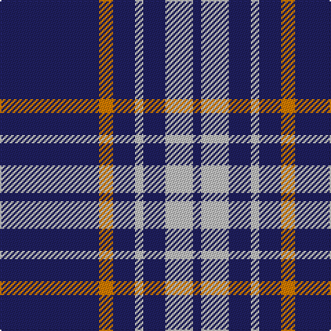

**Bands:** [BYBWBWB](/stripes/bybwbwb/) · **Stripes:** [DB LO DB LB DB LB DB](/stripes/stripes7/) DB LO DB LB DB LB DB

This was sourced from tartans-authority.  It is a [7 band tartan](/bands/bands7/).

Original link http://www.tartansauthority.com/tartan-ferret/display/2442/

## Also known as

This cloth is also recorded under:

- Scottish Qualifications Auth.

## Thread count
DB/72 O10 DB16 N6 DB16 N20 DB/6

## Palette
Each colour and its ΔE from the base-6 reference it is a variant of.

| Colour | Shade | Base | ΔE (OKLab) |
|---|---|---|---|
| DB | <code style="background-color:#202060;">#202060</code> `#202060` | B <code style="background-color:#2A418A;">#2A418A</code> | 0.11 |
| N | <code style="background-color:#C0C0C0;">#C0C0C0</code> `#C0C0C0` | W <code style="background-color:#F7F7F7;">#F7F7F7</code> | 0.17 |
| O | <code style="background-color:#D87C00;">#D87C00</code> `#D87C00` | Y <code style="background-color:#F2BF00;">#F2BF00</code> | 0.17 |

# Sample pattern

## Nearest tartans

The nearest existing variants by ΔTartan distance.

1. [Tokyo Bluebells](/setts/s8/db18r1db1r1db1k7db13w2~x4/) — ΔT 1.24
1. [South Australian Pipes & Drums (Corp](/setts/s6/db60ly6db11r25~x2/) — ΔT 1.34
1. [Nike ACG Lunarstorm (Fashion)](/setts/s7/db8r2db18r1db2w10db4~x2/) — ΔT 1.39
1. [Ochterlonie](/setts/s6/db35lr8db21lr13db6lo4~x2/) — ΔT 1.42
1. [Ikelman (Personal)](/setts/s10/db16w2db2w1db1w1db2w2db16w8~x4/) — ΔT 1.46
1. [BC Corps of Commissionaires](/setts/s7/db12w1r3w1r3w1db6~x4/) — ΔT 1.48
1. [Wheadon (Name)](/setts/s6/db40g7ly3g7db15r5~x2/) — ΔT 1.50
1. [BC Corps of Commissionaires, The](/setts/s7/db12lb1r3lb1r3lb1db6~x4/) — ΔT 1.51
1. [Auchterlonie (Personal)](/setts/s6/db40w8db25w14db8ly4~x2/) — ΔT 1.53
1. [Glen Moy](/setts/s5/db13lb3db1r3lb1~x6/) — ΔT 1.55

## Neighbour map

Every grey dot is one of 14299 variants placed by the first two principal components of the ΔTartan feature space (44% of its variance). Red is this tartan; blue dots are its nearest — click one to open its page.

<svg viewBox="0 0 640 380" role="img" style="max-width:100%;height:auto;border:1px solid #e0e0e0;border-radius:4px;display:block" xmlns="http://www.w3.org/2000/svg"><image href="/nn/cloud.v1.png" width="640" height="380"/><a href="/setts/s8/db18r1db1r1db1k7db13w2~x4/"><circle cx="460.5" cy="168.5" r="4" fill="#3465a4"><title>Tokyo Bluebells</title></circle></a><a href="/setts/s6/db60ly6db11r25~x2/"><circle cx="410.4" cy="214.8" r="4" fill="#3465a4"><title>South Australian Pipes &amp; Drums (Corp</title></circle></a><a href="/setts/s7/db8r2db18r1db2w10db4~x2/"><circle cx="409.3" cy="183.5" r="4" fill="#3465a4"><title>Nike ACG Lunarstorm (Fashion)</title></circle></a><a href="/setts/s6/db35lr8db21lr13db6lo4~x2/"><circle cx="388.0" cy="238.8" r="4" fill="#3465a4"><title>Ochterlonie</title></circle></a><a href="/setts/s10/db16w2db2w1db1w1db2w2db16w8~x4/"><circle cx="451.4" cy="175.0" r="4" fill="#3465a4"><title>Ikelman (Personal)</title></circle></a><a href="/setts/s7/db12w1r3w1r3w1db6~x4/"><circle cx="395.7" cy="206.2" r="4" fill="#3465a4"><title>BC Corps of Commissionaires</title></circle></a><a href="/setts/s6/db40g7ly3g7db15r5~x2/"><circle cx="428.1" cy="201.7" r="4" fill="#3465a4"><title>Wheadon (Name)</title></circle></a><a href="/setts/s7/db12lb1r3lb1r3lb1db6~x4/"><circle cx="406.5" cy="208.3" r="4" fill="#3465a4"><title>BC Corps of Commissionaires, The</title></circle></a><a href="/setts/s6/db40w8db25w14db8ly4~x2/"><circle cx="397.7" cy="222.3" r="4" fill="#3465a4"><title>Auchterlonie (Personal)</title></circle></a><a href="/setts/s5/db13lb3db1r3lb1~x6/"><circle cx="395.4" cy="200.9" r="4" fill="#3465a4"><title>Glen Moy</title></circle></a><circle cx="454.1" cy="201.7" r="5" fill="#c00000"/></svg>

ID: /setts/s7/db36lo5db8lb3db8lb10db3~x2/
