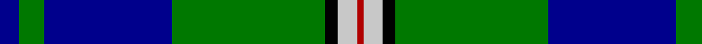

**Bands:** [BGBGKWR](/stripes/bgbgkwr/) · **Stripes:** [DB G DB G K LB R](/stripes/stripes7/) DB G DB G K LB R

This was sourced from tartans-authority.  It is a [7 band tartan](/bands/bands7/).

Original link http://www.tartansauthority.com/tartan-ferret/display/4108/

## Variants

Other setts woven to the same stripe pattern.

- [Nowell/Noel](/setts/s7/db8g2db10g12k1lb1r1~x4/)

## Thread count
DB/6 G8 DB40 G48 K4 N6 DR/2

## Palette
Each colour and its ΔE from the base-6 reference it is a variant of.

| Colour | Shade | Base | ΔE (OKLab) |
|---|---|---|---|
| DB | <code style="background-color:#00008C;">#00008C</code> `#00008C` | B <code style="background-color:#2A418A;">#2A418A</code> | 0.13 |
| DR | <code style="background-color:#B00000;">#B00000</code> `#B00000` | R <code style="background-color:#CC0000;">#CC0000</code> | 0.06 |
| G | <code style="background-color:#007800;">#007800</code> `#007800` | G <code style="background-color:#006100;">#006100</code> | 0.07 |
| K | <code style="background-color:#000000;">#000000</code> `#000000` | K <code style="background-color:#000000;">#000000</code> | 0.00 |
| N | <code style="background-color:#C8C8C8;">#C8C8C8</code> `#C8C8C8` | W <code style="background-color:#F7F7F7;">#F7F7F7</code> | 0.14 |

# Sample pattern

## Nearest tartans

The nearest existing variants by ΔTartan distance.

1. [Militello (Palermo) Dress (Personal)](/setts/s6/r3w3db36g36k2r2~x2/) — ΔT 1.20
1. [MacFadzean](/setts/s6/db48w2k20g22r3g4~x2/) — ΔT 1.22
1. [Ferguson of Athol](/setts/s7/db24k8g8r2g8k1w2~x2/) — ΔT 1.24
1. [Centennial-King George Lodge No.171](/setts/s5/ly2dg36b30w7r2~x2/) — ΔT 1.28
1. [MacLaren](/setts/s7/db24k8g8r2g8k1ly2~x2/) — ΔT 1.28
1. [Ferguson of Atholl Clan](/setts/s7/b24k8g8r2g8k1w2~x2/) — ΔT 1.29
1. [Vance (Family Association) Corporate Family Tartan Tartan Number: 2208. Earliest known date: December 1994 Designed and Copyrighted in the US by Mark W. Vance. Details from Vance Family Association website. See products available Copyright © Blair Urquhart, Comrie, 2015](/setts/s6/k4t24k2g13t2k3~x4/) — ΔT 1.30
1. [Centennial-King George Lodge No.171](/setts/s5/ly2g36db30w7r2~x2/) — ΔT 1.32
1. [Sinclair-Brown](/setts/s8/db64k11r2k4r2k4g32y4~x2/) — ΔT 1.34
1. [Carmichael](/setts/s6/k3g36db28r2db2ly3~x2/) — ΔT 1.36

## Neighbour map

Every grey dot is one of 14313 variants placed by the first two principal components of the ΔTartan feature space (44% of its variance). Red is this tartan; blue dots are its nearest — click one to open its page.

<svg viewBox="0 0 640 380" role="img" style="max-width:100%;height:auto;border:1px solid #e0e0e0;border-radius:4px;display:block" xmlns="http://www.w3.org/2000/svg"><image href="/nn/cloud.v1.png" width="640" height="380"/><a href="/setts/s6/r3w3db36g36k2r2~x2/"><circle cx="244.1" cy="148.3" r="4" fill="#3465a4"><title>Militello (Palermo) Dress (Personal)</title></circle></a><a href="/setts/s6/db48w2k20g22r3g4~x2/"><circle cx="259.5" cy="154.8" r="4" fill="#3465a4"><title>MacFadzean</title></circle></a><a href="/setts/s7/db24k8g8r2g8k1w2~x2/"><circle cx="234.8" cy="146.5" r="4" fill="#3465a4"><title>Ferguson of Athol</title></circle></a><a href="/setts/s5/ly2dg36b30w7r2~x2/"><circle cx="255.9" cy="173.6" r="4" fill="#3465a4"><title>Centennial-King George Lodge No.171</title></circle></a><a href="/setts/s7/db24k8g8r2g8k1ly2~x2/"><circle cx="236.5" cy="147.2" r="4" fill="#3465a4"><title>MacLaren</title></circle></a><a href="/setts/s7/b24k8g8r2g8k1w2~x2/"><circle cx="253.7" cy="157.0" r="4" fill="#3465a4"><title>Ferguson of Atholl Clan</title></circle></a><a href="/setts/s6/k4t24k2g13t2k3~x4/"><circle cx="261.1" cy="178.4" r="4" fill="#3465a4"><title>Vance (Family Association) Corporate Family Tartan Tartan Number: 2208. Earliest known date: December 1994 Designed and Copyrighted in the US by Mark W. Vance. Details from Vance Family Association website. See products available Copyright © Blair Urquhart, Comrie, 2015</title></circle></a><a href="/setts/s5/ly2g36db30w7r2~x2/"><circle cx="252.6" cy="171.6" r="4" fill="#3465a4"><title>Centennial-King George Lodge No.171</title></circle></a><a href="/setts/s8/db64k11r2k4r2k4g32y4~x2/"><circle cx="313.0" cy="115.8" r="4" fill="#3465a4"><title>Sinclair-Brown</title></circle></a><a href="/setts/s6/k3g36db28r2db2ly3~x2/"><circle cx="296.6" cy="163.6" r="4" fill="#3465a4"><title>Carmichael</title></circle></a><circle cx="283.7" cy="146.3" r="5" fill="#c00000"/></svg>

ID: /setts/s7/db3g4db20g24k2lb3r1~x2/
