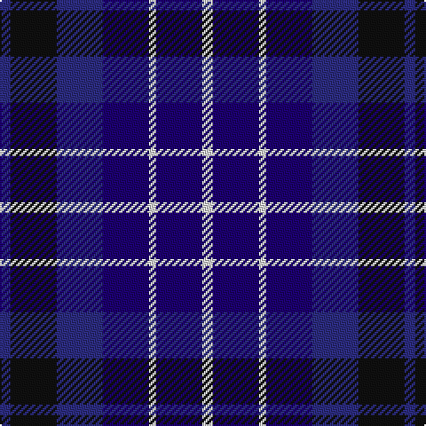

**Bands:** [BKBBWBW](/stripes/bkbbwbw/) · **Stripes:** [DB K DB DB W DB W](/stripes/stripes7/) DB K DB DB W DB W

This was sourced from register-of-tartans.  It is a [7 band tartan](/bands/bands7/).

Original link https://www.tartanregister.gov.uk/tartanDetails.aspx?ref=370

## Attestations

This cloth appears in 2 source records; the oldest owns this page.

- 01/01/2006 — Brodie Countryfare (Corporate) (register-of-tartans, [record](https://www.tartanregister.gov.uk/tartanDetails.aspx?ref=370))
- pre 2006 — Brodie Countryfare (Corporate) (tartans-authority, [record](http://www.tartansauthority.com/tartan-ferret/display/6937/))

## Register references

External register numbers recorded for this tartan.

- Scottish Register of Tartans: [370](https://www.tartanregister.gov.uk/tartanDetails.aspx?ref=370)
- Scottish Tartans Authority (ITI): 6937

## Thread count
DBa/6 K26 DBa26 DB26 LN4 DB26 LN/6

## Palette
Each colour and its ΔE from the base-6 reference it is a variant of.

| Colour | Shade | Base | ΔE (OKLab) |
|---|---|---|---|
| DB | <code style="background-color:#1C0070;">#1C0070</code> `#1C0070` | B <code style="background-color:#2A418A;">#2A418A</code> | 0.14 |
| DBa | <code style="background-color:#2C2C80;">#2C2C80</code> `#2C2C80` | B <code style="background-color:#2A418A;">#2A418A</code> | 0.06 |
| K | <code style="background-color:#101010;">#101010</code> `#101010` | K <code style="background-color:#000000;">#000000</code> | 0.17 |
| LN | <code style="background-color:#E0E0E0;">#E0E0E0</code> `#E0E0E0` | W <code style="background-color:#F7F7F7;">#F7F7F7</code> | 0.07 |

# Sample pattern

## Nearest tartans

The nearest existing variants by ΔTartan distance.

1. [Allianz Deutschland 2012 (Corporate)](/setts/s7/db6db3db6db20k20db8w4~x2/) — ΔT 0.94
1. [Heritage of Scotland](/setts/s7/db6w3db21k16dp6k3dp6~x2/) — ΔT 1.06
1. [Scottish N. A. Business Council (Co](/setts/s10/r2db6dt6db2r2db4dt6r2db2w1~x4/) — ΔT 1.16
1. [St. Andrew Society](/setts/s7/db16k16db16w3db16k2t3~x2/) — ΔT 1.20
1. [Blue](/setts/s7/r2db11r3db11t12db10w2~x2/) — ΔT 1.44
1. [Hamilton (Personal)](/setts/s10/db3dg3db18r14db5r14db5r14db21dg3~x2/) — ΔT 1.57
1. [MacCorquodale #2](/setts/s6/r8b32k24db24k3b3~x2/) — ΔT 1.57
1. [Daks, Muted blue](/setts/s8/o5db12db4o4db22db3db4o5/) — ΔT 1.57
1. [Scottish Express International](/setts/s6/k1db7k4lb1k4p1~x4/) — ΔT 1.57
1. [Lexington Fire Department](/setts/s8/k8db8k2db2w2k5db5r2~x5/) — ΔT 1.59

## Neighbour map

Every grey dot is one of 14313 variants placed by the first two principal components of the ΔTartan feature space (44% of its variance). Red is this tartan; blue dots are its nearest — click one to open its page.

<svg viewBox="0 0 640 380" role="img" style="max-width:100%;height:auto;border:1px solid #e0e0e0;border-radius:4px;display:block" xmlns="http://www.w3.org/2000/svg"><image href="/nn/cloud.v1.png" width="640" height="380"/><a href="/setts/s7/db6db3db6db20k20db8w4~x2/"><circle cx="235.0" cy="253.3" r="4" fill="#3465a4"><title>Allianz Deutschland 2012 (Corporate)</title></circle></a><a href="/setts/s7/db6w3db21k16dp6k3dp6~x2/"><circle cx="226.1" cy="236.4" r="4" fill="#3465a4"><title>Heritage of Scotland</title></circle></a><a href="/setts/s10/r2db6dt6db2r2db4dt6r2db2w1~x4/"><circle cx="199.2" cy="246.8" r="4" fill="#3465a4"><title>Scottish N. A. Business Council (Co</title></circle></a><a href="/setts/s7/db16k16db16w3db16k2t3~x2/"><circle cx="215.2" cy="244.7" r="4" fill="#3465a4"><title>St. Andrew Society</title></circle></a><a href="/setts/s7/r2db11r3db11t12db10w2~x2/"><circle cx="162.9" cy="237.8" r="4" fill="#3465a4"><title>Blue</title></circle></a><a href="/setts/s10/db3dg3db18r14db5r14db5r14db21dg3~x2/"><circle cx="229.7" cy="235.8" r="4" fill="#3465a4"><title>Hamilton (Personal)</title></circle></a><a href="/setts/s6/r8b32k24db24k3b3~x2/"><circle cx="200.7" cy="228.6" r="4" fill="#3465a4"><title>MacCorquodale #2</title></circle></a><a href="/setts/s8/o5db12db4o4db22db3db4o5/"><circle cx="280.9" cy="238.9" r="4" fill="#3465a4"><title>Daks, Muted blue</title></circle></a><a href="/setts/s6/k1db7k4lb1k4p1~x4/"><circle cx="285.5" cy="257.0" r="4" fill="#3465a4"><title>Scottish Express International</title></circle></a><a href="/setts/s8/k8db8k2db2w2k5db5r2~x5/"><circle cx="201.5" cy="268.7" r="4" fill="#3465a4"><title>Lexington Fire Department</title></circle></a><circle cx="194.8" cy="259.1" r="5" fill="#c00000"/></svg>

ID: /setts/s7/db3k13db13db13w2db13w3~x2/
