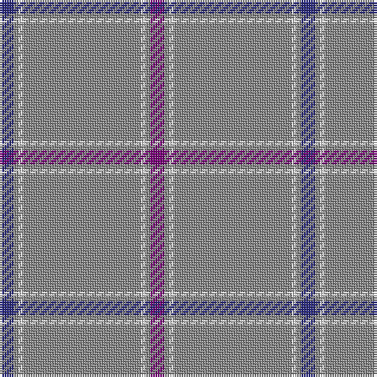

This page is one **sett** — a single exact thread-count. It belongs to the [tartan](/tartans/db3n1ln1n25ln1n1p3/)
(the same proportion at any scale), whose colour order is pattern [BRWRWRB](/stripes/brwrwrb/).

Sourced from house-of-tartan.  It is a [7 stripe tartan](/stripes/stripes7/).

Original link http://www.house-of-tartan.scotland.net/house/TartanViewjs.asp?colr=Def&tnam=387

## Thread count
DB/6 N2 LN2 N50 LN2 N2 P/6

## Palette
Each colour and the base-6 reference it is a variant of.

| Colour | Shade | Base |
|---|---|---|
| DB | <code style="background-color:#2C2C80;">#2C2C80</code> `oklch(35.0% 0.138 276.6)` <small>#2C2C80</small> | B <code style="background-color:#2A418A;">#2A418A</code> |
| LN | <code style="background-color:#E0E0E0;">#E0E0E0</code> `oklch(90.7% 0.000 89.9)` <small>#E0E0E0</small> | W <code style="background-color:#F7F7F7;">#F7F7F7</code> |
| N | <code style="background-color:#888888;">#888888</code> `oklch(62.7% 0.000 89.9)` <small>#888888</small> | R <code style="background-color:#CC0000;">#CC0000</code> |
| P | <code style="background-color:#780078;">#780078</code> `oklch(40.2% 0.185 328.4)` <small>#780078</small> | B <code style="background-color:#2A418A;">#2A418A</code> |

# Sample pattern

## Nearest tartans

The nearest existing variants by ΔTartan distance, with this tartan at the top so the swatches line up against it.

ΔTartan

Tartan

Sett

—

<a href="/ttd/edit/#slug=db3o1w1o25w1o1dp3~x2">St Giles Check Tartan Tartan Number: 387. Earliest known date: 1984 St Giles Church is in the Royal Mile, Edinburgh See products available Copyright © Blair Urquhart, Comrie, 2015</a> <a class="nn-out" href="/setts/s7/db3o1w1o25w1o1dp3~x2/" title="open its dictionary page">↗</a>

0.42

<a href="/ttd/edit/#slug=db3o1w1o25w1o1dp3~x4">St. Giles Check (Corporate)</a> <a class="nn-out" href="/setts/s7/db3o1w1o25w1o1dp3~x4/" title="open its dictionary page">↗</a>

0.60

<a href="/ttd/edit/#slug=db3y1w1y25w1y1p3~x2">St Giles, Check</a> <a class="nn-out" href="/setts/s7/db3y1w1y25w1y1p3~x2/" title="open its dictionary page">↗</a>

1.40

<a href="/ttd/edit/#slug=db2n2lb1n18lb2r2~x4">St. Giles Cathedral (Corporate)</a> <a class="nn-out" href="/setts/s6/db2n2lb1n18lb2r2~x4/" title="open its dictionary page">↗</a>

1.40

<a href="/ttd/edit/#slug=n70ly4n3ly4n7k2n2r7~x2">European</a> <a class="nn-out" href="/setts/s8/n70ly4n3ly4n7k2n2r7~x2/" title="open its dictionary page">↗</a>

1.54

<a href="/ttd/edit/#slug=w2lo44db8lo2db2lo3r1~x2">Reece (Name)</a> <a class="nn-out" href="/setts/s7/w2lo44db8lo2db2lo3r1~x2/" title="open its dictionary page">↗</a>

1.66

<a href="/ttd/edit/#slug=t48w2t7w2t7w2t20db11r2~x2">RAAF #3</a> <a class="nn-out" href="/setts/s9/t48w2t7w2t7w2t20db11r2~x2/" title="open its dictionary page">↗</a>

1.67

<a href="/setts/s12/db3o1w1o25w1o1dp3~x4/">St. Giles Check</a>

1.70

<a href="/ttd/edit/#slug=n65k2n4k2n10r24~x2">Norsemen, The</a> <a class="nn-out" href="/setts/s6/n65k2n4k2n10r24~x2/" title="open its dictionary page">↗</a>

1.71

<a href="/ttd/edit/#slug=b70db5b3w5b3w5b3r5b8~x2">Wyckoff, Ann Grainger Phillips</a> <a class="nn-out" href="/setts/s9/b70db5b3w5b3w5b3r5b8~x2/" title="open its dictionary page">↗</a>

1.75

<a href="/ttd/edit/#slug=n6k1lo6k1n28w1k2w1n16w1r5~x2">Historic Caledonian Railway Enthusiasts', The</a> <a class="nn-out" href="/setts/s11/n6k1lo6k1n28w1k2w1n16w1r5~x2/" title="open its dictionary page">↗</a>

## Neighbour map

Every grey dot is one of 14299 variants placed by the first two principal components of the ΔTartan feature space (44% of its variance). Red is this tartan; blue dots are its nearest — click one to open its page.

<svg viewBox="0 0 640 380" role="img" style="max-width:100%;height:auto;border:1px solid #e0e0e0;border-radius:4px;display:block" xmlns="http://www.w3.org/2000/svg"><image href="/nn/cloud.v1.png" width="640" height="380"/><a href="/setts/s7/db3o1w1o25w1o1dp3~x4/"><circle cx="545.2" cy="137.6" r="4" fill="#3465a4"><title>St. Giles Check (Corporate)</title></circle></a><a href="/setts/s7/db3y1w1y25w1y1p3~x2/"><circle cx="574.4" cy="153.7" r="4" fill="#3465a4"><title>St Giles, Check</title></circle></a><a href="/setts/s6/db2n2lb1n18lb2r2~x4/"><circle cx="521.7" cy="185.3" r="4" fill="#3465a4"><title>St. Giles Cathedral (Corporate)</title></circle></a><a href="/setts/s8/n70ly4n3ly4n7k2n2r7~x2/"><circle cx="626.0" cy="132.9" r="4" fill="#3465a4"><title>European</title></circle></a><a href="/setts/s7/w2lo44db8lo2db2lo3r1~x2/"><circle cx="589.6" cy="118.6" r="4" fill="#3465a4"><title>Reece (Name)</title></circle></a><a href="/setts/s9/t48w2t7w2t7w2t20db11r2~x2/"><circle cx="574.0" cy="166.2" r="4" fill="#3465a4"><title>RAAF #3</title></circle></a><a href="/setts/s12/db3o1w1o25w1o1dp3~x4/"><circle cx="611.7" cy="123.9" r="4" fill="#3465a4"><title>St. Giles Check</title></circle></a><a href="/setts/s6/n65k2n4k2n10r24~x2/"><circle cx="552.5" cy="177.1" r="4" fill="#3465a4"><title>Norsemen, The</title></circle></a><a href="/setts/s9/b70db5b3w5b3w5b3r5b8~x2/"><circle cx="559.8" cy="126.5" r="4" fill="#3465a4"><title>Wyckoff, Ann Grainger Phillips</title></circle></a><a href="/setts/s11/n6k1lo6k1n28w1k2w1n16w1r5~x2/"><circle cx="476.0" cy="117.4" r="4" fill="#3465a4"><title>Historic Caledonian Railway Enthusiasts', The</title></circle></a><circle cx="557.5" cy="144.0" r="5" fill="#c00000"/></svg>

ID: /setts/s7/db3o1w1o25w1o1dp3~x2/
