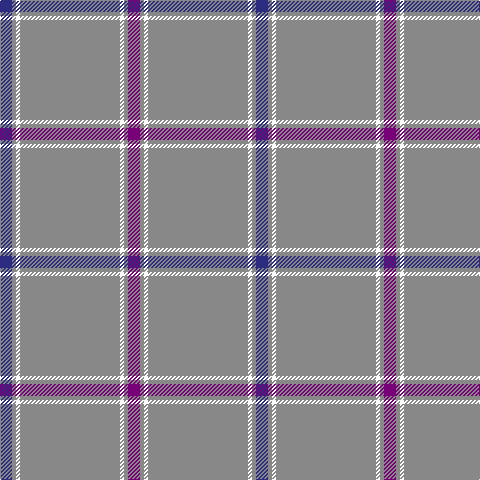

This page is one **sett** — a single exact thread-count. It belongs to the [tartan](/tartans/db3o1w1o25w1o1dp3/)
(the same proportion at any scale), whose colour order is pattern [BRWRWRB](/stripes/brwrwrb/).

Sourced from tartans-authority.  It is a [7 stripe tartan](/stripes/stripes7/).

Original link http://www.tartansauthority.com/tartan-ferret/display/387/

## Also known as

This cloth is also recorded under:

- St. Giles Check

## Register references

External register numbers recorded for this tartan.

- Scottish Tartans Authority (ITI): 387

## Thread count
DB/12 N4 W4 N100 W4 N4 P/12

## Palette

Palette: <strong>Tartan Register</strong>
<table><thead><tr><th>Colour</th><th>Threads</th><th>Shade</th><th>Base</th><th>OKLCh</th></tr></thead><tbody><tr><td>DB/</td><td style="text-align:right;font-variant-numeric:tabular-nums">12</td><td><code style="background-color:#2C2C80;">#2C2C80</code> <small style="color:#888">#2C2C80</small></td><td>B <code style="background-color:#2A418A;">#2A418A</code></td><td><small style="color:#888">oklch(35.0% 0.138 276.6)</small></td></tr><tr><td>N</td><td style="text-align:right;font-variant-numeric:tabular-nums">4</td><td><code style="background-color:#888888;">#888888</code> <small style="color:#888">#888888</small></td><td>R <code style="background-color:#CC0000;">#CC0000</code></td><td><small style="color:#888">oklch(62.7% 0.000 89.9)</small></td></tr><tr><td>W</td><td style="text-align:right;font-variant-numeric:tabular-nums">4</td><td><code style="background-color:#FCFCFC;">#FCFCFC</code> <small style="color:#888">#FCFCFC</small></td><td>W <code style="background-color:#F7F7F7;">#F7F7F7</code></td><td><small style="color:#888">oklch(99.1% 0.000 89.9)</small></td></tr><tr><td>N</td><td style="text-align:right;font-variant-numeric:tabular-nums">100</td><td><code style="background-color:#888888;">#888888</code> <small style="color:#888">#888888</small></td><td>R <code style="background-color:#CC0000;">#CC0000</code></td><td><small style="color:#888">oklch(62.7% 0.000 89.9)</small></td></tr><tr><td>W</td><td style="text-align:right;font-variant-numeric:tabular-nums">4</td><td><code style="background-color:#FCFCFC;">#FCFCFC</code> <small style="color:#888">#FCFCFC</small></td><td>W <code style="background-color:#F7F7F7;">#F7F7F7</code></td><td><small style="color:#888">oklch(99.1% 0.000 89.9)</small></td></tr><tr><td>N</td><td style="text-align:right;font-variant-numeric:tabular-nums">4</td><td><code style="background-color:#888888;">#888888</code> <small style="color:#888">#888888</small></td><td>R <code style="background-color:#CC0000;">#CC0000</code></td><td><small style="color:#888">oklch(62.7% 0.000 89.9)</small></td></tr><tr><td>P/</td><td style="text-align:right;font-variant-numeric:tabular-nums">12</td><td><code style="background-color:#780078;">#780078</code> <small style="color:#888">#780078</small></td><td>B <code style="background-color:#2A418A;">#2A418A</code></td><td><small style="color:#888">oklch(40.2% 0.185 328.4)</small></td></tr></tbody></table>

# Sample pattern

## Nearest tartans

The nearest existing variants by ΔTartan distance, with this tartan at the top so the swatches line up against it.

ΔTartan

Tartan

Sett

—

<a href="/ttd/edit/#slug=db3o1w1o25w1o1dp3~x4">St. Giles Check (Corporate)</a> <a class="nn-out" href="/setts/s7/db3o1w1o25w1o1dp3~x4/" title="open its dictionary page">↗</a>

0.42

<a href="/ttd/edit/#slug=db3o1w1o25w1o1dp3~x2">St Giles Check Tartan Tartan Number: 387. Earliest known date: 1984 St Giles Church is in the Royal Mile, Edinburgh See products available Copyright © Blair Urquhart, Comrie, 2015</a> <a class="nn-out" href="/setts/s7/db3o1w1o25w1o1dp3~x2/" title="open its dictionary page">↗</a>

1.01

<a href="/ttd/edit/#slug=db3y1w1y25w1y1p3~x2">St Giles, Check</a> <a class="nn-out" href="/setts/s7/db3y1w1y25w1y1p3~x2/" title="open its dictionary page">↗</a>

1.49

<a href="/ttd/edit/#slug=w2lo44db8lo2db2lo3r1~x2">Reece (Name)</a> <a class="nn-out" href="/setts/s7/w2lo44db8lo2db2lo3r1~x2/" title="open its dictionary page">↗</a>

1.51

<a href="/ttd/edit/#slug=n70ly4n3ly4n7k2n2r7~x2">European</a> <a class="nn-out" href="/setts/s8/n70ly4n3ly4n7k2n2r7~x2/" title="open its dictionary page">↗</a>

1.52

<a href="/ttd/edit/#slug=b70db5b3w5b3w5b3r5b8~x2">Wyckoff, Ann Grainger Phillips</a> <a class="nn-out" href="/setts/s9/b70db5b3w5b3w5b3r5b8~x2/" title="open its dictionary page">↗</a>

1.56

<a href="/ttd/edit/#slug=db2n2lb1n18lb2r2~x4">St. Giles Cathedral (Corporate)</a> <a class="nn-out" href="/setts/s6/db2n2lb1n18lb2r2~x4/" title="open its dictionary page">↗</a>

1.61

<a href="/ttd/edit/#slug=y24y1k9y1y9y2w2db2~x2">Gairloch</a> <a class="nn-out" href="/setts/s8/y24y1k9y1y9y2w2db2~x2/" title="open its dictionary page">↗</a>

1.69

<a href="/ttd/edit/#slug=n6k1lo6k1n28w1k2w1n16w1r5~x2">Historic Caledonian Railway Enthusiasts', The</a> <a class="nn-out" href="/setts/s11/n6k1lo6k1n28w1k2w1n16w1r5~x2/" title="open its dictionary page">↗</a>

1.69

<a href="/ttd/edit/#slug=t66w2t10w2t10w2t12r3db24~x2">RAAF #5</a> <a class="nn-out" href="/setts/s9/t66w2t10w2t10w2t12r3db24~x2/" title="open its dictionary page">↗</a>

1.72

<a href="/setts/s12/db3o1w1o25w1o1dp3~x4/">St. Giles Check</a>

## Neighbour map

Every grey dot is one of 14359 variants placed by the first two principal components of the ΔTartan feature space (44% of its variance). Red is this tartan; blue dots are its nearest — click one to open its page.

<svg viewBox="0 0 640 380" role="img" style="max-width:100%;height:auto;border:1px solid #e0e0e0;border-radius:4px;display:block" xmlns="http://www.w3.org/2000/svg"><image href="/nn/cloud.v1.png" width="640" height="380"/><a href="/setts/s7/db3o1w1o25w1o1dp3~x2/"><circle cx="556.2" cy="144.0" r="4" fill="#3465a4"><title>St Giles Check Tartan Tartan Number: 387. Earliest known date: 1984 St Giles Church is in the Royal Mile, Edinburgh See products available Copyright © Blair Urquhart, Comrie, 2015</title></circle></a><a href="/setts/s7/db3y1w1y25w1y1p3~x2/"><circle cx="573.3" cy="153.6" r="4" fill="#3465a4"><title>St Giles, Check</title></circle></a><a href="/setts/s7/w2lo44db8lo2db2lo3r1~x2/"><circle cx="588.1" cy="118.4" r="4" fill="#3465a4"><title>Reece (Name)</title></circle></a><a href="/setts/s8/n70ly4n3ly4n7k2n2r7~x2/"><circle cx="626.0" cy="132.6" r="4" fill="#3465a4"><title>European</title></circle></a><a href="/setts/s9/b70db5b3w5b3w5b3r5b8~x2/"><circle cx="558.6" cy="126.5" r="4" fill="#3465a4"><title>Wyckoff, Ann Grainger Phillips</title></circle></a><a href="/setts/s6/db2n2lb1n18lb2r2~x4/"><circle cx="520.7" cy="185.5" r="4" fill="#3465a4"><title>St. Giles Cathedral (Corporate)</title></circle></a><a href="/setts/s8/y24y1k9y1y9y2w2db2~x2/"><circle cx="470.3" cy="147.3" r="4" fill="#3465a4"><title>Gairloch</title></circle></a><a href="/setts/s11/n6k1lo6k1n28w1k2w1n16w1r5~x2/"><circle cx="474.9" cy="117.5" r="4" fill="#3465a4"><title>Historic Caledonian Railway Enthusiasts', The</title></circle></a><a href="/setts/s9/t66w2t10w2t10w2t12r3db24~x2/"><circle cx="499.9" cy="131.3" r="4" fill="#3465a4"><title>RAAF #5</title></circle></a><a href="/setts/s12/db3o1w1o25w1o1dp3~x4/"><circle cx="610.2" cy="123.6" r="4" fill="#3465a4"><title>St. Giles Check</title></circle></a><circle cx="543.9" cy="137.6" r="5" fill="#c00000"/></svg>

ID: /setts/s7/db3o1w1o25w1o1dp3~x4/
