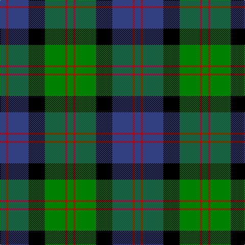

In pattern [BRBKGRG](/stripes/brbkgrg/).

This was sourced from weddslist.  It is a [7 stripe tartan](/stripes/stripes7/).

Original link http://www.weddslist.com/cgi-bin/tartans/pg.pl?source=sts

## Attestations

This cloth appears in 2 source records; the oldest owns this page.

- undated — Blair (weddslist, [record](http://www.weddslist.com/cgi-bin/tartans/pg.pl?source=sts))
- undated — Blair Clan Tartan Tartan Number: 416. Earliest known date: pre 1963 Described by MacKinlay as a "Modern family sett". See products available Copyright © Blair Urquhart, Comrie, 2015 (house-of-tartan, [record](http://www.house-of-tartan.scotland.net/house/TartanViewjs.asp?colr=Def&tnam=416))

## Thread count
G/12 R4 G40 K32 B40 R4 B/12

## Palette
Each colour and the base-6 reference it is a variant of.

| Colour | Shade | Base |
|---|---|---|
| B | <code style="background-color:#304080;">#304080</code> `oklch(39.4% 0.109 270.2)` <small>#304080</small> | B <code style="background-color:#2A418A;">#2A418A</code> |
| G | <code style="background-color:#008000;">#008000</code> `oklch(52.0% 0.177 142.5)` <small>#008000</small> | G <code style="background-color:#006100;">#006100</code> |
| K | <code style="background-color:#000000;">#000000</code> `oklch(0.0% 0.000 0.0)` <small>#000000</small> | K <code style="background-color:#000000;">#000000</code> |
| R | <code style="background-color:#C00000;">#C00000</code> `oklch(50.7% 0.208 29.2)` <small>#C00000</small> | R <code style="background-color:#CC0000;">#CC0000</code> |

# Sample pattern

## Nearest tartans

The nearest existing variants by ΔTartan distance.

1. [Gunn](/setts/s6/r2g12k12g1db12g1~x2/) — ΔT 0.61
1. [Unnamed, No 115](/setts/s8/db10k6t1g6k1~x2/) — ΔT 0.65
1. [Ferguson of Balquhidder](/setts/s6/k2g12k12r1db12g2~x2/) — ΔT 0.68
1. [Unnamed, No 59](/setts/s6/t1db11k11g11k2t1~x2/) — ΔT 0.69
1. [MacNeil 1](/setts/s6/w1db9k9g9k2w1~x4/) — ΔT 0.72
1. [Graham of Montrose](/setts/s6/k4g19k16w2db15g4~x2/) — ΔT 0.72
1. [Flower of Scotland](/setts/s6/db3g28db3k16db28r3/) — ΔT 0.75
1. [Melville](/setts/s6/k4w2g18k13db12k2~x2/) — ΔT 0.75
1. [Fletcher of Dunans](/setts/s7/db6k1db6k8r1g8r2~x2/) — ΔT 0.82
1. [Graham of Menteith](/setts/s6/g18t2g4k14db12k3~x2/) — ΔT 0.83

## Neighbour map

Every grey dot is one of 14299 variants placed by the first two principal components of the ΔTartan feature space (44% of its variance). Red is this tartan; blue dots are its nearest — click one to open its page.

<svg viewBox="0 0 640 380" role="img" style="max-width:100%;height:auto;border:1px solid #e0e0e0;border-radius:4px;display:block" xmlns="http://www.w3.org/2000/svg"><image href="/nn/cloud.v1.png" width="640" height="380"/><a href="/setts/s6/r2g12k12g1db12g1~x2/"><circle cx="173.1" cy="206.0" r="4" fill="#3465a4"><title>Gunn</title></circle></a><a href="/setts/s8/db10k6t1g6k1~x2/"><circle cx="146.4" cy="214.8" r="4" fill="#3465a4"><title>Unnamed, No 115</title></circle></a><a href="/setts/s6/k2g12k12r1db12g2~x2/"><circle cx="171.6" cy="211.8" r="4" fill="#3465a4"><title>Ferguson of Balquhidder</title></circle></a><a href="/setts/s6/t1db11k11g11k2t1~x2/"><circle cx="167.6" cy="212.4" r="4" fill="#3465a4"><title>Unnamed, No 59</title></circle></a><a href="/setts/s6/w1db9k9g9k2w1~x4/"><circle cx="146.6" cy="216.6" r="4" fill="#3465a4"><title>MacNeil 1</title></circle></a><a href="/setts/s6/k4g19k16w2db15g4~x2/"><circle cx="162.2" cy="224.2" r="4" fill="#3465a4"><title>Graham of Montrose</title></circle></a><a href="/setts/s6/db3g28db3k16db28r3/"><circle cx="207.2" cy="216.0" r="4" fill="#3465a4"><title>Flower of Scotland</title></circle></a><a href="/setts/s6/k4w2g18k13db12k2~x2/"><circle cx="159.8" cy="221.5" r="4" fill="#3465a4"><title>Melville</title></circle></a><a href="/setts/s7/db6k1db6k8r1g8r2~x2/"><circle cx="147.3" cy="227.6" r="4" fill="#3465a4"><title>Fletcher of Dunans</title></circle></a><a href="/setts/s6/g18t2g4k14db12k3~x2/"><circle cx="177.8" cy="228.0" r="4" fill="#3465a4"><title>Graham of Menteith</title></circle></a><circle cx="167.4" cy="213.5" r="5" fill="#c00000"/></svg>

ID: /setts/s7/db3r1db10k8g10r1g3~x4/
