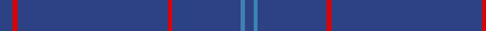

In pattern [BBBRBRB](/stripes/bbbrbrb/).

This was sourced from register-of-tartans.  It is a [7 stripe tartan](/stripes/stripes7/).

Original link https://www.tartanregister.gov.uk/tartanDetails.aspx?ref=2166

## Also known as

This cloth is also recorded under:

- Lochaber Old..
- Lochaber, Old..

## Attestations

This cloth appears in 3 source records; the oldest owns this page.

- undated — Lochaber Old (register-of-tartans, [record](https://www.tartanregister.gov.uk/tartanDetails.aspx?ref=2166))
- undated — Lochaber, Old.. (weddslist, [record](http://www.weddslist.com/cgi-bin/tartans/pg.pl?source=sts))
- undated — Lochaber Old.. District Tartan Tartan Number: 33. Earliest known date: 1797 J.Telfer Dunbar Collection. Lochaber is the home of Clan Cameron and a portion of the Clanranald MacDonalds. The former military Fort William is now the population centre of the district on the West coast of Scotland. This is one of several recorded old authentic patterns from the Lochaber district. See products available Copyright © Blair Urquhart, Comrie, 2015 (house-of-tartan, [record](http://www.house-of-tartan.scotland.net/house/TartanViewjs.asp?colr=Def&tnam=33))

## Register references

External register numbers recorded for this tartan.

- Scottish Register of Tartans: [2166](https://www.tartanregister.gov.uk/tartanDetails.aspx?ref=2166)
- Scottish Tartans World Register: 33

## Thread count
B/12 R4 B140 R4 B64 Ba4 B/8

## Palette
Each colour and the base-6 reference it is a variant of.

| Colour | Shade | Base |
|---|---|---|
| B | <code style="background-color:#2C4084;">#2C4084</code> `oklch(39.4% 0.117 268.3)` <small>#2C4084</small> | B <code style="background-color:#2A418A;">#2A418A</code> |
| Ba | <code style="background-color:#3C82AF;">#3C82AF</code> `oklch(58.1% 0.099 239.8)` <small>#3C82AF</small> | B <code style="background-color:#2A418A;">#2A418A</code> |
| R | <code style="background-color:#DC0000;">#DC0000</code> `oklch(56.2% 0.230 29.2)` <small>#DC0000</small> | R <code style="background-color:#CC0000;">#CC0000</code> |

# Sample pattern

## Nearest tartans

The nearest existing variants by ΔTartan distance, with this tartan at the top so the swatches line up against it.

ΔTartan

Tartan

Sett

—

<a href="/ttd/edit/#slug=db3r1db35r1db16t1db2~x4">Lochaber Old</a> <a class="nn-out" href="/setts/s7/db3r1db35r1db16t1db2~x4/" title="open its dictionary page">↗</a>

1.83

<a href="/setts/s6/db33g3r1~x2/">Norwich No.030</a>

2.96

<a href="/ttd/edit/#slug=b86ly2b18r3k1w2~x2">Wylie (Ancient)</a> <a class="nn-out" href="/setts/s6/b86ly2b18r3k1w2~x2/" title="open its dictionary page">↗</a>

3.12

<a href="/ttd/edit/#slug=db42db10db2db2r2db2db10r6db2r3db2~x2">Loch Monar (Fashion)</a> <a class="nn-out" href="/setts/s11/db42db10db2db2r2db2db10r6db2r3db2~x2/" title="open its dictionary page">↗</a>

3.21

<a href="/ttd/edit/#slug=k99r5k4r3k2y1~x2">Allt Dubh (Black Burn)</a> <a class="nn-out" href="/setts/s6/k99r5k4r3k2y1~x2/" title="open its dictionary page">↗</a>

3.33

<a href="/ttd/edit/#slug=k50r1db3dp1~x4">Alich (Personal)</a> <a class="nn-out" href="/setts/s4/k50r1db3dp1~x4/" title="open its dictionary page">↗</a>

3.38

<a href="/ttd/edit/#slug=k50r1dt3dp1~x4">Alich (Personal)</a> <a class="nn-out" href="/setts/s4/k50r1dt3dp1~x4/" title="open its dictionary page">↗</a>

3.41

<a href="/ttd/edit/#slug=n88dy3lo2k2k1~x2">Eternity Fashion Tartan Tartan Number: 10214. Earliest known date: 01/02/2010 This tartan was designed for day wear grey tweed jackets. It has been shown in the Dedicated to Wedding magazine (April 2010). Perfection leads to eternity is the goal for all eternal marriage. See products available Copyright © Blair Urquhart, Comrie, 2015</a> <a class="nn-out" href="/setts/s5/n88dy3lo2k2k1~x2/" title="open its dictionary page">↗</a>

3.41

<a href="/ttd/edit/#slug=dg60r2dg8r1dg5k2">St. David's (District)</a> <a class="nn-out" href="/setts/s6/dg60r2dg8r1dg5k2/" title="open its dictionary page">↗</a>

3.44

<a href="/ttd/edit/#slug=db8lo2db8dg7db57k3t1~x2">Cullen (Christian Hill)</a> <a class="nn-out" href="/setts/s7/db8lo2db8dg7db57k3t1~x2/" title="open its dictionary page">↗</a>

3.48

<a href="/ttd/edit/#slug=do88o3ly2k2lr1~x2">Eternity, Dedicated 2 Weddings</a> <a class="nn-out" href="/setts/s5/do88o3ly2k2lr1~x2/" title="open its dictionary page">↗</a>

## Neighbour map

Every grey dot is one of 14299 variants placed by the first two principal components of the ΔTartan feature space (44% of its variance). Red is this tartan; blue dots are its nearest — click one to open its page.

<svg viewBox="0 0 640 380" role="img" style="max-width:100%;height:auto;border:1px solid #e0e0e0;border-radius:4px;display:block" xmlns="http://www.w3.org/2000/svg"><image href="/nn/cloud.v1.png" width="640" height="380"/><a href="/setts/s6/db33g3r1~x2/"><circle cx="626.0" cy="225.9" r="4" fill="#3465a4"><title>Norwich No.030</title></circle></a><a href="/setts/s6/b86ly2b18r3k1w2~x2/"><circle cx="626.0" cy="147.3" r="4" fill="#3465a4"><title>Wylie (Ancient)</title></circle></a><a href="/setts/s11/db42db10db2db2r2db2db10r6db2r3db2~x2/"><circle cx="626.0" cy="213.3" r="4" fill="#3465a4"><title>Loch Monar (Fashion)</title></circle></a><a href="/setts/s6/k99r5k4r3k2y1~x2/"><circle cx="626.0" cy="193.7" r="4" fill="#3465a4"><title>Allt Dubh (Black Burn)</title></circle></a><a href="/setts/s4/k50r1db3dp1~x4/"><circle cx="626.0" cy="213.5" r="4" fill="#3465a4"><title>Alich (Personal)</title></circle></a><a href="/setts/s4/k50r1dt3dp1~x4/"><circle cx="626.0" cy="217.2" r="4" fill="#3465a4"><title>Alich (Personal)</title></circle></a><a href="/setts/s5/n88dy3lo2k2k1~x2/"><circle cx="626.0" cy="176.3" r="4" fill="#3465a4"><title>Eternity Fashion Tartan Tartan Number: 10214. Earliest known date: 01/02/2010 This tartan was designed for day wear grey tweed jackets. It has been shown in the Dedicated to Wedding magazine (April 2010). Perfection leads to eternity is the goal for all eternal marriage. See products available Copyright © Blair Urquhart, Comrie, 2015</title></circle></a><a href="/setts/s6/dg60r2dg8r1dg5k2/"><circle cx="626.0" cy="200.1" r="4" fill="#3465a4"><title>St. David's (District)</title></circle></a><a href="/setts/s7/db8lo2db8dg7db57k3t1~x2/"><circle cx="626.0" cy="152.1" r="4" fill="#3465a4"><title>Cullen (Christian Hill)</title></circle></a><a href="/setts/s5/do88o3ly2k2lr1~x2/"><circle cx="626.0" cy="155.4" r="4" fill="#3465a4"><title>Eternity, Dedicated 2 Weddings</title></circle></a><circle cx="626.0" cy="221.0" r="5" fill="#c00000"/></svg>

ID: /setts/s7/db3r1db35r1db16t1db2~x4/
