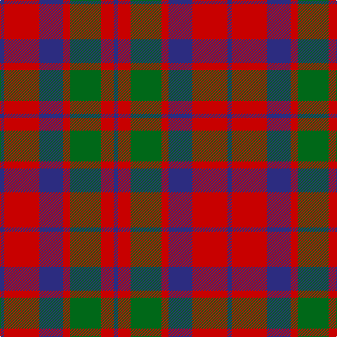

In pattern [BRBRGRB](/stripes/brbrgrb/).

This was sourced from register-of-tartans.  It is a [7 stripe tartan](/stripes/stripes7/).

Original link https://www.tartanregister.gov.uk/tartanDetails.aspx?ref=2429

## Also known as

This cloth is also recorded under:

- MacFadyen MacBean
- MacFadyen, MacBean

## Attestations

This cloth appears in 4 source records; the oldest owns this page.

- 01/01/1745 — MacFadyan (MacGregor Hastie) (register-of-tartans, [record](https://www.tartanregister.gov.uk/tartanDetails.aspx?ref=2429))
- 1745 — MacFadyan (MacGregor Hastie) (tartans-authority, [record](http://www.tartansauthority.com/tartan-ferret/display/403/))
- undated — MacFadyen, MacBean (Old) (weddslist, [record](http://www.weddslist.com/cgi-bin/tartans/pg.pl?source=sts))
- undated — MacFadyen MacBean (Old) Clan Tartan Tartan Number: 403. Earliest known date: pre 2003 This sample comes from the MacGregor-Hastie collection which forms the basis of the cloth archive of the Scottish Tartans Society. Some of the samples, including this one, were unmarked. One can assume that the sample dates between 1930 and 1950. See products available Copyright © Blair Urquhart, Comrie, 2015 (house-of-tartan, [record](http://www.house-of-tartan.scotland.net/house/TartanViewjs.asp?colr=Def&tnam=403))

## Register references

External register numbers recorded for this tartan.

- Scottish Register of Tartans: [2429](https://www.tartanregister.gov.uk/tartanDetails.aspx?ref=2429)
- Scottish Tartans Authority (ITI): 403
- Scottish Tartans World Register: 403

## Thread count
DB/6 R50 DB34 R10 G44 R18 DB/6

## Palette
Each colour and the base-6 reference it is a variant of.

| Colour | Shade | Base |
|---|---|---|
| DB | <code style="background-color:#2C2C80;">#2C2C80</code> `oklch(35.0% 0.138 276.6)` <small>#2C2C80</small> | B <code style="background-color:#2A418A;">#2A418A</code> |
| G | <code style="background-color:#006818;">#006818</code> `oklch(45.0% 0.142 145.0)` <small>#006818</small> | G <code style="background-color:#006100;">#006100</code> |
| R | <code style="background-color:#C80000;">#C80000</code> `oklch(52.3% 0.215 29.2)` <small>#C80000</small> | R <code style="background-color:#CC0000;">#CC0000</code> |

# Sample pattern

## Nearest tartans

The nearest existing variants by ΔTartan distance.

1. [Fraser (Wilson 1820)](/setts/s9/db2r2db10r10db1r10g10r1db2~x4/) — ΔT 0.71
1. [Thomson, Red (Name)](/setts/s6/t4r28k6t12k12t3~x2/) — ΔT 0.95
1. [Unidentified 16](/setts/s6/r4g26r26p26r3p4~x2/) — ΔT 0.99
1. [Bronte House Check](/setts/s6/m10dy60dt13lo24dt24dy8/) — ΔT 1.01
1. [MacNab 1](/setts/s6/dp3r19dp18g19dp3g3~x2/) — ΔT 1.03
1. [MacNab (Macgregor - Hastie)](/setts/s6/dg3dp3dg19dp18r19dp3~x2/) — ΔT 1.08
1. [Convention of the Baronage (Corp)](/setts/s9/g3r9t1g9r1g1r9db9r1~x4/) — ΔT 1.08
1. [MacBean of Tomatin (Clan)](/setts/s7/db3r19db13r5g21r8db3~x2/) — ΔT 1.08
1. [Baronage](/setts/s9/dg3r9t1dg9r1dg1r8db9r1~x4/) — ΔT 1.09
1. [Glasgow, City of](/setts/s7/g28r4dp25r22g27r4dp2~x2/) — ΔT 1.09

## Neighbour map

Every grey dot is one of 14299 variants placed by the first two principal components of the ΔTartan feature space (44% of its variance). Red is this tartan; blue dots are its nearest — click one to open its page.

<svg viewBox="0 0 640 380" role="img" style="max-width:100%;height:auto;border:1px solid #e0e0e0;border-radius:4px;display:block" xmlns="http://www.w3.org/2000/svg"><image href="/nn/cloud.v1.png" width="640" height="380"/><a href="/setts/s9/db2r2db10r10db1r10g10r1db2~x4/"><circle cx="284.0" cy="209.3" r="4" fill="#3465a4"><title>Fraser (Wilson 1820)</title></circle></a><a href="/setts/s6/t4r28k6t12k12t3~x2/"><circle cx="243.3" cy="217.1" r="4" fill="#3465a4"><title>Thomson, Red (Name)</title></circle></a><a href="/setts/s6/r4g26r26p26r3p4~x2/"><circle cx="240.3" cy="231.3" r="4" fill="#3465a4"><title>Unidentified 16</title></circle></a><a href="/setts/s6/m10dy60dt13lo24dt24dy8/"><circle cx="248.8" cy="222.4" r="4" fill="#3465a4"><title>Bronte House Check</title></circle></a><a href="/setts/s6/dp3r19dp18g19dp3g3~x2/"><circle cx="210.6" cy="245.5" r="4" fill="#3465a4"><title>MacNab 1</title></circle></a><a href="/setts/s6/dg3dp3dg19dp18r19dp3~x2/"><circle cx="226.3" cy="251.0" r="4" fill="#3465a4"><title>MacNab (Macgregor - Hastie)</title></circle></a><a href="/setts/s9/g3r9t1g9r1g1r9db9r1~x4/"><circle cx="251.9" cy="197.2" r="4" fill="#3465a4"><title>Convention of the Baronage (Corp)</title></circle></a><a href="/setts/s7/db3r19db13r5g21r8db3~x2/"><circle cx="256.4" cy="257.4" r="4" fill="#3465a4"><title>MacBean of Tomatin (Clan)</title></circle></a><a href="/setts/s9/dg3r9t1dg9r1dg1r8db9r1~x4/"><circle cx="247.0" cy="199.6" r="4" fill="#3465a4"><title>Baronage</title></circle></a><a href="/setts/s7/g28r4dp25r22g27r4dp2~x2/"><circle cx="298.8" cy="223.8" r="4" fill="#3465a4"><title>Glasgow, City of</title></circle></a><circle cx="266.1" cy="233.3" r="5" fill="#c00000"/></svg>

ID: /setts/s7/db3r25db17r5g22r9db3~x2/
