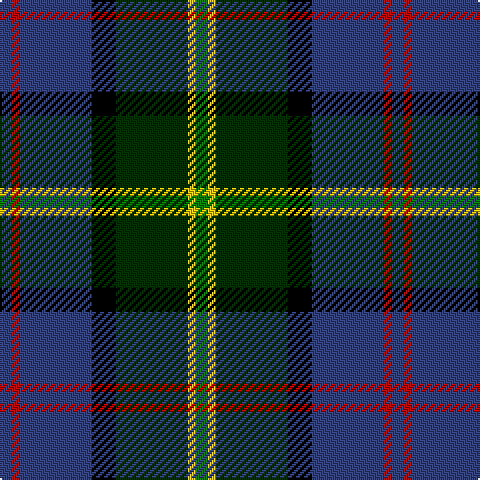

This page is one **sett** — a single exact thread-count. It belongs to the [tartan](/tartans/g3y2dg18k6b18r2b3/)
(the same proportion at any scale), whose colour order is pattern [BRBKGYG](/stripes/brbkgyg/).

Sourced from weddslist.  It is a [7 stripe tartan](/stripes/stripes7/).

Original link http://www.weddslist.com/cgi-bin/tartans/pg.pl?source=sts

## Thread count
G/6 Y4 DG36 K12 B36 R4 B/6

## Palette
Each colour and the base-6 reference it is a variant of.

| Colour | Shade | Base |
|---|---|---|
| B | <code style="background-color:#304080;">#304080</code> `oklch(39.4% 0.109 270.2)` <small>#304080</small> | B <code style="background-color:#2A418A;">#2A418A</code> |
| DG | <code style="background-color:#003000;">#003000</code> `oklch(26.8% 0.091 142.5)` <small>#003000</small> | G <code style="background-color:#006100;">#006100</code> |
| G | <code style="background-color:#008000;">#008000</code> `oklch(52.0% 0.177 142.5)` <small>#008000</small> | G <code style="background-color:#006100;">#006100</code> |
| K | <code style="background-color:#000000;">#000000</code> `oklch(0.0% 0.000 0.0)` <small>#000000</small> | K <code style="background-color:#000000;">#000000</code> |
| R | <code style="background-color:#C00000;">#C00000</code> `oklch(50.7% 0.208 29.2)` <small>#C00000</small> | R <code style="background-color:#CC0000;">#CC0000</code> |
| Y | <code style="background-color:#F0C000;">#F0C000</code> `oklch(82.7% 0.169 90.5)` <small>#F0C000</small> | Y <code style="background-color:#F2BF00;">#F2BF00</code> |

# Sample pattern

## Nearest tartans

The nearest existing variants by ΔTartan distance, with this tartan at the top so the swatches line up against it.

ΔTartan

Tartan

Sett

—

<a href="/ttd/edit/#slug=db3r2db18k6dg18ly2g3~x2">McComb</a> <a class="nn-out" href="/setts/s7/db3r2db18k6dg18ly2g3~x2/" title="open its dictionary page">↗</a>

0.67

<a href="/ttd/edit/#slug=r3g3db4g17k13dt26w3~x2">Royal Burgh of Peebles (District)</a> <a class="nn-out" href="/setts/s7/r3g3db4g17k13dt26w3~x2/" title="open its dictionary page">↗</a>

0.72

<a href="/ttd/edit/#slug=db3r2db18k6g18ly2g3~x2">McComb (Personal)</a> <a class="nn-out" href="/setts/s7/db3r2db18k6g18ly2g3~x2/" title="open its dictionary page">↗</a>

0.73

<a href="/ttd/edit/#slug=k29r3dt24n6k8w4n8o6~x2">Yates (Personal)</a> <a class="nn-out" href="/setts/s8/k29r3dt24n6k8w4n8o6~x2/" title="open its dictionary page">↗</a>

0.79

<a href="/ttd/edit/#slug=w5k26ly2dg24dt7k3r3~x2">Cornish Hunting District Tartan Tartan Number: 1568. Earliest known date: 1984 The Cornish Hunting tartan was first produced in 1984, and was marketed by the firm, Cornovi Creations, Cornwall. It is based on the Cornish National tartan designed by E.E. Morton-Nance, who regarded tartan as the heritage of all Celts, not Scots alone. (P Smith and G Teall, District Tartans, 1992) The hunting sett replaces the 'National' yellow with dark green and the azure with a darker shade of blue. Cornish Hunting is a registered design (No. 514267). See products available Copyright © Blair Urquhart, Comrie, 2015</a> <a class="nn-out" href="/setts/s7/w5k26ly2dg24dt7k3r3~x2/" title="open its dictionary page">↗</a>

0.80

<a href="/ttd/edit/#slug=g16lb3g3k10db12r2k3~x2">MacLean, Donald Personal Tartan Tartan Number: 3440. Earliest known date: pre 2002 From Pendleton Woolen Mills of Oregon, owners of the only copy of Clans Originaux. EBW 8.11.02. This is the same as MacTaggart #408 and #409!!! See products available Copyright © Blair Urquhart, Comrie, 2015</a> <a class="nn-out" href="/setts/s7/g16lb3g3k10db12r2k3~x2/" title="open its dictionary page">↗</a>

0.81

<a href="/ttd/edit/#slug=r2k6ly1dg12ly1db6lr2~x4">James (Personal)</a> <a class="nn-out" href="/setts/s7/r2k6ly1dg12ly1db6lr2~x4/" title="open its dictionary page">↗</a>

0.85

<a href="/ttd/edit/#slug=dy4db3k18k3k2g18dy3g2lb2~x4">Tombow 21st School Memorial</a> <a class="nn-out" href="/setts/s9/dy4db3k18k3k2g18dy3g2lb2~x4/" title="open its dictionary page">↗</a>

0.86

<a href="/ttd/edit/#slug=w2db20r3k10g20lo2~x2">Morris of Eddergoll (Personal)</a> <a class="nn-out" href="/setts/s6/w2db20r3k10g20lo2~x2/" title="open its dictionary page">↗</a>

0.86

<a href="/ttd/edit/#slug=r3g2db27k19g27dp2ly3~x2">Christian Hunting (Personal)</a> <a class="nn-out" href="/setts/s7/r3g2db27k19g27dp2ly3~x2/" title="open its dictionary page">↗</a>

0.91

<a href="/ttd/edit/#slug=db34w5db5r5db5dr26g33o6~x2">Blairmore</a> <a class="nn-out" href="/setts/s8/db34w5db5r5db5dr26g33o6~x2/" title="open its dictionary page">↗</a>

## Neighbour map

Every grey dot is one of 14299 variants placed by the first two principal components of the ΔTartan feature space (44% of its variance). Red is this tartan; blue dots are its nearest — click one to open its page.

<svg viewBox="0 0 640 380" role="img" style="max-width:100%;height:auto;border:1px solid #e0e0e0;border-radius:4px;display:block" xmlns="http://www.w3.org/2000/svg"><image href="/nn/cloud.v1.png" width="640" height="380"/><a href="/setts/s7/r3g3db4g17k13dt26w3~x2/"><circle cx="155.6" cy="190.3" r="4" fill="#3465a4"><title>Royal Burgh of Peebles (District)</title></circle></a><a href="/setts/s7/db3r2db18k6g18ly2g3~x2/"><circle cx="185.0" cy="184.3" r="4" fill="#3465a4"><title>McComb (Personal)</title></circle></a><a href="/setts/s8/k29r3dt24n6k8w4n8o6~x2/"><circle cx="174.7" cy="178.6" r="4" fill="#3465a4"><title>Yates (Personal)</title></circle></a><a href="/setts/s7/w5k26ly2dg24dt7k3r3~x2/"><circle cx="196.2" cy="163.3" r="4" fill="#3465a4"><title>Cornish Hunting District Tartan Tartan Number: 1568. Earliest known date: 1984 The Cornish Hunting tartan was first produced in 1984, and was marketed by the firm, Cornovi Creations, Cornwall. It is based on the Cornish National tartan designed by E.E. Morton-Nance, who regarded tartan as the heritage of all Celts, not Scots alone. (P Smith and G Teall, District Tartans, 1992) The hunting sett replaces the 'National' yellow with dark green and the azure with a darker shade of blue. Cornish Hunting is a registered design (No. 514267). See products available Copyright © Blair Urquhart, Comrie, 2015</title></circle></a><a href="/setts/s7/g16lb3g3k10db12r2k3~x2/"><circle cx="129.8" cy="196.3" r="4" fill="#3465a4"><title>MacLean, Donald Personal Tartan Tartan Number: 3440. Earliest known date: pre 2002 From Pendleton Woolen Mills of Oregon, owners of the only copy of Clans Originaux. EBW 8.11.02. This is the same as MacTaggart #408 and #409!!! See products available Copyright © Blair Urquhart, Comrie, 2015</title></circle></a><a href="/setts/s7/r2k6ly1dg12ly1db6lr2~x4/"><circle cx="163.5" cy="169.8" r="4" fill="#3465a4"><title>James (Personal)</title></circle></a><a href="/setts/s9/dy4db3k18k3k2g18dy3g2lb2~x4/"><circle cx="155.6" cy="161.3" r="4" fill="#3465a4"><title>Tombow 21st School Memorial</title></circle></a><a href="/setts/s6/w2db20r3k10g20lo2~x2/"><circle cx="138.9" cy="181.3" r="4" fill="#3465a4"><title>Morris of Eddergoll (Personal)</title></circle></a><a href="/setts/s7/r3g2db27k19g27dp2ly3~x2/"><circle cx="175.0" cy="166.8" r="4" fill="#3465a4"><title>Christian Hunting (Personal)</title></circle></a><a href="/setts/s8/db34w5db5r5db5dr26g33o6~x2/"><circle cx="119.3" cy="179.1" r="4" fill="#3465a4"><title>Blairmore</title></circle></a><circle cx="177.3" cy="181.7" r="5" fill="#c00000"/></svg>

ID: /setts/s7/db3r2db18k6dg18ly2g3~x2/
