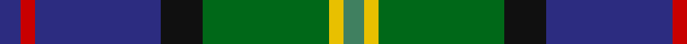
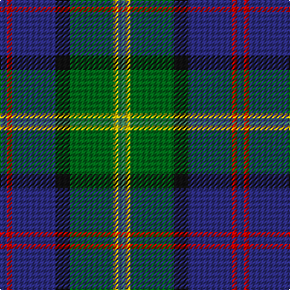

**Bands:** [BRBKGYG](/stripes/brbkgyg/) · **Stripes:** [DB R DB K G LY G](/stripes/stripes7/) DB R DB K G LY G

This was sourced from register-of-tartans.  It is a [7 band tartan](/bands/bands7/).

Original link https://www.tartanregister.gov.uk/tartanDetails.aspx?ref=2878

## Attestations

This cloth appears in 2 source records; the oldest owns this page.

- 01/01/1997 — McComb (Personal) (register-of-tartans, [record](https://www.tartanregister.gov.uk/tartanDetails.aspx?ref=2878))
- pre 1997 — McComb (Personal) (tartans-authority, [record](http://www.tartansauthority.com/tartan-ferret/display/2340/))

## Register references

External register numbers recorded for this tartan.

- Scottish Register of Tartans: [2878](https://www.tartanregister.gov.uk/tartanDetails.aspx?ref=2878)
- Scottish Tartans Authority (ITI): 2340
- Scottish Tartans World Register: 2340

## Thread count
DB/6 R4 DB36 K12 G36 Y4 Ga/6

## Palette
Each colour and its ΔE from the base-6 reference it is a variant of.

| Colour | Shade | Base | ΔE (OKLab) |
|---|---|---|---|
| DB | <code style="background-color:#2C2C80;">#2C2C80</code> `#2C2C80` | B <code style="background-color:#2A418A;">#2A418A</code> | 0.06 |
| G | <code style="background-color:#006818;">#006818</code> `#006818` | G <code style="background-color:#006100;">#006100</code> | 0.02 |
| Ga | <code style="background-color:#408060;">#408060</code> `#408060` | G <code style="background-color:#006100;">#006100</code> | 0.14 |
| K | <code style="background-color:#101010;">#101010</code> `#101010` | K <code style="background-color:#000000;">#000000</code> | 0.17 |
| R | <code style="background-color:#C80000;">#C80000</code> `#C80000` | R <code style="background-color:#CC0000;">#CC0000</code> | 0.01 |
| Y | <code style="background-color:#E8C000;">#E8C000</code> `#E8C000` | Y <code style="background-color:#F2BF00;">#F2BF00</code> | 0.02 |

# Sample pattern

## Nearest tartans

The nearest existing variants by ΔTartan distance.

1. [Ayrshire District Tartan Tartan Number: 436. Earliest known date: 1988 Dr Phil Smith, a Fellow of the Scottish Tartans Society, designed the Ayrshire district tartan at the suggestion of the Clan Boyd and Clan Cunningham Societies. In his book, 'District Tartans' (1992) co-authored with Dr G Teall, he says, the colours "..reflect the gold of the rising sun, the green of the land and brown of the coast, the blue of the sea and the red of the setting sun. The Ayrshire tartan is intended for those with connections in the districts of Kyle, Cunninghame and Inverclyde." See products available Copyright © Blair Urquhart, Comrie, 2015](/setts/s8/db2r1db10w1dy4g8ly1g2~x4/) — ΔT 0.48
1. [McComb](/setts/s7/db3r2db18k6dg18ly2g3~x2/) — ΔT 0.72
1. [Royal Burgh of Peebles (District)](/setts/s7/r3g3db4g17k13dt26w3~x2/) — ΔT 0.79
1. [Christian Hunting (Personal)](/setts/s7/ly3dp2g27k19db27g2r3~x2/) — ΔT 0.84
1. [Schmidt (2014)](/setts/s10/k3db20db8db4g20k2g2r2g3ly3~x2/) — ΔT 0.88
1. [Connor (Personal)](/setts/s9/db1dy4g8ly1g8db12w1db2r1~x4/) — ΔT 0.89
1. [James (Personal)](/setts/s7/lr2db6ly1dg12ly1k6r2~x4/) — ΔT 0.92
1. [Big Rory (Corporate)](/setts/s10/n10w5n48k35g5k5g35r5g5dp5/) — ΔT 0.94
1. [Yates (Personal)](/setts/s8/k29r3dt24n6k8w4n8o6~x2/) — ΔT 0.94
1. [Porteous Family Tartan Tartan Number: 1264. Earliest known date: 1978 Designed for the Porteous Family Association, and submitted to the Monitoring Committee of the Scottish Tartan Society by Captain Barry Porteous who was president of the association at that time. See products available Copyright © Blair Urquhart, Comrie, 2015](/setts/s6/k1ly1db8g10db7w1~x2/) — ΔT 0.95

## Neighbour map

Every grey dot is one of 14313 variants placed by the first two principal components of the ΔTartan feature space (44% of its variance). Red is this tartan; blue dots are its nearest — click one to open its page.

<svg viewBox="0 0 640 380" role="img" style="max-width:100%;height:auto;border:1px solid #e0e0e0;border-radius:4px;display:block" xmlns="http://www.w3.org/2000/svg"><image href="/nn/cloud.v1.png" width="640" height="380"/><a href="/setts/s8/db2r1db10w1dy4g8ly1g2~x4/"><circle cx="191.1" cy="172.8" r="4" fill="#3465a4"><title>Ayrshire District Tartan Tartan Number: 436. Earliest known date: 1988 Dr Phil Smith, a Fellow of the Scottish Tartans Society, designed the Ayrshire district tartan at the suggestion of the Clan Boyd and Clan Cunningham Societies. In his book, 'District Tartans' (1992) co-authored with Dr G Teall, he says, the colours &quot;..reflect the gold of the rising sun, the green of the land and brown of the coast, the blue of the sea and the red of the setting sun. The Ayrshire tartan is intended for those with connections in the districts of Kyle, Cunninghame and Inverclyde.&quot; See products available Copyright © Blair Urquhart, Comrie, 2015</title></circle></a><a href="/setts/s7/db3r2db18k6dg18ly2g3~x2/"><circle cx="177.1" cy="181.7" r="4" fill="#3465a4"><title>McComb</title></circle></a><a href="/setts/s7/r3g3db4g17k13dt26w3~x2/"><circle cx="155.4" cy="190.2" r="4" fill="#3465a4"><title>Royal Burgh of Peebles (District)</title></circle></a><a href="/setts/s7/ly3dp2g27k19db27g2r3~x2/"><circle cx="174.9" cy="166.7" r="4" fill="#3465a4"><title>Christian Hunting (Personal)</title></circle></a><a href="/setts/s10/k3db20db8db4g20k2g2r2g3ly3~x2/"><circle cx="174.9" cy="158.8" r="4" fill="#3465a4"><title>Schmidt (2014)</title></circle></a><a href="/setts/s9/db1dy4g8ly1g8db12w1db2r1~x4/"><circle cx="217.0" cy="166.3" r="4" fill="#3465a4"><title>Connor (Personal)</title></circle></a><a href="/setts/s7/lr2db6ly1dg12ly1k6r2~x4/"><circle cx="163.4" cy="169.7" r="4" fill="#3465a4"><title>James (Personal)</title></circle></a><a href="/setts/s10/n10w5n48k35g5k5g35r5g5dp5/"><circle cx="169.4" cy="161.8" r="4" fill="#3465a4"><title>Big Rory (Corporate)</title></circle></a><a href="/setts/s8/k29r3dt24n6k8w4n8o6~x2/"><circle cx="174.5" cy="178.5" r="4" fill="#3465a4"><title>Yates (Personal)</title></circle></a><a href="/setts/s6/k1ly1db8g10db7w1~x2/"><circle cx="164.9" cy="201.3" r="4" fill="#3465a4"><title>Porteous Family Tartan Tartan Number: 1264. Earliest known date: 1978 Designed for the Porteous Family Association, and submitted to the Monitoring Committee of the Scottish Tartan Society by Captain Barry Porteous who was president of the association at that time. See products available Copyright © Blair Urquhart, Comrie, 2015</title></circle></a><circle cx="184.9" cy="184.2" r="5" fill="#c00000"/></svg>

ID: /setts/s7/db3r2db18k6g18ly2g3~x2/
