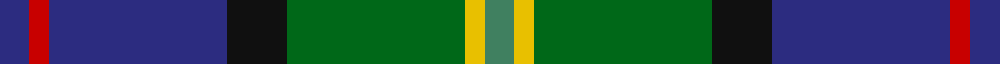

This page is one **sett** — a single exact thread-count. It belongs to the [tartan](/tartans/db3r2db18k6gi18ly2g3/)
(the same proportion at any scale), whose colour order is pattern [BRBKGYG](/stripes/brbkgyg/).

Sourced from register-of-tartans.  It is a [7 stripe tartan](/stripes/stripes7/).

Original link https://www.tartanregister.gov.uk/tartanDetails.aspx?ref=2878

## Also known as

This cloth is also recorded under:

- McComb

2 attestations — the source records this cloth was collapsed from (oldest owns this page)

<ul>
<li>01/01/1997 — McComb (Personal) (register-of-tartans, <a href="https://www.tartanregister.gov.uk/tartanDetails.aspx?ref=2878">record</a>)</li>
<li>pre 1997 — McComb (Personal) (tartans-authority, <a href="http://www.tartansauthority.com/tartan-ferret/display/2340/">record</a>)</li>
</ul>

## Register references

External register numbers recorded for this tartan.

- Scottish Register of Tartans: [2878](https://www.tartanregister.gov.uk/tartanDetails.aspx?ref=2878)
- Scottish Tartans Authority (ITI): 2340
- Scottish Tartans World Register: 2340

## Thread count
DB/6 R4 DB36 K12 G36 Y4 Ga/6

## Palette

Palette: <strong>Tartan Register</strong>
<table><thead><tr><th>Colour</th><th>Threads</th><th>Shade</th><th>Base</th><th>OKLCh</th></tr></thead><tbody><tr><td>DB/</td><td style="text-align:right;font-variant-numeric:tabular-nums">6</td><td><code style="background-color:#2C2C80;">#2C2C80</code> <small style="color:#888">#2C2C80</small></td><td>B <code style="background-color:#2A418A;">#2A418A</code></td><td><small style="color:#888">oklch(35.0% 0.138 276.6)</small></td></tr><tr><td>R</td><td style="text-align:right;font-variant-numeric:tabular-nums">4</td><td><code style="background-color:#C80000;">#C80000</code> <small style="color:#888">#C80000</small></td><td>R <code style="background-color:#CC0000;">#CC0000</code></td><td><small style="color:#888">oklch(52.3% 0.215 29.2)</small></td></tr><tr><td>DB</td><td style="text-align:right;font-variant-numeric:tabular-nums">36</td><td><code style="background-color:#2C2C80;">#2C2C80</code> <small style="color:#888">#2C2C80</small></td><td>B <code style="background-color:#2A418A;">#2A418A</code></td><td><small style="color:#888">oklch(35.0% 0.138 276.6)</small></td></tr><tr><td>K</td><td style="text-align:right;font-variant-numeric:tabular-nums">12</td><td><code style="background-color:#101010;">#101010</code> <small style="color:#888">#101010</small></td><td>K <code style="background-color:#000000;">#000000</code></td><td><small style="color:#888">oklch(17.3% 0.000 89.9)</small></td></tr><tr><td>G</td><td style="text-align:right;font-variant-numeric:tabular-nums">36</td><td><code style="background-color:#006818;">#006818</code> <small style="color:#888">#006818</small></td><td>G <code style="background-color:#006100;">#006100</code></td><td><small style="color:#888">oklch(45.0% 0.142 145.0)</small></td></tr><tr><td>Y</td><td style="text-align:right;font-variant-numeric:tabular-nums">4</td><td><code style="background-color:#E8C000;">#E8C000</code> <small style="color:#888">#E8C000</small></td><td>Y <code style="background-color:#F2BF00;">#F2BF00</code></td><td><small style="color:#888">oklch(81.9% 0.168 93.7)</small></td></tr><tr><td>Ga/</td><td style="text-align:right;font-variant-numeric:tabular-nums">6</td><td><code style="background-color:#408060;">#408060</code> <small style="color:#888">#408060</small></td><td>G <code style="background-color:#006100;">#006100</code></td><td><small style="color:#888">oklch(54.8% 0.084 160.1)</small></td></tr></tbody></table>

# Sample pattern

## Nearest tartans

The nearest existing variants by ΔTartan distance, with this tartan at the top so the swatches line up against it.

ΔTartan

Tartan

Sett

—

<a href="/ttd/edit/#slug=db3r2db18k6gi18ly2g3~x2">McComb (Personal)</a> <a class="nn-out" href="/setts/s7/db3r2db18k6gi18ly2g3~x2/" title="open its dictionary page">↗</a>

0.48

<a href="/ttd/edit/#slug=db2r1db10w1dy4g8ly1g2~x4">Ayrshire District Tartan Tartan Number: 436. Earliest known date: 1988 Dr Phil Smith, a Fellow of the Scottish Tartans Society, designed the Ayrshire district tartan at the suggestion of the Clan Boyd and Clan Cunningham Societies. In his book, 'District Tartans' (1992) co-authored with Dr G Teall, he says, the colours &quot;..reflect the gold of the rising sun, the green of the land and brown of the coast, the blue of the sea and the red of the setting sun. The Ayrshire tartan is intended for those with connections in the districts of Kyle, Cunninghame and Inverclyde.&quot; See products available Copyright © Blair Urquhart, Comrie, 2015</a> <a class="nn-out" href="/setts/s8/db2r1db10w1dy4g8ly1g2~x4/" title="open its dictionary page">↗</a>

0.72

<a href="/ttd/edit/#slug=db3r2db18k6dg18ly2g3~x2">McComb</a> <a class="nn-out" href="/setts/s7/db3r2db18k6dg18ly2g3~x2/" title="open its dictionary page">↗</a>

0.79

<a href="/ttd/edit/#slug=r3g3db4g17k13dt26w3~x2">Royal Burgh of Peebles (District)</a> <a class="nn-out" href="/setts/s7/r3g3db4g17k13dt26w3~x2/" title="open its dictionary page">↗</a>

0.85

<a href="/ttd/edit/#slug=r3g2db27k19g27dp2ly3~x2">Christian Hunting (Personal)</a> <a class="nn-out" href="/setts/s7/r3g2db27k19g27dp2ly3~x2/" title="open its dictionary page">↗</a>

0.88

<a href="/ttd/edit/#slug=k3db20dbi8db4g20k2g2r2g3ly3~x2">Schmidt (2014)</a> <a class="nn-out" href="/setts/s10/k3db20dbi8db4g20k2g2r2g3ly3~x2/" title="open its dictionary page">↗</a>

0.89

<a href="/ttd/edit/#slug=db1dy4g8ly1g8db12w1db2r1~x4">Connor (Personal)</a> <a class="nn-out" href="/setts/s9/db1dy4g8ly1g8db12w1db2r1~x4/" title="open its dictionary page">↗</a>

0.92

<a href="/ttd/edit/#slug=r2k6ly1dg12ly1db6lr2~x4">James (Personal)</a> <a class="nn-out" href="/setts/s7/r2k6ly1dg12ly1db6lr2~x4/" title="open its dictionary page">↗</a>

0.94

<a href="/ttd/edit/#slug=n10w5n48k35g5k5g35r5g5dp5">Big Rory (Corporate)</a> <a class="nn-out" href="/setts/s10/n10w5n48k35g5k5g35r5g5dp5/" title="open its dictionary page">↗</a>

0.94

<a href="/ttd/edit/#slug=k29r3dt24n6k8w4n8o6~x2">Yates (Personal)</a> <a class="nn-out" href="/setts/s8/k29r3dt24n6k8w4n8o6~x2/" title="open its dictionary page">↗</a>

0.95

<a href="/ttd/edit/#slug=k1ly1db8g10dbi7w1~x2">Porteous Family Tartan Tartan Number: 1264. Earliest known date: 1978 Designed for the Porteous Family Association, and submitted to the Monitoring Committee of the Scottish Tartan Society by Captain Barry Porteous who was president of the association at that time. See products available Copyright © Blair Urquhart, Comrie, 2015</a> <a class="nn-out" href="/setts/s6/k1ly1db8g10dbi7w1~x2/" title="open its dictionary page">↗</a>

## Neighbour map

Every grey dot is one of 14359 variants placed by the first two principal components of the ΔTartan feature space (44% of its variance). Red is this tartan; blue dots are its nearest — click one to open its page.

<svg viewBox="0 0 640 380" role="img" style="max-width:100%;height:auto;border:1px solid #e0e0e0;border-radius:4px;display:block" xmlns="http://www.w3.org/2000/svg"><image href="/nn/cloud.v1.png" width="640" height="380"/><a href="/setts/s8/db2r1db10w1dy4g8ly1g2~x4/"><circle cx="190.9" cy="173.7" r="4" fill="#3465a4"><title>Ayrshire District Tartan Tartan Number: 436. Earliest known date: 1988 Dr Phil Smith, a Fellow of the Scottish Tartans Society, designed the Ayrshire district tartan at the suggestion of the Clan Boyd and Clan Cunningham Societies. In his book, 'District Tartans' (1992) co-authored with Dr G Teall, he says, the colours &quot;..reflect the gold of the rising sun, the green of the land and brown of the coast, the blue of the sea and the red of the setting sun. The Ayrshire tartan is intended for those with connections in the districts of Kyle, Cunninghame and Inverclyde.&quot; See products available Copyright © Blair Urquhart, Comrie, 2015</title></circle></a><a href="/setts/s7/db3r2db18k6dg18ly2g3~x2/"><circle cx="177.2" cy="182.7" r="4" fill="#3465a4"><title>McComb</title></circle></a><a href="/setts/s7/r3g3db4g17k13dt26w3~x2/"><circle cx="155.6" cy="191.3" r="4" fill="#3465a4"><title>Royal Burgh of Peebles (District)</title></circle></a><a href="/setts/s7/r3g2db27k19g27dp2ly3~x2/"><circle cx="174.9" cy="167.6" r="4" fill="#3465a4"><title>Christian Hunting (Personal)</title></circle></a><a href="/setts/s10/k3db20dbi8db4g20k2g2r2g3ly3~x2/"><circle cx="174.9" cy="159.7" r="4" fill="#3465a4"><title>Schmidt (2014)</title></circle></a><a href="/setts/s9/db1dy4g8ly1g8db12w1db2r1~x4/"><circle cx="216.8" cy="167.1" r="4" fill="#3465a4"><title>Connor (Personal)</title></circle></a><a href="/setts/s7/r2k6ly1dg12ly1db6lr2~x4/"><circle cx="163.4" cy="170.7" r="4" fill="#3465a4"><title>James (Personal)</title></circle></a><a href="/setts/s10/n10w5n48k35g5k5g35r5g5dp5/"><circle cx="169.4" cy="162.7" r="4" fill="#3465a4"><title>Big Rory (Corporate)</title></circle></a><a href="/setts/s8/k29r3dt24n6k8w4n8o6~x2/"><circle cx="174.6" cy="179.6" r="4" fill="#3465a4"><title>Yates (Personal)</title></circle></a><a href="/setts/s6/k1ly1db8g10dbi7w1~x2/"><circle cx="165.0" cy="202.4" r="4" fill="#3465a4"><title>Porteous Family Tartan Tartan Number: 1264. Earliest known date: 1978 Designed for the Porteous Family Association, and submitted to the Monitoring Committee of the Scottish Tartan Society by Captain Barry Porteous who was president of the association at that time. See products available Copyright © Blair Urquhart, Comrie, 2015</title></circle></a><circle cx="184.9" cy="185.1" r="5" fill="#c00000"/></svg>

ID: /setts/s7/db3r2db18k6gi18ly2g3~x2/
