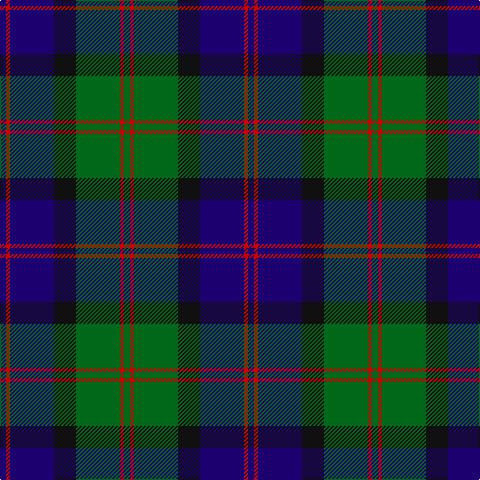

**Bands:** [GRGKBRB](/stripes/grgkbrb/) · **Stripes:** [G R G K DB R DB](/stripes/stripes7/) G R G K DB R DB

This was sourced from register-of-tartans.  It is a [7 band tartan](/bands/bands7/).

Original link https://www.tartanregister.gov.uk/tartanDetails.aspx?ref=1312

## Attestations

This cloth appears in 2 source records; the oldest owns this page.

- 01/01/1978 — Gammell (1978) (Personal) (register-of-tartans, [record](https://www.tartanregister.gov.uk/tartanDetails.aspx?ref=1312))
- pre 1978 — Gammell (1978) (Personal) (tartans-authority, [record](http://www.tartansauthority.com/tartan-ferret/display/4970/))

## Register references

External register numbers recorded for this tartan.

- Scottish Register of Tartans: [1312](https://www.tartanregister.gov.uk/tartanDetails.aspx?ref=1312)
- Scottish Tartans Authority (ITI): 4970

## Variants

Other setts woven to the same stripe pattern.

- [Blair](/setts/s7/db4r1db18k20g18r1g4~x2/)
- [Blair](/setts/s7/db3r1db10k8g10r1g3~x4/)

## Thread count
DB/6 R4 DB44 K22 G44 R4 G/6

## Palette
Each colour and its ΔE from the base-6 reference it is a variant of.

| Colour | Shade | Base | ΔE (OKLab) |
|---|---|---|---|
| DB | <code style="background-color:#1C0070;">#1C0070</code> `#1C0070` | B <code style="background-color:#2A418A;">#2A418A</code> | 0.14 |
| G | <code style="background-color:#006818;">#006818</code> `#006818` | G <code style="background-color:#006100;">#006100</code> | 0.02 |
| K | <code style="background-color:#101010;">#101010</code> `#101010` | K <code style="background-color:#000000;">#000000</code> | 0.17 |
| R | <code style="background-color:#C80000;">#C80000</code> `#C80000` | R <code style="background-color:#CC0000;">#CC0000</code> | 0.01 |

# Sample pattern

## Nearest tartans

The nearest existing variants by ΔTartan distance.

1. [Reid and Taylor](/setts/s7/k2g10k9db9r1k1db2~x2/) — ΔT 0.78
1. [National Galleries of Scotland](/setts/s7/k7g22k22db6r2db15r2~x2/) — ΔT 0.79
1. [Swallow Hotels (Corporate)](/setts/s9/k4g21k10r2k10db21k4db4k4~x2/) — ΔT 0.80
1. [Gunn](/setts/s6/r2g12k12g1db12g2~x2/) — ΔT 0.81
1. [MacThomas LC](/setts/s7/dg5dp3dg32k16db32dp3db5/) — ΔT 0.85
1. [MacRobart (Personal)](/setts/s6/db30k10g10lb2g15lb2~x2/) — ΔT 0.85
1. [Mowat (Clans Originaux)](/setts/s7/db24k3db5k23ly2k11g22~x2/) — ΔT 0.86
1. [Renfrew](/setts/s7/db6k2db18k18g18k3r2~x2/) — ΔT 0.90
1. [Gary/Garry (Name)](/setts/s8/k4g24db6dp3k6dp12g3dp4~x2/) — ΔT 0.91
1. [Black Watch (Coarse Kilt)](/setts/s7/r4k4db24k24g24k2r3~x2/) — ΔT 0.93

## Neighbour map

Every grey dot is one of 14299 variants placed by the first two principal components of the ΔTartan feature space (44% of its variance). Red is this tartan; blue dots are its nearest — click one to open its page.

<svg viewBox="0 0 640 380" role="img" style="max-width:100%;height:auto;border:1px solid #e0e0e0;border-radius:4px;display:block" xmlns="http://www.w3.org/2000/svg"><image href="/nn/cloud.v1.png" width="640" height="380"/><a href="/setts/s7/k2g10k9db9r1k1db2~x2/"><circle cx="221.3" cy="231.7" r="4" fill="#3465a4"><title>Reid and Taylor</title></circle></a><a href="/setts/s7/k7g22k22db6r2db15r2~x2/"><circle cx="218.5" cy="229.4" r="4" fill="#3465a4"><title>National Galleries of Scotland</title></circle></a><a href="/setts/s9/k4g21k10r2k10db21k4db4k4~x2/"><circle cx="224.8" cy="213.8" r="4" fill="#3465a4"><title>Swallow Hotels (Corporate)</title></circle></a><a href="/setts/s6/r2g12k12g1db12g2~x2/"><circle cx="216.6" cy="230.6" r="4" fill="#3465a4"><title>Gunn</title></circle></a><a href="/setts/s7/dg5dp3dg32k16db32dp3db5/"><circle cx="234.9" cy="223.5" r="4" fill="#3465a4"><title>MacThomas LC</title></circle></a><a href="/setts/s6/db30k10g10lb2g15lb2~x2/"><circle cx="264.2" cy="217.4" r="4" fill="#3465a4"><title>MacRobart (Personal)</title></circle></a><a href="/setts/s7/db24k3db5k23ly2k11g22~x2/"><circle cx="238.5" cy="231.6" r="4" fill="#3465a4"><title>Mowat (Clans Originaux)</title></circle></a><a href="/setts/s7/db6k2db18k18g18k3r2~x2/"><circle cx="219.3" cy="238.9" r="4" fill="#3465a4"><title>Renfrew</title></circle></a><a href="/setts/s8/k4g24db6dp3k6dp12g3dp4~x2/"><circle cx="213.9" cy="212.6" r="4" fill="#3465a4"><title>Gary/Garry (Name)</title></circle></a><a href="/setts/s7/r4k4db24k24g24k2r3~x2/"><circle cx="220.5" cy="218.1" r="4" fill="#3465a4"><title>Black Watch (Coarse Kilt)</title></circle></a><circle cx="231.6" cy="210.5" r="5" fill="#c00000"/></svg>

ID: /setts/s7/db3r2db22k11g22r2g3~x2/
