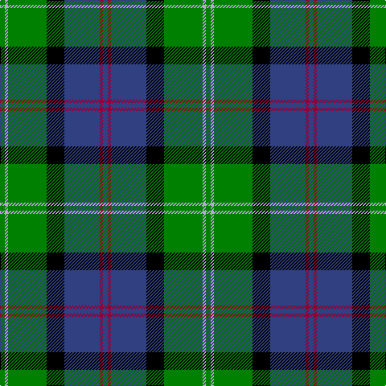

This page is one **sett** — a single exact thread-count. It belongs to the [tartan](/tartans/g3lp2g24k11b22dr2b3/)
(the same proportion at any scale), whose colour order is pattern [BRBKGWG](/stripes/brbkgwg/).

Sourced from weddslist.  It is a [7 stripe tartan](/stripes/stripes7/).

Original link http://www.weddslist.com/cgi-bin/tartans/pg.pl?source=sts

## Thread count
G/6 LP4 G48 K22 B44 DR4 B/6

## Palette
Each colour and the base-6 reference it is a variant of.

| Colour | Shade | Base |
|---|---|---|
| B | <code style="background-color:#304080;">#304080</code> `oklch(39.4% 0.109 270.2)` <small>#304080</small> | B <code style="background-color:#2A418A;">#2A418A</code> |
| DR | <code style="background-color:#900030;">#900030</code> `oklch(41.6% 0.166 13.6)` <small>#900030</small> | R <code style="background-color:#CC0000;">#CC0000</code> |
| G | <code style="background-color:#008000;">#008000</code> `oklch(52.0% 0.177 142.5)` <small>#008000</small> | G <code style="background-color:#006100;">#006100</code> |
| K | <code style="background-color:#000000;">#000000</code> `oklch(0.0% 0.000 0.0)` <small>#000000</small> | K <code style="background-color:#000000;">#000000</code> |
| LP | <code style="background-color:#C0A0E0;">#C0A0E0</code> `oklch(75.7% 0.096 307.0)` <small>#C0A0E0</small> | W <code style="background-color:#F7F7F7;">#F7F7F7</code> |

# Sample pattern

## Nearest tartans

The nearest existing variants by ΔTartan distance, with this tartan at the top so the swatches line up against it.

ΔTartan

Tartan

Sett

—

<a href="/ttd/edit/#slug=db3r2db22k11g24lp2g3~x2">MacThomas</a> <a class="nn-out" href="/setts/s7/db3r2db22k11g24lp2g3~x2/" title="open its dictionary page">↗</a>

0.68

<a href="/ttd/edit/#slug=k3r1ly1db11g13db5r1ly1~x2">Snodgrass</a> <a class="nn-out" href="/setts/s8/k3r1ly1db11g13db5r1ly1~x2/" title="open its dictionary page">↗</a>

0.72

<a href="/ttd/edit/#slug=g28k4g5dr4g5k19db19y2~x2">City of Guelph</a> <a class="nn-out" href="/setts/s8/g28k4g5dr4g5k19db19y2~x2/" title="open its dictionary page">↗</a>

0.79

<a href="/ttd/edit/#slug=g3db12lr1k12g13r2g2~x2">MacPhadran</a> <a class="nn-out" href="/setts/s7/g3db12lr1k12g13r2g2~x2/" title="open its dictionary page">↗</a>

0.84

<a href="/ttd/edit/#slug=g9t2g1k6db6r1db1~x2">MacTaggert</a> <a class="nn-out" href="/setts/s7/g9t2g1k6db6r1db1~x2/" title="open its dictionary page">↗</a>

0.86

<a href="/ttd/edit/#slug=db2r1db10w1y4g8g1g2~x4">Ayrshire</a> <a class="nn-out" href="/setts/s8/db2r1db10w1y4g8g1g2~x4/" title="open its dictionary page">↗</a>

0.89

<a href="/ttd/edit/#slug=k7m3g29db29w3~x2">Highlander, Highland Laddie Kilts</a> <a class="nn-out" href="/setts/s5/k7m3g29db29w3~x2/" title="open its dictionary page">↗</a>

0.89

<a href="/ttd/edit/#slug=db24k4r3k4g24k4lo4~x2">Skene</a> <a class="nn-out" href="/setts/s7/db24k4r3k4g24k4lo4~x2/" title="open its dictionary page">↗</a>

0.90

<a href="/ttd/edit/#slug=r3k2g15k10db20k2ly2~x2">MacLeod, Macleod of Harris</a> <a class="nn-out" href="/setts/s7/r3k2g15k10db20k2ly2~x2/" title="open its dictionary page">↗</a>

0.90

<a href="/ttd/edit/#slug=r2db23k14g16k2w2~x2">MacPhail, hunting</a> <a class="nn-out" href="/setts/s6/r2db23k14g16k2w2~x2/" title="open its dictionary page">↗</a>

0.93

<a href="/ttd/edit/#slug=w15dg98dt72r25dt8ly15">Afternoon Tea / Darjeeling</a> <a class="nn-out" href="/setts/s6/w15dg98dt72r25dt8ly15/" title="open its dictionary page">↗</a>

## Neighbour map

Every grey dot is one of 14299 variants placed by the first two principal components of the ΔTartan feature space (44% of its variance). Red is this tartan; blue dots are its nearest — click one to open its page.

<svg viewBox="0 0 640 380" role="img" style="max-width:100%;height:auto;border:1px solid #e0e0e0;border-radius:4px;display:block" xmlns="http://www.w3.org/2000/svg"><image href="/nn/cloud.v1.png" width="640" height="380"/><a href="/setts/s8/k3r1ly1db11g13db5r1ly1~x2/"><circle cx="222.0" cy="161.1" r="4" fill="#3465a4"><title>Snodgrass</title></circle></a><a href="/setts/s8/g28k4g5dr4g5k19db19y2~x2/"><circle cx="209.4" cy="179.4" r="4" fill="#3465a4"><title>City of Guelph</title></circle></a><a href="/setts/s7/g3db12lr1k12g13r2g2~x2/"><circle cx="168.9" cy="180.1" r="4" fill="#3465a4"><title>MacPhadran</title></circle></a><a href="/setts/s7/g9t2g1k6db6r1db1~x2/"><circle cx="144.9" cy="192.6" r="4" fill="#3465a4"><title>MacTaggert</title></circle></a><a href="/setts/s8/db2r1db10w1y4g8g1g2~x4/"><circle cx="177.6" cy="169.8" r="4" fill="#3465a4"><title>Ayrshire</title></circle></a><a href="/setts/s5/k7m3g29db29w3~x2/"><circle cx="198.4" cy="204.9" r="4" fill="#3465a4"><title>Highlander, Highland Laddie Kilts</title></circle></a><a href="/setts/s7/db24k4r3k4g24k4lo4~x2/"><circle cx="149.5" cy="182.5" r="4" fill="#3465a4"><title>Skene</title></circle></a><a href="/setts/s7/r3k2g15k10db20k2ly2~x2/"><circle cx="151.4" cy="179.5" r="4" fill="#3465a4"><title>MacLeod, Macleod of Harris</title></circle></a><a href="/setts/s6/r2db23k14g16k2w2~x2/"><circle cx="167.2" cy="186.2" r="4" fill="#3465a4"><title>MacPhail, hunting</title></circle></a><a href="/setts/s6/w15dg98dt72r25dt8ly15/"><circle cx="206.2" cy="187.6" r="4" fill="#3465a4"><title>Afternoon Tea / Darjeeling</title></circle></a><circle cx="195.3" cy="176.2" r="5" fill="#c00000"/></svg>

ID: /setts/s7/db3r2db22k11g24lp2g3~x2/
