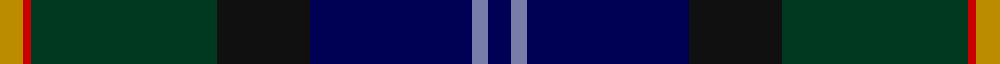
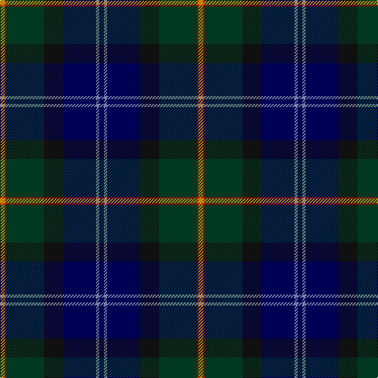

**Bands:** [YRGKBBB](/stripes/yrgkbbb/) · **Stripes:** [LO R DG K DB T DB](/stripes/stripes7/) LO R DG K DB T DB

This was sourced from tartans-authority.  It is a [7 band tartan](/bands/bands7/).

Original link http://www.tartansauthority.com/tartan-ferret/display/7476/

## Attestations

This cloth appears in 2 source records; the oldest owns this page.

- 2006 — Nova Scotia Int. Tattoo (Corporate) (tartans-authority, [record](http://www.tartansauthority.com/tartan-ferret/display/7476/))
- undated — Nova Scotia International Tatoo (register-of-tartans, [record](https://www.tartanregister.gov.uk/tartanDetails.aspx?ref=5518))

## Register references

External register numbers recorded for this tartan.

- Scottish Register of Tartans: [5518](https://www.tartanregister.gov.uk/tartanDetails.aspx?ref=5518)
- Scottish Tartans Authority (ITI): 7476

## Thread count
DY/6 R2 DG48 K24 DB42 B4 DB/6

## Palette
Each colour and its ΔE from the base-6 reference it is a variant of.

| Colour | Shade | Base | ΔE (OKLab) |
|---|---|---|---|
| B | <code style="background-color:#787CA8;">#787CA8</code> `#787CA8` | B <code style="background-color:#2A418A;">#2A418A</code> | 0.21 |
| DB | <code style="background-color:#000054;">#000054</code> `#000054` | B <code style="background-color:#2A418A;">#2A418A</code> | 0.20 |
| DG | <code style="background-color:#003820;">#003820</code> `#003820` | G <code style="background-color:#006100;">#006100</code> | 0.15 |
| DY | <code style="background-color:#BC8C00;">#BC8C00</code> `#BC8C00` | Y <code style="background-color:#F2BF00;">#F2BF00</code> | 0.16 |
| K | <code style="background-color:#101010;">#101010</code> `#101010` | K <code style="background-color:#000000;">#000000</code> | 0.17 |
| R | <code style="background-color:#C80000;">#C80000</code> `#C80000` | R <code style="background-color:#CC0000;">#CC0000</code> | 0.01 |

# Sample pattern

## Nearest tartans

The nearest existing variants by ΔTartan distance.

1. [Chesters, Eric (Personal)](/setts/s7/k12g8ly1dg13lb1db31k8~x2/) — ΔT 0.76
1. [Chesters, Eric (Personal)](/setts/s7/k12g8ly1dg13t1db31k8~x2/) — ΔT 1.01
1. [Muir-Hill (Personal)](/setts/s7/w2k2r1dt20k15dg30ly1~x2/) — ΔT 1.11
1. [Purves (2014)](/setts/s8/k4w1dg12k3db16r1db1r1~x2/) — ΔT 1.22
1. [Lochaber #2](/setts/s8/dg3r1dg18k20r1db18t1dg2~x4/) — ΔT 1.22
1. [Leung (Personal)](/setts/s9/dp4db7dp2db25k19w2dg23k2lo3~x2/) — ΔT 1.25
1. [Purves (2014)](/setts/s8/do4w1dg12k3db16r1db1r1~x2/) — ΔT 1.28
1. [Begg (Scarfskerry)](/setts/s9/p4dg30db12g3k2db3k26dp4k2/) — ΔT 1.34
1. [Sidey Family Tartan (Name)](/setts/s10/db4w1k2db25k12b1k2g16k2r1~x2/) — ΔT 1.37
1. [Beauly Firth and Glens](/setts/s8/dp3n3dp3n27w1t15k22r3~x2/) — ΔT 1.40

## Neighbour map

Every grey dot is one of 14299 variants placed by the first two principal components of the ΔTartan feature space (44% of its variance). Red is this tartan; blue dots are its nearest — click one to open its page.

<svg viewBox="0 0 640 380" role="img" style="max-width:100%;height:auto;border:1px solid #e0e0e0;border-radius:4px;display:block" xmlns="http://www.w3.org/2000/svg"><image href="/nn/cloud.v1.png" width="640" height="380"/><a href="/setts/s7/k12g8ly1dg13lb1db31k8~x2/"><circle cx="253.9" cy="164.5" r="4" fill="#3465a4"><title>Chesters, Eric (Personal)</title></circle></a><a href="/setts/s7/k12g8ly1dg13t1db31k8~x2/"><circle cx="285.4" cy="177.4" r="4" fill="#3465a4"><title>Chesters, Eric (Personal)</title></circle></a><a href="/setts/s7/w2k2r1dt20k15dg30ly1~x2/"><circle cx="291.3" cy="161.0" r="4" fill="#3465a4"><title>Muir-Hill (Personal)</title></circle></a><a href="/setts/s8/k4w1dg12k3db16r1db1r1~x2/"><circle cx="263.4" cy="163.6" r="4" fill="#3465a4"><title>Purves (2014)</title></circle></a><a href="/setts/s8/dg3r1dg18k20r1db18t1dg2~x4/"><circle cx="263.4" cy="180.3" r="4" fill="#3465a4"><title>Lochaber #2</title></circle></a><a href="/setts/s9/dp4db7dp2db25k19w2dg23k2lo3~x2/"><circle cx="195.7" cy="176.5" r="4" fill="#3465a4"><title>Leung (Personal)</title></circle></a><a href="/setts/s8/do4w1dg12k3db16r1db1r1~x2/"><circle cx="256.1" cy="161.4" r="4" fill="#3465a4"><title>Purves (2014)</title></circle></a><a href="/setts/s9/p4dg30db12g3k2db3k26dp4k2/"><circle cx="199.4" cy="154.2" r="4" fill="#3465a4"><title>Begg (Scarfskerry)</title></circle></a><a href="/setts/s10/db4w1k2db25k12b1k2g16k2r1~x2/"><circle cx="275.2" cy="129.7" r="4" fill="#3465a4"><title>Sidey Family Tartan (Name)</title></circle></a><a href="/setts/s8/dp3n3dp3n27w1t15k22r3~x2/"><circle cx="233.9" cy="138.6" r="4" fill="#3465a4"><title>Beauly Firth and Glens</title></circle></a><circle cx="245.7" cy="172.9" r="5" fill="#c00000"/></svg>

ID: /setts/s7/db3t2db21k12dg24r1lo3~x2/
