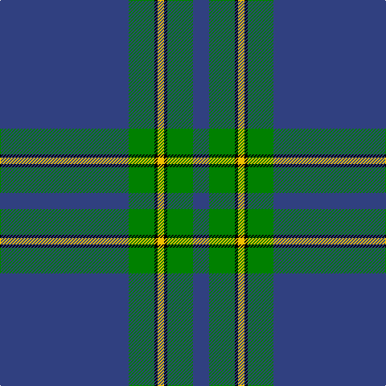

In pattern [BGKYKGB](/stripes/bgkykgb/).

This was sourced from weddslist.  It is a [7 stripe tartan](/stripes/stripes7/).

Original link http://www.weddslist.com/cgi-bin/tartans/pg.pl?source=sts

## Also known as

This cloth is also recorded under:

- Salvation Army, Hunting

## Attestations

This cloth appears in 2 source records; the oldest owns this page.

- undated — Salvation Army, Hunting (weddslist, [record](http://www.weddslist.com/cgi-bin/tartans/pg.pl?source=sts))
- undated — Salvation Army Hunting Corporate Tartan Tartan Number: 150. Earliest known date: 1983 Designed to be ready for the Perth Citadel Corps Centenary. The hunting version replaces red with green. See products available Copyright © Blair Urquhart, Comrie, 2015 (house-of-tartan, [record](http://www.house-of-tartan.scotland.net/house/TartanViewjs.asp?colr=Def&tnam=150))

## Thread count
B/160 G32 K4 Y8 K4 G32 B/20

## Palette
Each colour and the base-6 reference it is a variant of.

| Colour | Shade | Base |
|---|---|---|
| B | <code style="background-color:#304080;">#304080</code> `oklch(39.4% 0.109 270.2)` <small>#304080</small> | B <code style="background-color:#2A418A;">#2A418A</code> |
| G | <code style="background-color:#008000;">#008000</code> `oklch(52.0% 0.177 142.5)` <small>#008000</small> | G <code style="background-color:#006100;">#006100</code> |
| K | <code style="background-color:#000000;">#000000</code> `oklch(0.0% 0.000 0.0)` <small>#000000</small> | K <code style="background-color:#000000;">#000000</code> |
| Y | <code style="background-color:#F0C000;">#F0C000</code> `oklch(82.7% 0.169 90.5)` <small>#F0C000</small> | Y <code style="background-color:#F2BF00;">#F2BF00</code> |

# Sample pattern

## Nearest tartans

The nearest existing variants by ΔTartan distance, with this tartan at the top so the swatches line up against it.

ΔTartan

Tartan

Sett

—

<a href="/ttd/edit/#slug=db40g8k1ly2k1g8db5~x4">Salvation Army, Hunting</a> <a class="nn-out" href="/setts/s7/db40g8k1ly2k1g8db5~x4/" title="open its dictionary page">↗</a>

0.98

<a href="/ttd/edit/#slug=db8w4dt6db2dt6o10dt63w3">Pride of the Clyde</a> <a class="nn-out" href="/setts/s8/db8w4dt6db2dt6o10dt63w3/" title="open its dictionary page">↗</a>

1.05

<a href="/ttd/edit/#slug=dt5ly1g7r1dt45r5ly3dt4ly3~x2">Brooks Brothers Signature Corporate Tartan Tartan Number: 10652. Earliest known date: 01/05/2012 Brooks Brothers' Scottish roots originate in Perthshire's Glen Lyon. Thomas Lyon emigrated from Glen Lyon to the USA in the 1600s. It was his granddaughter, Lavinia, who married Henry Sands Brooks, founder of the Brooks empire. Brooks opened his first store in Cherry Street, New York in 1818. This simple and elegant tartan contains elements of the traditional 1819 Campbell tartan (the major clan in Glen Lyon) and incorporates the gold from the Brooks Brothers famous Golden Fleece logo and their equally famous necktie design, No. 1 stripe. See products available Copyright © Blair Urquhart, Comrie, 2015</a> <a class="nn-out" href="/setts/s9/dt5ly1g7r1dt45r5ly3dt4ly3~x2/" title="open its dictionary page">↗</a>

1.28

<a href="/ttd/edit/#slug=n36k3dy3t1dy3k3n4dy6k1t2~x4">Chateau</a> <a class="nn-out" href="/setts/s10/n36k3dy3t1dy3k3n4dy6k1t2~x4/" title="open its dictionary page">↗</a>

1.29

<a href="/ttd/edit/#slug=g44db11g5t3g4db8g4w1~x2">Hastings-Stephenson (Personal)</a> <a class="nn-out" href="/setts/s8/g44db11g5t3g4db8g4w1~x2/" title="open its dictionary page">↗</a>

1.35

<a href="/ttd/edit/#slug=b64k3g14k4b4k12lo4~x2">Murray of Elibank</a> <a class="nn-out" href="/setts/s7/b64k3g14k4b4k12lo4~x2/" title="open its dictionary page">↗</a>

1.36

<a href="/ttd/edit/#slug=do4t48do21t14lo3t6do1ly3~x2">Munster Ancestry</a> <a class="nn-out" href="/setts/s8/do4t48do21t14lo3t6do1ly3~x2/" title="open its dictionary page">↗</a>

1.43

<a href="/ttd/edit/#slug=db48g14r3g2r3g2~x2">Wilson</a> <a class="nn-out" href="/setts/s6/db48g14r3g2r3g2~x2/" title="open its dictionary page">↗</a>

1.45

<a href="/ttd/edit/#slug=dp11t90dy3t11dp7dy11dp13t11">Royal Conservatoire of Scotland</a> <a class="nn-out" href="/setts/s8/dp11t90dy3t11dp7dy11dp13t11/" title="open its dictionary page">↗</a>

1.54

<a href="/ttd/edit/#slug=n140k3w16k3do16k3do16">Crail</a> <a class="nn-out" href="/setts/s7/n140k3w16k3do16k3do16/" title="open its dictionary page">↗</a>

1.54

<a href="/ttd/edit/#slug=dt3g6dt2ly3dt42k6w3~x2">Bro-sant-Brieg</a> <a class="nn-out" href="/setts/s7/dt3g6dt2ly3dt42k6w3~x2/" title="open its dictionary page">↗</a>

## Neighbour map

Every grey dot is one of 14299 variants placed by the first two principal components of the ΔTartan feature space (44% of its variance). Red is this tartan; blue dots are its nearest — click one to open its page.

<svg viewBox="0 0 640 380" role="img" style="max-width:100%;height:auto;border:1px solid #e0e0e0;border-radius:4px;display:block" xmlns="http://www.w3.org/2000/svg"><image href="/nn/cloud.v1.png" width="640" height="380"/><a href="/setts/s8/db8w4dt6db2dt6o10dt63w3/"><circle cx="510.5" cy="146.2" r="4" fill="#3465a4"><title>Pride of the Clyde</title></circle></a><a href="/setts/s9/dt5ly1g7r1dt45r5ly3dt4ly3~x2/"><circle cx="508.0" cy="114.1" r="4" fill="#3465a4"><title>Brooks Brothers Signature Corporate Tartan Tartan Number: 10652. Earliest known date: 01/05/2012 Brooks Brothers' Scottish roots originate in Perthshire's Glen Lyon. Thomas Lyon emigrated from Glen Lyon to the USA in the 1600s. It was his granddaughter, Lavinia, who married Henry Sands Brooks, founder of the Brooks empire. Brooks opened his first store in Cherry Street, New York in 1818. This simple and elegant tartan contains elements of the traditional 1819 Campbell tartan (the major clan in Glen Lyon) and incorporates the gold from the Brooks Brothers famous Golden Fleece logo and their equally famous necktie design, No. 1 stripe. See products available Copyright © Blair Urquhart, Comrie, 2015</title></circle></a><a href="/setts/s10/n36k3dy3t1dy3k3n4dy6k1t2~x4/"><circle cx="451.0" cy="123.5" r="4" fill="#3465a4"><title>Chateau</title></circle></a><a href="/setts/s8/g44db11g5t3g4db8g4w1~x2/"><circle cx="502.3" cy="146.5" r="4" fill="#3465a4"><title>Hastings-Stephenson (Personal)</title></circle></a><a href="/setts/s7/b64k3g14k4b4k12lo4~x2/"><circle cx="413.7" cy="161.7" r="4" fill="#3465a4"><title>Murray of Elibank</title></circle></a><a href="/setts/s8/do4t48do21t14lo3t6do1ly3~x2/"><circle cx="504.3" cy="156.7" r="4" fill="#3465a4"><title>Munster Ancestry</title></circle></a><a href="/setts/s6/db48g14r3g2r3g2~x2/"><circle cx="490.3" cy="188.3" r="4" fill="#3465a4"><title>Wilson</title></circle></a><a href="/setts/s8/dp11t90dy3t11dp7dy11dp13t11/"><circle cx="514.4" cy="164.1" r="4" fill="#3465a4"><title>Royal Conservatoire of Scotland</title></circle></a><a href="/setts/s7/n140k3w16k3do16k3do16/"><circle cx="502.6" cy="111.6" r="4" fill="#3465a4"><title>Crail</title></circle></a><a href="/setts/s7/dt3g6dt2ly3dt42k6w3~x2/"><circle cx="455.8" cy="146.7" r="4" fill="#3465a4"><title>Bro-sant-Brieg</title></circle></a><circle cx="487.3" cy="143.1" r="5" fill="#c00000"/></svg>

ID: /setts/s7/db40g8k1ly2k1g8db5~x4/
