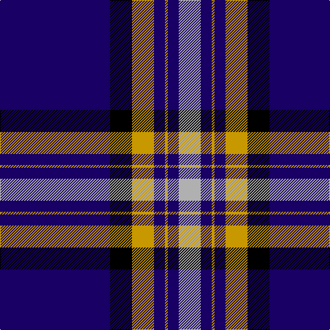

In pattern [BKYBYBY](/stripes/bkybyby/).

This was sourced from register-of-tartans.  It is a [7 stripe tartan](/stripes/stripes7/).

Original link https://www.tartanregister.gov.uk/tartanDetails.aspx?ref=4550

## Register references

External register numbers recorded for this tartan.

- Scottish Register of Tartans: [4550](https://www.tartanregister.gov.uk/tartanDetails.aspx?ref=4550)
- Scottish Tartans Authority (ITI): 4526

## Thread count
DB/160 K32 DY32 DB16 DY4 DB16 N/32

## Palette
Each colour and the base-6 reference it is a variant of.

| Colour | Shade | Base |
|---|---|---|
| DB | <code style="background-color:#180064;">#180064</code> `oklch(24.2% 0.150 277.1)` <small>#180064</small> | B <code style="background-color:#2A418A;">#2A418A</code> |
| DY | <code style="background-color:#C89800;">#C89800</code> `oklch(70.6% 0.144 85.9)` <small>#C89800</small> | Y <code style="background-color:#F2BF00;">#F2BF00</code> |
| K | <code style="background-color:#000000;">#000000</code> `oklch(0.0% 0.000 0.0)` <small>#000000</small> | K <code style="background-color:#000000;">#000000</code> |
| N | <code style="background-color:#B0B0B0;">#B0B0B0</code> `oklch(75.7% 0.000 89.9)` <small>#B0B0B0</small> | Y <code style="background-color:#F2BF00;">#F2BF00</code> |

# Sample pattern

## Nearest tartans

The nearest existing variants by ΔTartan distance, with this tartan at the top so the swatches line up against it.

ΔTartan

Tartan

Sett

—

<a href="/ttd/edit/#slug=db40k8ly8db4ly1db4lr8~x4">Wcwm 4907-2</a> <a class="nn-out" href="/setts/s7/db40k8ly8db4ly1db4lr8~x4/" title="open its dictionary page">↗</a>

1.15

<a href="/ttd/edit/#slug=db75k4r25db6k6w2~x2">Hong Kong St Andrew's Society</a> <a class="nn-out" href="/setts/s6/db75k4r25db6k6w2~x2/" title="open its dictionary page">↗</a>

1.34

<a href="/ttd/edit/#slug=db28dr3w1dr3db4w2dp1w5~x4">Baker Family Tartan Tartan Number: 613. Earliest known date: pre 2003 STS notes 'Sample in trade specimens file.' See products available Copyright © Blair Urquhart, Comrie, 2015</a> <a class="nn-out" href="/setts/s8/db28dr3w1dr3db4w2dp1w5~x4/" title="open its dictionary page">↗</a>

1.35

<a href="/ttd/edit/#slug=b18w1k3w1b9w1k45b4~x2">Lynn (Personal)</a> <a class="nn-out" href="/setts/s8/b18w1k3w1b9w1k45b4~x2/" title="open its dictionary page">↗</a>

1.41

<a href="/ttd/edit/#slug=db28o3w1o3db4w2dp1w5~x4">Baker</a> <a class="nn-out" href="/setts/s8/db28o3w1o3db4w2dp1w5~x4/" title="open its dictionary page">↗</a>

1.44

<a href="/ttd/edit/#slug=db28lo3w1lo3db4w2dp1w5~x4">Baker (Name)</a> <a class="nn-out" href="/setts/s8/db28lo3w1lo3db4w2dp1w5~x4/" title="open its dictionary page">↗</a>

1.45

<a href="/ttd/edit/#slug=db42r2y16r2db6r2y8lo3~x2">Prince George's Police Pipe Band</a> <a class="nn-out" href="/setts/s8/db42r2y16r2db6r2y8lo3~x2/" title="open its dictionary page">↗</a>

1.49

<a href="/ttd/edit/#slug=db45k10y2k2ly2k2y10db5k1db5ly1~x2">Skye</a> <a class="nn-out" href="/setts/s11/db45k10y2k2ly2k2y10db5k1db5ly1~x2/" title="open its dictionary page">↗</a>

1.52

<a href="/ttd/edit/#slug=db50ly4db3ly4db8k2db12w5~x2">Indiana #2</a> <a class="nn-out" href="/setts/s8/db50ly4db3ly4db8k2db12w5~x2/" title="open its dictionary page">↗</a>

1.53

<a href="/ttd/edit/#slug=k60r3k5r3lr18o3~x2">Ailsa, Navy (Fashion)</a> <a class="nn-out" href="/setts/s6/k60r3k5r3lr18o3~x2/" title="open its dictionary page">↗</a>

1.54

<a href="/ttd/edit/#slug=db32ly4db12db2db4db2o16db67ly6">Calum's Cabin</a> <a class="nn-out" href="/setts/s9/db32ly4db12db2db4db2o16db67ly6/" title="open its dictionary page">↗</a>

## Neighbour map

Every grey dot is one of 14299 variants placed by the first two principal components of the ΔTartan feature space (44% of its variance). Red is this tartan; blue dots are its nearest — click one to open its page.

<svg viewBox="0 0 640 380" role="img" style="max-width:100%;height:auto;border:1px solid #e0e0e0;border-radius:4px;display:block" xmlns="http://www.w3.org/2000/svg"><image href="/nn/cloud.v1.png" width="640" height="380"/><a href="/setts/s6/db75k4r25db6k6w2~x2/"><circle cx="458.4" cy="142.1" r="4" fill="#3465a4"><title>Hong Kong St Andrew's Society</title></circle></a><a href="/setts/s8/db28dr3w1dr3db4w2dp1w5~x4/"><circle cx="428.3" cy="122.3" r="4" fill="#3465a4"><title>Baker Family Tartan Tartan Number: 613. Earliest known date: pre 2003 STS notes 'Sample in trade specimens file.' See products available Copyright © Blair Urquhart, Comrie, 2015</title></circle></a><a href="/setts/s8/b18w1k3w1b9w1k45b4~x2/"><circle cx="415.6" cy="129.7" r="4" fill="#3465a4"><title>Lynn (Personal)</title></circle></a><a href="/setts/s8/db28o3w1o3db4w2dp1w5~x4/"><circle cx="414.7" cy="115.6" r="4" fill="#3465a4"><title>Baker</title></circle></a><a href="/setts/s8/db28lo3w1lo3db4w2dp1w5~x4/"><circle cx="413.6" cy="115.4" r="4" fill="#3465a4"><title>Baker (Name)</title></circle></a><a href="/setts/s8/db42r2y16r2db6r2y8lo3~x2/"><circle cx="365.8" cy="146.2" r="4" fill="#3465a4"><title>Prince George's Police Pipe Band</title></circle></a><a href="/setts/s11/db45k10y2k2ly2k2y10db5k1db5ly1~x2/"><circle cx="429.8" cy="96.0" r="4" fill="#3465a4"><title>Skye</title></circle></a><a href="/setts/s8/db50ly4db3ly4db8k2db12w5~x2/"><circle cx="412.6" cy="123.7" r="4" fill="#3465a4"><title>Indiana #2</title></circle></a><a href="/setts/s6/k60r3k5r3lr18o3~x2/"><circle cx="436.6" cy="160.2" r="4" fill="#3465a4"><title>Ailsa, Navy (Fashion)</title></circle></a><a href="/setts/s9/db32ly4db12db2db4db2o16db67ly6/"><circle cx="467.7" cy="140.5" r="4" fill="#3465a4"><title>Calum's Cabin</title></circle></a><circle cx="403.6" cy="131.2" r="5" fill="#c00000"/></svg>

ID: /setts/s7/db40k8ly8db4ly1db4lr8~x4/
