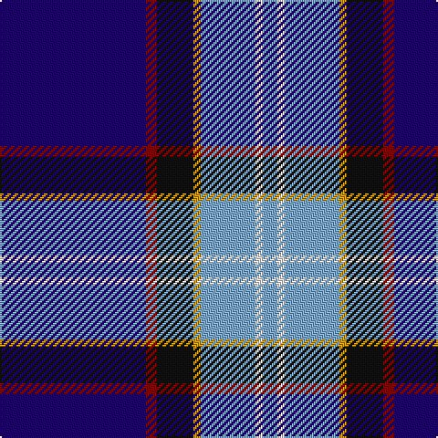

In pattern [BRKYYWY](/stripes/brkyywy/).

This was sourced from tartans-authority.  It is a [7 stripe tartan](/stripes/stripes7/).

Original link http://www.tartansauthority.com/tartan-ferret/display/5074/

## Thread count
DB/80 DR6 K20 DY4 B30 W4 B/8

## Palette
Each colour and the base-6 reference it is a variant of.

| Colour | Shade | Base |
|---|---|---|
| B | <code style="background-color:#7CA8CC;">#7CA8CC</code> `oklch(71.3% 0.071 243.7)` <small>#7CA8CC</small> | Y <code style="background-color:#F2BF00;">#F2BF00</code> |
| DB | <code style="background-color:#1C0070;">#1C0070</code> `oklch(26.3% 0.162 277.1)` <small>#1C0070</small> | B <code style="background-color:#2A418A;">#2A418A</code> |
| DR | <code style="background-color:#880000;">#880000</code> `oklch(39.4% 0.162 29.2)` <small>#880000</small> | R <code style="background-color:#CC0000;">#CC0000</code> |
| DY | <code style="background-color:#D09800;">#D09800</code> `oklch(71.4% 0.147 82.1)` <small>#D09800</small> | Y <code style="background-color:#F2BF00;">#F2BF00</code> |
| K | <code style="background-color:#101010;">#101010</code> `oklch(17.3% 0.000 89.9)` <small>#101010</small> | K <code style="background-color:#000000;">#000000</code> |
| W | <code style="background-color:#FCFCFC;">#FCFCFC</code> `oklch(99.1% 0.000 89.9)` <small>#FCFCFC</small> | W <code style="background-color:#F7F7F7;">#F7F7F7</code> |

# Sample pattern

## Nearest tartans

The nearest existing variants by ΔTartan distance.

1. [Oren Peterson](/setts/s6/m1g2t10r1db15w1~x4/) — ΔT 0.82
1. [Virginia International Tattoo Hixon](/setts/s8/lb8db10dt69w6dt6r8b19lb3/) — ΔT 1.18
1. [MacCormick Festive](/setts/s9/w3db3k1t16k1db8r3db24ly3~x2/) — ΔT 1.21
1. [Sinclair, Blue (Personal)](/setts/s7/db4r2db40k11g2w16r2~x2/) — ΔT 1.25
1. [Blairgowrie Golf Club, The](/setts/s7/w3r5g5dp4dg7db38lo3~x2/) — ΔT 1.26
1. [Shearer (2016)](/setts/s6/k4n4dt32r4t17w2~x2/) — ΔT 1.33
1. [Alan Stone Family (Personal)](/setts/s6/r2w6k12db36o12ly1~x2/) — ΔT 1.35
1. [LLoyd of Astargus Canadian Family Tartan Tartan Number: 5771. Earliest known date: 2001 The designer of this tartan is of Welsh & Scottish blood and sees this tartan as being appropriate for any Lloyds with Scottish blood. The 'Astargus' derives from Gaelic - 'Astar' being said to mean "travelling or making distance" and 'gus' meaning "until I come back" See products available Copyright © Blair Urquhart, Comrie, 2015](/setts/s6/r3db38k13w3o20ly2~x2/) — ΔT 1.35
1. [Gorman Family (Canada) (Personal)](/setts/s6/g6n16db49n14db2w6~x2/) — ΔT 1.36
1. [Unidentified #23](/setts/s7/db35r2k16ly2b25w2b6~x2/) — ΔT 1.36

## Neighbour map

Every grey dot is one of 14299 variants placed by the first two principal components of the ΔTartan feature space (44% of its variance). Red is this tartan; blue dots are its nearest — click one to open its page.

<svg viewBox="0 0 640 380" role="img" style="max-width:100%;height:auto;border:1px solid #e0e0e0;border-radius:4px;display:block" xmlns="http://www.w3.org/2000/svg"><image href="/nn/cloud.v1.png" width="640" height="380"/><a href="/setts/s6/m1g2t10r1db15w1~x4/"><circle cx="246.2" cy="144.0" r="4" fill="#3465a4"><title>Oren Peterson</title></circle></a><a href="/setts/s8/lb8db10dt69w6dt6r8b19lb3/"><circle cx="299.5" cy="110.2" r="4" fill="#3465a4"><title>Virginia International Tattoo Hixon</title></circle></a><a href="/setts/s9/w3db3k1t16k1db8r3db24ly3~x2/"><circle cx="297.7" cy="114.6" r="4" fill="#3465a4"><title>MacCormick Festive</title></circle></a><a href="/setts/s7/db4r2db40k11g2w16r2~x2/"><circle cx="291.0" cy="126.2" r="4" fill="#3465a4"><title>Sinclair, Blue (Personal)</title></circle></a><a href="/setts/s7/w3r5g5dp4dg7db38lo3~x2/"><circle cx="258.0" cy="120.6" r="4" fill="#3465a4"><title>Blairgowrie Golf Club, The</title></circle></a><a href="/setts/s6/k4n4dt32r4t17w2~x2/"><circle cx="249.5" cy="150.3" r="4" fill="#3465a4"><title>Shearer (2016)</title></circle></a><a href="/setts/s6/r2w6k12db36o12ly1~x2/"><circle cx="269.6" cy="114.2" r="4" fill="#3465a4"><title>Alan Stone Family (Personal)</title></circle></a><a href="/setts/s6/r3db38k13w3o20ly2~x2/"><circle cx="236.9" cy="145.6" r="4" fill="#3465a4"><title>LLoyd of Astargus Canadian Family Tartan Tartan Number: 5771. Earliest known date: 2001 The designer of this tartan is of Welsh &amp; Scottish blood and sees this tartan as being appropriate for any Lloyds with Scottish blood. The 'Astargus' derives from Gaelic - 'Astar' being said to mean &quot;travelling or making distance&quot; and 'gus' meaning &quot;until I come back&quot; See products available Copyright © Blair Urquhart, Comrie, 2015</title></circle></a><a href="/setts/s6/g6n16db49n14db2w6~x2/"><circle cx="306.0" cy="159.2" r="4" fill="#3465a4"><title>Gorman Family (Canada) (Personal)</title></circle></a><a href="/setts/s7/db35r2k16ly2b25w2b6~x2/"><circle cx="177.9" cy="138.7" r="4" fill="#3465a4"><title>Unidentified #23</title></circle></a><circle cx="259.8" cy="120.5" r="5" fill="#c00000"/></svg>

ID: /setts/s7/db40r3k10lo2lr15w2lr4~x2/
