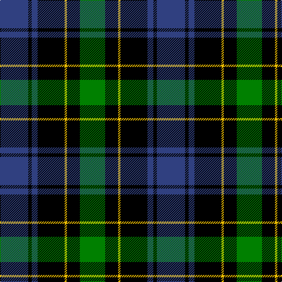

In pattern [BKBKYKG](/stripes/bkbkykg/).

This was sourced from weddslist.  It is a [7 stripe tartan](/stripes/stripes7/).

Original link http://www.weddslist.com/cgi-bin/tartans/pg.pl?source=sts

## Thread count
B/48 K6 B10 K46 Y4 K22 G/43

## Palette
Each colour and the base-6 reference it is a variant of.

| Colour | Shade | Base |
|---|---|---|
| B | <code style="background-color:#304080;">#304080</code> `oklch(39.4% 0.109 270.2)` <small>#304080</small> | B <code style="background-color:#2A418A;">#2A418A</code> |
| G | <code style="background-color:#008000;">#008000</code> `oklch(52.0% 0.177 142.5)` <small>#008000</small> | G <code style="background-color:#006100;">#006100</code> |
| K | <code style="background-color:#000000;">#000000</code> `oklch(0.0% 0.000 0.0)` <small>#000000</small> | K <code style="background-color:#000000;">#000000</code> |
| Y | <code style="background-color:#F0C000;">#F0C000</code> `oklch(82.7% 0.169 90.5)` <small>#F0C000</small> | Y <code style="background-color:#F2BF00;">#F2BF00</code> |

# Sample pattern

## Nearest tartans

The nearest existing variants by ΔTartan distance.

1. [Graham W](/setts/s6/dg21lb2dg4k17dp14k3/) — ΔT 0.56
1. [Unnamed, No 59](/setts/s6/t1db11k11g11k2t1~x2/) — ΔT 0.80
1. [Fletcher](/setts/s7/db6k1db6k8r1g8k2~x2/) — ΔT 0.81
1. [Ferguson of Balquhidder](/setts/s6/k2g12k12r1db12g2~x2/) — ΔT 0.82
1. [Unnamed, No 115](/setts/s8/db10k6t1g6k1~x2/) — ΔT 0.83
1. [Melville](/setts/s6/k5lb2dg18k17dp16k3/) — ΔT 0.84
1. [Forbes](/setts/s9/db8k2db2k2db2k8g7k1w1~x2/) — ΔT 0.89
1. [Melville](/setts/s6/k4w2g18k13db12k2~x2/) — ΔT 0.90
1. [Unnamed 6](/setts/s8/k16g16k2g16k16w2p16k1~x2/) — ΔT 0.91
1. [Gunn](/setts/s6/r2g12k12g1db12g1~x2/) — ΔT 0.93

## Neighbour map

Every grey dot is one of 14299 variants placed by the first two principal components of the ΔTartan feature space (44% of its variance). Red is this tartan; blue dots are its nearest — click one to open its page.

<svg viewBox="0 0 640 380" role="img" style="max-width:100%;height:auto;border:1px solid #e0e0e0;border-radius:4px;display:block" xmlns="http://www.w3.org/2000/svg"><image href="/nn/cloud.v1.png" width="640" height="380"/><a href="/setts/s6/dg21lb2dg4k17dp14k3/"><circle cx="200.8" cy="222.2" r="4" fill="#3465a4"><title>Graham W</title></circle></a><a href="/setts/s6/t1db11k11g11k2t1~x2/"><circle cx="167.6" cy="212.4" r="4" fill="#3465a4"><title>Unnamed, No 59</title></circle></a><a href="/setts/s7/db6k1db6k8r1g8k2~x2/"><circle cx="158.3" cy="232.2" r="4" fill="#3465a4"><title>Fletcher</title></circle></a><a href="/setts/s6/k2g12k12r1db12g2~x2/"><circle cx="171.6" cy="211.8" r="4" fill="#3465a4"><title>Ferguson of Balquhidder</title></circle></a><a href="/setts/s8/db10k6t1g6k1~x2/"><circle cx="146.4" cy="214.8" r="4" fill="#3465a4"><title>Unnamed, No 115</title></circle></a><a href="/setts/s6/k5lb2dg18k17dp16k3/"><circle cx="187.5" cy="231.6" r="4" fill="#3465a4"><title>Melville</title></circle></a><a href="/setts/s9/db8k2db2k2db2k8g7k1w1~x2/"><circle cx="171.5" cy="206.5" r="4" fill="#3465a4"><title>Forbes</title></circle></a><a href="/setts/s6/k4w2g18k13db12k2~x2/"><circle cx="159.8" cy="221.5" r="4" fill="#3465a4"><title>Melville</title></circle></a><a href="/setts/s8/k16g16k2g16k16w2p16k1~x2/"><circle cx="192.6" cy="193.2" r="4" fill="#3465a4"><title>Unnamed 6</title></circle></a><a href="/setts/s6/r2g12k12g1db12g1~x2/"><circle cx="173.1" cy="206.0" r="4" fill="#3465a4"><title>Gunn</title></circle></a><circle cx="192.7" cy="210.3" r="5" fill="#c00000"/></svg>

ID: /setts/s7/db48k6db10k46ly4k22g43/
