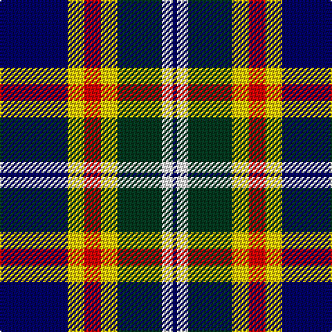

In pattern [BWGYRYB](/stripes/bwgyryb/).

This was sourced from register-of-tartans.  It is a [7 stripe tartan](/stripes/stripes7/).

Original link https://www.tartanregister.gov.uk/tartanDetails.aspx?ref=11012

## Attestations

This cloth appears in 2 source records; the oldest owns this page.

- 01/08/2013 — Kuznetsov (2014) (register-of-tartans, [record](https://www.tartanregister.gov.uk/tartanDetails.aspx?ref=11012))
- 2014 — Kuznetsov (2014) (tartans-authority, [record](http://www.tartansauthority.com/tartan-ferret/display/11012/))

## Register references

External register numbers recorded for this tartan.

- Scottish Register of Tartans: [11012](https://www.tartanregister.gov.uk/tartanDetails.aspx?ref=11012)

## Thread count
DB/49 Y12 R12 Y12 DG32 W8 DB/3

## Palette
Each colour and its ΔE from the base-6 reference it is a variant of.

| Colour | Shade | Base | ΔE (OKLab) |
|---|---|---|---|
| DB | <code style="background-color:#000064;">#000064</code> `#000064` | B <code style="background-color:#2A418A;">#2A418A</code> | 0.18 |
| DG | <code style="background-color:#003820;">#003820</code> `#003820` | G <code style="background-color:#006100;">#006100</code> | 0.15 |
| R | <code style="background-color:#DC0000;">#DC0000</code> `#DC0000` | R <code style="background-color:#CC0000;">#CC0000</code> | 0.03 |
| W | <code style="background-color:#FFFFFF;">#FFFFFF</code> `#FFFFFF` | W <code style="background-color:#F7F7F7;">#F7F7F7</code> | 0.02 |
| Y | <code style="background-color:#FCCC00;">#FCCC00</code> `#FCCC00` | Y <code style="background-color:#F2BF00;">#F2BF00</code> | 0.04 |

# Sample pattern

## Nearest tartans

The nearest existing variants by ΔTartan distance.

1. [Clunie (Name)](/setts/s6/w6db24k7o11k2ly6~x2/) — ΔT 0.80
1. [Clunie (Personal)](/setts/s6/w12db48k13o22k3ly6/) — ΔT 0.90
1. [Lovell (2014)](/setts/s8/ly2k2db14db4k5r2ly5r1~x4/) — ΔT 0.97
1. [Collister (Personal)](/setts/s10/k26n2k2n2k2n10w10n6dt10lo5~x2/) — ΔT 1.00
1. [MacManus (Estimated threadcount)](/setts/s9/w3ly2g8k2ly3k2db15k1ly2~x4/) — ΔT 1.04
1. [Ferguson Dress #2](/setts/s7/db68k42w32r5w32dg4w6/) — ΔT 1.05
1. [MacTavish / Thom(p)son, dress](/setts/s6/r4t28k6w12k12ly3~x2/) — ΔT 1.07
1. [Ailsa, Craig](/setts/s8/r5w2db20ly2k16w18k2w5~x2/) — ΔT 1.09
1. [Bannockbane, Blue](/setts/s8/k4ly2k13ly1w8t13ly2t4~x2/) — ΔT 1.09
1. [NEWYORKER](/setts/s9/r3k1lb12k2db2k2k14lb2k2~x2/) — ΔT 1.10

## Neighbour map

Every grey dot is one of 14299 variants placed by the first two principal components of the ΔTartan feature space (44% of its variance). Red is this tartan; blue dots are its nearest — click one to open its page.

<svg viewBox="0 0 640 380" role="img" style="max-width:100%;height:auto;border:1px solid #e0e0e0;border-radius:4px;display:block" xmlns="http://www.w3.org/2000/svg"><image href="/nn/cloud.v1.png" width="640" height="380"/><a href="/setts/s6/w6db24k7o11k2ly6~x2/"><circle cx="154.7" cy="176.3" r="4" fill="#3465a4"><title>Clunie (Name)</title></circle></a><a href="/setts/s6/w12db48k13o22k3ly6/"><circle cx="197.6" cy="160.5" r="4" fill="#3465a4"><title>Clunie (Personal)</title></circle></a><a href="/setts/s8/ly2k2db14db4k5r2ly5r1~x4/"><circle cx="166.1" cy="152.9" r="4" fill="#3465a4"><title>Lovell (2014)</title></circle></a><a href="/setts/s10/k26n2k2n2k2n10w10n6dt10lo5~x2/"><circle cx="158.2" cy="141.8" r="4" fill="#3465a4"><title>Collister (Personal)</title></circle></a><a href="/setts/s9/w3ly2g8k2ly3k2db15k1ly2~x4/"><circle cx="160.8" cy="136.3" r="4" fill="#3465a4"><title>MacManus (Estimated threadcount)</title></circle></a><a href="/setts/s7/db68k42w32r5w32dg4w6/"><circle cx="160.2" cy="148.1" r="4" fill="#3465a4"><title>Ferguson Dress #2</title></circle></a><a href="/setts/s6/r4t28k6w12k12ly3~x2/"><circle cx="148.3" cy="177.9" r="4" fill="#3465a4"><title>MacTavish / Thom(p)son, dress</title></circle></a><a href="/setts/s8/r5w2db20ly2k16w18k2w5~x2/"><circle cx="116.9" cy="154.0" r="4" fill="#3465a4"><title>Ailsa, Craig</title></circle></a><a href="/setts/s8/k4ly2k13ly1w8t13ly2t4~x2/"><circle cx="146.5" cy="171.4" r="4" fill="#3465a4"><title>Bannockbane, Blue</title></circle></a><a href="/setts/s9/r3k1lb12k2db2k2k14lb2k2~x2/"><circle cx="170.6" cy="129.2" r="4" fill="#3465a4"><title>NEWYORKER</title></circle></a><circle cx="157.0" cy="152.3" r="5" fill="#c00000"/></svg>

ID: /setts/s7/db49ly12r12ly12dg32w8db3/
